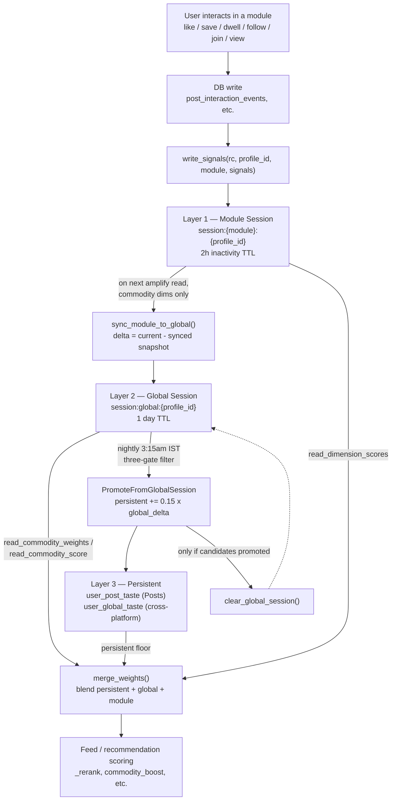
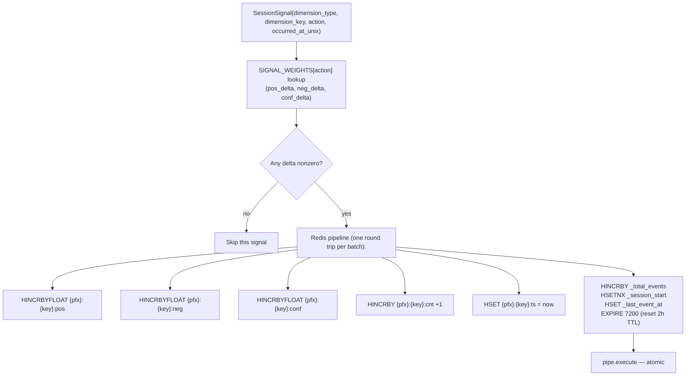
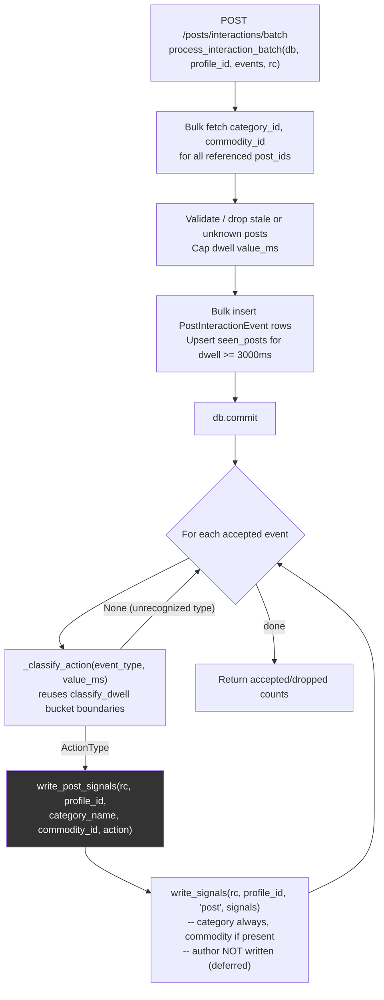
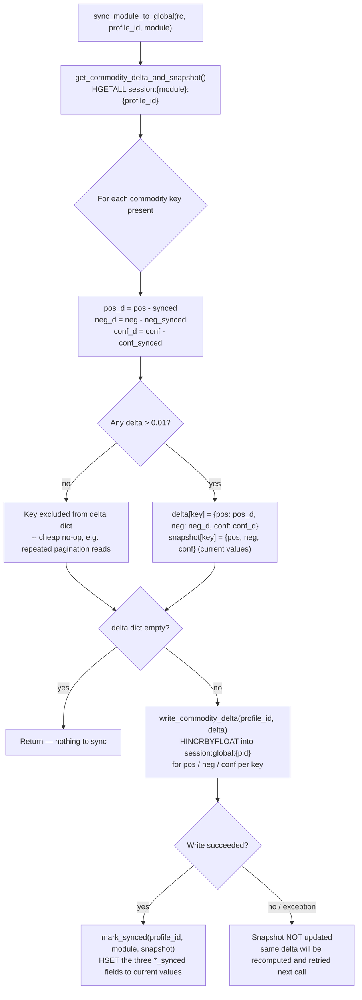
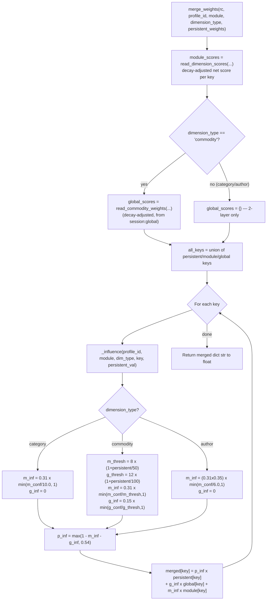
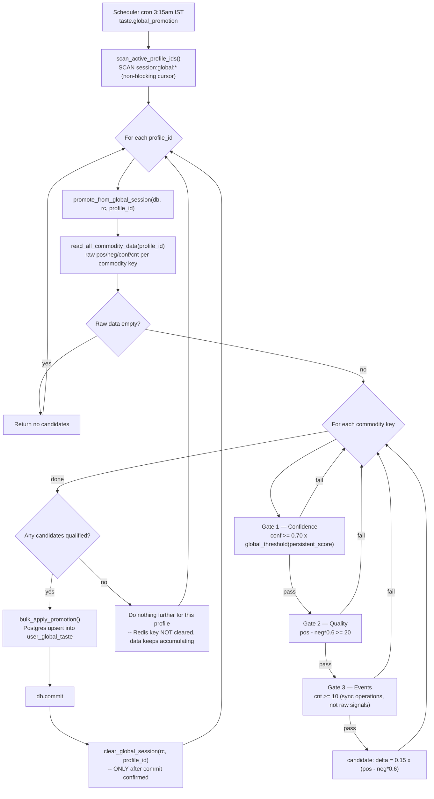
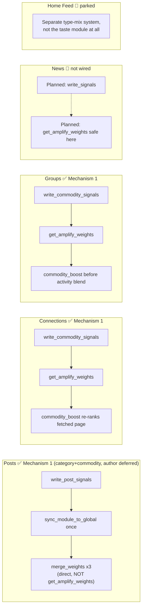

# Dynamic Recommendation System — Flowcharts

Companion visual reference to `dynamic_recommendation_architecture.md` and
`recommendation_taste_architecture.md`. Renders as diagrams in GitHub/VSCode
markdown preview (Mermaid). Current as of 2026-07-14.

---

## 1. Overall three-layer data flow

---

## 2. Write path — generic `write_signals` internals

---

## 3. Posts write path (the concrete, currently-shipped example)

---

## 4. Module → Global sync — the delta/snapshot mechanism (detail)

---

## 5. Read path — the blend formula (`merge_weights`)

---

## 6. Nightly promotion (3:15am IST)

---

## 7. Per-module wiring status (at a glance)

**Why Posts looks different from Connections/Groups:** `get_amplify_weights` unconditionally sources "persistent" from `user_global_taste` (sparse, cross-platform) — correct for Connections/Groups since they have no legacy per-module table of their own, wrong for Posts which already has a mature `user_post_taste`. News has no legacy table either, so once built it can safely use `get_amplify_weights` like Connections/Groups do.
