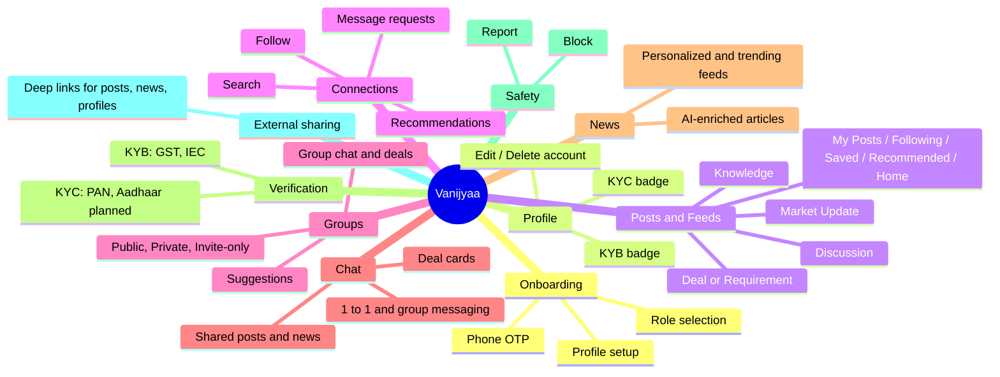

# 01 — Product Overview

This document describes Vanijyaa **purely from the point of view of the person using it** — no code, no architecture, just "what can I do with this app and why would I want to." Understanding the product this way first makes every later technical document easier to follow, because you'll already know *why* a given piece of code needs to exist before you read *how* it works.

Every feature named here is backed by real, verified code — see [Feature Guide](10_Feature_Guide.md) for the technical version of this same tour, with file references.

---

## 1. Onboarding — becoming a user

A new user's very first interaction is proving they own a phone number, not typing a password. They enter their phone number, receive an OTP (one-time password) via SMS, and enter it. Behind the scenes this OTP round-trip is handled by **Firebase** (a Google product this app uses purely for OTP delivery/verification, not for the rest of its data) — full detail in [Authentication](14_Authentication.md).

Once the phone number is verified, if this is genuinely a new person, they go through onboarding screens that collect:
- Their **role**: Trader, Broker, or Exporter.
- Their **name** and **business name**.
- The **commodities** they trade (from a fixed, small list — currently rice, cotton, sugar).
- Their **interests** (why they're here — e.g. finding connections, generating leads, following news).
- A **quantity range** (how much they typically trade, e.g. "50–500 MT" — MT = metric tons) — this quietly matters a lot later, because it's one of the signals the recommendation engine uses to decide who to match them with.
- Their **business location** (city, state, and precise coordinates).

Only after all of this is collected does the user get a real, permanent account with a login session — up until that point they're in a temporary "onboarding" state with a short-lived token that can only be used to finish signing up, not to do anything else in the app.

## 2. Profile — who you are on the platform

Every user has a public profile: name, role, business name, city/state, the commodities they trade, an avatar photo, and — importantly — two independent verification badges:
- **KYC verified** ("is_user_verified") — the person's identity has been checked (currently via PAN card; Aadhaar is planned but not yet available).
- **KYB verified** ("is_business_verified") — their business has been checked (GST registration for Traders/Brokers, IEC — Import Export Code — for Exporters).

A user can edit their name, business details, and location; their role is fixed once chosen (it's too structurally important to the rest of the system to let people change it casually). Users can also permanently delete their account, which removes their profile and everything tied to it.

## 3. Posts and the Feed — the platform's social layer

A **post** is the platform's core content unit — similar in spirit to a LinkedIn post or a classified ad, depending on the category chosen:
- **Market Update** — sharing information about market conditions.
- **Knowledge** — educational/informational content.
- **Discussion** — open conversation starters.
- **Deal / Requirement** — a structured buy/sell listing: commodity, grain type & size, quantity, price, and whether the price is fixed or negotiable. This is the one category with real structured data behind it, not just free text.

A post can include up to 5 images, can be marked public or "followers only," and can optionally be restricted to specific roles (e.g. "Exporters only"). Other users can like, comment on, save, and share a post. Post authors can edit or delete their own posts, and can mark a Deal/Requirement post as closed once it's no longer available.

There isn't one single "feed" — there are several, each serving a different purpose:
- **My Posts** — everything you've posted.
- **Following Feed** — posts from people you follow, ranked by a mix of recency, your own taste history, and commodity match.
- **Saved Posts** — everything you've bookmarked.
- **Recommendation Feed** — a personalized feed built by the recommendation engine (see [Recommendation Engine](19_Recommendation_Engine.md)), blending posts similar to your profile, currently popular posts, and freshly published ones.
- **Home Feed** — a single unified feed mixing posts, news, group activity, and connection suggestions together (see below) — this is the screen a user most likely lands on when opening the app.

## 4. Connections — your professional network

This is the "who do you know" layer. A user can:
- **Follow** another user (one-directional, like Twitter/X rather than a mutual "friend" relationship like Facebook).
- **Search** for other users by name, role, commodity, or city.
- Get **recommended matches** — the platform proactively suggests other traders/brokers/exporters likely to be relevant, based on commodity overlap, role, location, and trade volume.
- Send a **message request** to someone they don't yet have an open conversation with, optionally with a short introductory message — the recipient can accept (which opens a real chat) or decline.

## 5. Groups — communities

A **group** is a shared space for people with a common interest — e.g. a regional commodity-trading community. Groups have:
- A name, description, rules, cover image, and a set of target commodities/roles that drive who it gets recommended to.
- **Accessibility** levels: public (anyone can join instantly), private (join requests need admin approval), or invite-only (join via a shared link).
- **Admins** and regular members; admins can add/remove members, freeze a member's posting rights, and manage group settings.
- Their own **chat** (see below) and their own **deals** — a group-scoped version of the Deal/Requirement post concept, which can optionally also be published to the poster's public feed.
- A **suggestions** feed, recommending groups a user hasn't joined yet but is likely interested in.

## 6. Chat — direct and group messaging

Once two users have an open conversation (either by directly starting one, or after a message request is accepted), they can exchange:
- Text messages, images, videos, documents, audio, and location pins.
- **Deal cards** — a structured deal, shareable directly inside a 1:1 or group chat, distinct from (but similar in shape to) a Deal/Requirement post.
- **Shared posts and news articles** — forwarded from elsewhere in the app into a conversation.

Messages show delivery and read status (the familiar "sent / delivered / read" ticks), and a sender can delete their own message (which soft-deletes it — it disappears from view but the row isn't physically removed). Group chats follow the group's own posting permissions (e.g. an admin-only group won't let regular members send messages). There's also a unified "all chats" inbox mixing DMs and group chats by recency, and a dedicated "share sheet" for sending a post or article to a chosen set of DMs/groups at once.

## 7. News — curated agricultural trade news

Separately from user-generated posts, the platform ingests real news articles from external providers, enriches them using an AI model to classify their relevance, and serves them as a personalized news feed. Each article carries:
- A short AI-generated summary.
- A **primary factor** classification (what kind of story this is, e.g. policy, weather, pricing).
- **Role relevance scores** — how relevant this article is predicted to be for a Trader vs. a Broker vs. an Exporter.
- **Impact direction and score** — is this good or bad news for the market, and how significant.
- **Commodity and state tags** — which commodities and Indian states the article concerns.

Users can like, save, comment on, and share news articles, and can browse a trending feed, a filtered feed (global/domestic/government news), and their saved articles, in addition to their personalized recommended feed.

## 8. Verification — KYC and KYB

Described briefly in §2 above; the mechanics: a user submits a document number (PAN, GST, or IEC), the backend calls a third-party verification API (Surepass) to check it against government records, and on success flips the corresponding profile flag. KYB (business) verification requires KYC (identity) verification to already be complete, and the specific document required depends on the user's role (Trader/Broker → GST; Exporter → IEC).

## 9. Safety — blocking and reporting

Users can block another user (intended to hide that person from their feeds, DMs, and recommendations — see the important caveat in [Known Limitations](30_Known_Limitations.md), this doesn't fully work today) and can report a user, group, or post for moderation review, choosing from a fixed set of reasons (spam, harassment, inappropriate content, scam, impersonation, other). Reports go into a queue with a status a moderator would move through (pending → reviewed → actioned/dismissed) — there is currently no admin interface for that moderation queue described anywhere in this codebase; see [Known Limitations](30_Known_Limitations.md).

## 10. Sharing outside the app

Posts, news articles, and user profiles can each be turned into a shareable deep link (`vanijyaa://...`) with ready-made share text, intended for sharing via WhatsApp, SMS, or any external channel outside the app itself — distinct from in-app sharing via chat (§6).

---

## Feature map at a glance

---
**Previous:** [00 — Project Introduction](00_Project_Introduction.md) · **Next:** [02 — How the System Works](02_How_the_System_Works.md)
