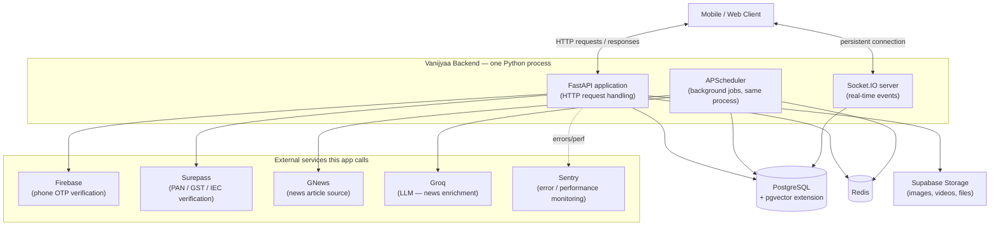
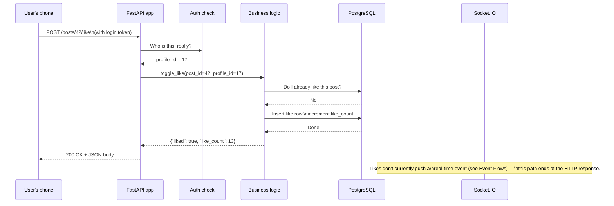

# 02 — How the System Works

This document builds your mental model of the *technical* system, the way [Product Overview](01_Product_Overview.md) built your mental model of the *product*. By the end of this page you should be able to answer: "when a mobile app talks to this backend, what pieces of software actually get involved, and what does each one do?"

## The shape of the system

Vanijyaa's backend is **one Python process** (well — nearly one; see the caveat about the background scheduler below) that mobile/web clients talk to over HTTP and over a persistent real-time connection. That one process talks outward to a handful of other systems it depends on:



Nothing in that diagram should be unfamiliar to you by the end of this document — each box is explained below.

## The pieces, explained

### The web framework: FastAPI

**What it is:** FastAPI is a Python framework for building HTTP APIs. "HTTP API" means: the client sends a request (e.g. "GET me the details of post #42") over the HTTP protocol — the same protocol your browser uses to load web pages — and the server sends back a response, typically as JSON (a simple, human-readable text format for structured data, e.g. `{"id": 42, "title": "..."}`).

**Why this project uses it:** FastAPI is fast, has good support for validating incoming data automatically (so a request with a malformed body gets rejected before your code ever sees it), and generates interactive API documentation automatically from the code. For a backend whose entire job is "expose the app's features as an API for a mobile client to call," this is a standard, well-suited choice.

**How it's used here:** the single `FastAPI()` application object is created in `main.py`. Every feature area (auth, posts, chat, etc.) defines a **router** — a FastAPI object that groups related endpoints together (e.g. everything under `/posts/...`) — and `main.py` "includes" every router into the one app. This is covered in depth in [Startup Process](05_Startup_Process.md) and [Modules](11_Modules.md).

### The database: PostgreSQL, and how Python talks to it

**What it is:** PostgreSQL ("Postgres") is a relational database — it stores data in tables with rows and columns, and lets you query it with SQL (Structured Query Language). This app's data — users, posts, groups, messages, everything durable — lives in one PostgreSQL database.

**How Python code talks to it — SQLAlchemy, and what an "ORM" is:** Writing raw SQL strings all over a large codebase is error-prone and hard to keep consistent. Instead, this app uses **SQLAlchemy**, an "ORM" (Object-Relational Mapper). An ORM lets you define a Python class — e.g. `class Post(Base): id = ...; title = ...` — and the library translates operations on that class into SQL behind the scenes. So `db.query(Post).filter(Post.id == 42).first()` becomes a `SELECT ... FROM posts WHERE id = 42` query, without anyone writing that SQL by hand. Every table in the database has a matching Python class (a "model") somewhere under `app/modules/*/models.py`See [Database Guide](09_Database_Guide.md) for the full table-by-table reference.

**Keeping the database schema in sync — Alembic:** When a table needs a new column, or a whole new table needs to be created, someone has to run that change against the actual database. **Alembic** is a migration tool: every schema change is written as a small, timestamped Python script (a "migration") under `alembic/versions/`, each one knowing which migration came immediately before it — forming a chain. Running `alembic upgrade head` applies every migration that hasn't been applied yet, in order. This means the database schema has a full, replayable history, and any environment (a teammate's laptop, a staging server) can be brought to the exact same schema state from scratch. The audit (`audit/audit_phase_12.md`) verified this chain is intact and that every current model has a matching migration.

**Similarity search — pgvector:** Several features (recommending people to connect with, ranking posts/news for a feed) work by comparing numeric "embedding vectors" — long lists of numbers that represent something's characteristics (a user's trading profile, a post's topic) such that similar things have similar vectors. **pgvector** is a PostgreSQL extension that adds a vector data type and fast similarity search directly inside the database, so "find the 20 most similar profiles to this one" can be one efficient database query instead of pulling millions of rows into Python. Full explanation in [Recommendation Engine](19_Recommendation_Engine.md).

### The cache and short-lived store: Redis

**What it is:** Redis is an in-memory key-value store — think of it as a giant, extremely fast dictionary that lives in RAM rather than on disk, usually running as its own separate small server process. Because it's memory-resident, reads and writes are very fast, but data can be configured to expire automatically or be lost on restart — so Redis is a poor fit for anything that must never be lost, and a great fit for anything short-lived or reconstructible.

**How this app uses it:** rate limiting (though see the gap noted in [Authorization](15_Authorization.md)), session-scoped personalization signals that should only influence the next couple of hours of recommendations (see [Recommendation Engine](19_Recommendation_Engine.md)), and tracking which users are currently online for chat. Full key-by-key reference in [Redis](17_Redis.md).

### The real-time layer: Socket.IO

**What it is:** ordinary HTTP is request-response — the client asks, the server answers, the connection ends. That's fine for "load my feed," but wrong for "notify me the instant someone sends me a message." **Socket.IO** is a protocol (with matching server and client libraries) for keeping a persistent, two-way connection open between client and server, so either side can push a message to the other at any time without the other side having to ask first.

**How this app uses it:** chat messages, delivery/read receipts, typing indicators, and "new post/deal shared with you" notifications are all pushed over Socket.IO rather than requiring the client to repeatedly ask "anything new?" It's mounted inside the *same* process as the HTTP API (see `main.py`), not a separate service. Full detail in [Event Flows](20_Event_Flows.md).

### The background job runner: APScheduler

**What it is:** some work needs to happen on a timer, not in response to a user's request — e.g. "every 30 minutes, fetch fresh news articles." **APScheduler** is a Python library that runs functions on a schedule (every N minutes, or at a specific time of day, cron-style) inside the same running process.

**Important nuance:** because it runs *inside the same process* as the API (not as a separate worker service), a long-running scheduled job and an incoming HTTP request are, in a sense, sharing the same house. This is discussed with its real implications in [Background Jobs](18_Background_Jobs.md) and [Runtime Architecture](06_Runtime_Architecture.md).

### External services

The app doesn't try to do everything itself — several capabilities are delegated to specialized third-party services:
- **Firebase** verifies phone OTPs, so this app never has to build SMS delivery or OTP-generation itself.
- **Surepass** checks PAN/GST/IEC numbers against real government data sources for KYC/KYB verification.
- **GNews** supplies the raw news articles the News feature ingests.
- **Groq** runs the LLM (large language model — an AI model that processes text) that classifies and summarizes each news article.
- **Supabase Storage** holds uploaded files (avatars, post images, chat attachments, group media) — the backend never stores image bytes itself, only URLs pointing at Supabase.
- **Sentry** collects errors and performance data from the running app for observability.

Each of these is explained in depth wherever it's relevant (Firebase in [Authentication](14_Authentication.md), Surepass under Verification in [Feature Guide](10_Feature_Guide.md), GNews/Groq in [Recommendation Engine](19_Recommendation_Engine.md) and [Feature Guide](10_Feature_Guide.md), Supabase in [Image Uploads](21_Image_Uploads.md)).

## A concept you'll see everywhere: dependency injection

FastAPI (and this codebase) leans heavily on a pattern called **dependency injection**. The idea: instead of a function reaching out and creating the things it needs (a database connection, the current logged-in user) itself, those things are declared as parameters, and the framework supplies ("injects") them automatically before the function runs. In this codebase you'll constantly see function signatures like:

```python
def get_my_posts_api(
    profile_id: int = Depends(get_current_profile_id),
    db: Session = Depends(get_db),
):
    ...
```

`Depends(get_current_profile_id)` means: "before calling this function, run `get_current_profile_id`, and pass its result in as `profile_id`." This is how the app gets a database connection and figures out who's making the request, consistently, without every single endpoint re-implementing that logic. It's explained fully, with the actual functions involved, in [Request Lifecycle](07_Request_Lifecycle.md).

## The story of one request, at the 10,000-ft level

Here's "a user taps the heart icon on a post," traced through every box in the diagram above, at a conceptual level (the file-by-file version is [Request Lifecycle](07_Request_Lifecycle.md)):



Notice what did **not** happen here: no background job ran, no external service was called, no Redis lookup happened. Not every request touches every box in the system diagram — most touch only the API and the database. The interesting, more-boxes cases (recommendations reading from Redis, chat pushing over Socket.IO, verification calling Surepass) are covered in their own dedicated documents.

---
**Previous:** [01 — Product Overview](01_Product_Overview.md) · **Next:** [03 — Repository Tour](03_Repository_Tour.md)
