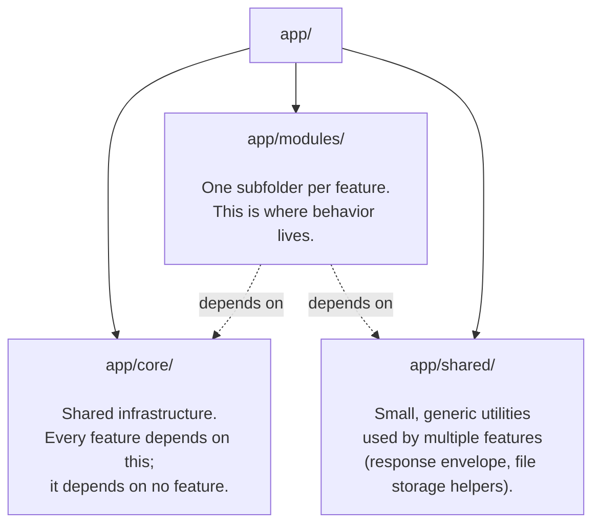
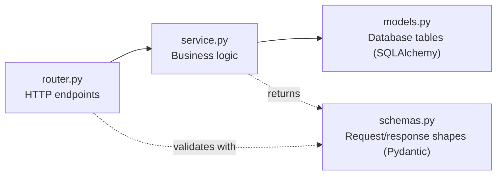

# 03 — Repository Tour

This is a guided walk through the repository, in the order you'd naturally encounter things if someone sat you down and clicked through the folder tree explaining each one. For a dense, scannable reference version of the same information, see [Folder Structure](04_Folder_Structure.md).

## Starting at the top level

If you `ls` the repository root, here's what you'll find and why:

| Entry | What it is | Why it's here |
|---|---|---|
| `main.py` | The application's entry point | This is the file `uvicorn` (the server program that actually runs a FastAPI app) is pointed at. It builds the `FastAPI` object, registers every feature's router, and wraps the whole thing in a Socket.IO layer. See [Startup Process](05_Startup_Process.md). |
| `app/` | All application code | Everything the app does, organized by feature. This is where you'll spend the vast majority of your time — the rest of this tour spends most of its words here. |
| `alembic/`, `alembic.ini` | Database migration history and config | See [How the System Works](02_How_the_System_Works.md)'s Alembic explanation, and the full [Database Guide](09_Database_Guide.md). |
| `tests/` | The automated test suite | One test file (`test_security_fixes.py`) covering authentication/authorization regressions, plus `conftest.py` (shared test setup). At the time of the architectural audit this suite could not run at all due to a stale reference in `conftest.py` — see `audit/audit_phase_01.md`'s finding P1-F2 before you rely on it. |
| `requirements.txt` | The list of Python packages this app depends on | Installed via `pip install -r requirements.txt`. Notably does **not** include `pytest` — the test suite's own dependency isn't declared here (also flagged in the audit). |
| `render.yaml` | Deployment configuration for Render.com | See [Deployment](26_Deployment.md). |
| `.env` | Local environment variables (secrets, URLs, feature flags) | Never committed to git (see `.gitignore`) — every developer and every deployment environment has their own copy. See [Configuration](24_Configuration.md) for what belongs in it. |
| `service.json` | A Firebase service account credential file | Used as a local-development fallback for Firebase authentication when the `GOOGLE_SERVICE_ACCOUNT_JSON` environment variable isn't set — see `auth/service.py`'s `_get_firebase_app()` and [Authentication](14_Authentication.md). Gitignored, like `.env`. |
| `documentation/` | A large pre-existing set of API-contract and architecture documents | Written across the project's history, describing individual features/endpoints. **Treat with caution**: the audit found multiple documents here describing an older version of the API that no longer matches the code (e.g. `gaps.md` references fields and endpoint shapes that have since changed). Useful as historical context, not as current truth. |
| `upgraded_documentation/` | A second, separate pre-existing documentation set | Similar in spirit to `documentation/` — per-feature write-ups (auth flow, chat module, groups API, etc.) plus one file (`results.md`) that's just raw manual API-test output, not documentation. Same caution applies as above. |
| `audit/` | The completed architectural audit | 14 phase files plus a final synthesis report, produced by a prior, separate exercise whose explicit goal was to find dead code, duplication, and architectural problems. This handbook (in `audits/`) cross-references it but is not a copy of it. |
| `audits/` | This handbook | The 32-document set you're reading right now. |
| `scripts/` | A mix of real utility scripts and abandoned prototypes | Entirely excluded from git (`.gitignore` lists `scripts` as a whole). Contains legitimate one-off maintenance scripts (e.g. `seed_posts.py`, `fix_comment_counts.py`) sitting alongside three full, superseded prototype implementations of the news feature (`scripts/news/`, `scripts/news_module/`, `scripts/news_new/`) that the audit confirmed are dead — see `audit/audit_phase_01.md` finding P1-F6. Because this entire folder is gitignored, nothing in it is part of the deployed application; treat anything you find here as "maybe useful local scratch work," never as a dependency of the running app. |
| `TESTING/` | A couple of ad-hoc, manually-run upload test scripts | Also gitignored. Not part of the automated test suite (that's `tests/`) — these look like scripts a developer ran by hand while building the avatar/post-image upload flow. |
| `uploads/avatars/` | An empty-looking local folder | **Not referenced anywhere in the current application code** (verified by search) — the app's actual file storage is entirely delegated to Supabase Storage, an external service (see [Image Uploads](21_Image_Uploads.md)). This folder appears to be a leftover from an earlier, local-disk-based approach to file storage that was since replaced. |
| `README.md` | Intended repo readme | Currently contains no useful content (an encoding artifact, effectively empty) — this handbook is the closest thing to a real README this project has. |
| `COMMANDSSS` | A developer's personal local-dev cheat sheet | Not project documentation — just a scratch file recording the commands one developer used to start the server locally and expose it via a Cloudflare tunnel for testing on a real device. Mentioned here only so you recognize it for what it is if you stumble on it. |

## Now, the part that matters: `app/`

Everything that actually runs in production lives under `app/`. It has three top-level pieces, and understanding the split between them is one of the most useful mental models you can build early:

### `app/core/` — the foundation every feature stands on

This is the plumbing that has nothing to do with any specific feature — it's the same regardless of whether you're building the chat feature or the news feature. It holds:
- **`config.py`** — the app's settings object (database URL, Redis URL, API keys, token lifetimes). See [Configuration](24_Configuration.md) — and note there's a *second*, unrelated, dead settings file at `app/config.py` (one level up) that the audit flagged; don't confuse the two.
- **`database/`** — the SQLAlchemy engine and session setup that every feature uses to talk to PostgreSQL.
- **`security/jwt_handler.py`** — creating and validating the login tokens (JWTs) described in [Authentication](14_Authentication.md).
- **`redis_client.py`** — the shared Redis connection.
- **`rate_limiter.py`** — a sliding-window rate limiter. Notably, per the audit, this is built and works but currently has zero call sites anywhere in the app — see [Authorization](15_Authorization.md).
- **`scheduler.py`** — registers every background job (see [Background Jobs](18_Background_Jobs.md)).
- **`monitoring.py`** — Sentry setup.

**Rule of thumb for this folder:** if you're tempted to add something feature-specific here (e.g. "a helper just for formatting post captions"), it belongs in that feature's own module instead. `app/core/` should only ever grow when something is genuinely needed by *multiple, unrelated* features.

### `app/modules/` — where the features live

Every user-facing feature from [Product Overview](01_Product_Overview.md) has a matching folder here: `auth/`, `profile/`, `connections/`, `groups/`, `chat/`, `post/`, `news_new/`, `feed/`, `taste/`, `safety/`, `verification/`, `deeplink/`. This is explained folder-by-folder in [Modules](11_Modules.md) — the short version, so this tour isn't incomplete on its own:

Most modules follow a simple, consistent internal shape — a small number of files, each with one job:

A few modules are bigger and are organized as a **package of sub-features** instead of one flat file per concern — `post/` contains `post_recommendation_module/` and `post_user_interaction/` as their own nested packages; `news_new/` contains `ingestion/`, `intelligence/`, `news_recommendation_engine/`, and `news_user_interaction/`; `chat/` and `taste/` go a step further and use a **layered "clean architecture" style** (separate `domain/`, `application/`, `data/`, `presentation/` folders) rather than the flat `router.py`/`service.py`/`models.py` shape. Why some modules are flat and some are layered is not something this handbook can verify from the code alone — it reads as an evolution in the team's preferred style over time (the layered modules are, per the git history the audit examined, generally newer) rather than a deliberate rule about when to use which. [Modules](11_Modules.md) and [Service Layer](12_Service_Layer.md) cover both shapes in full.

### `app/shared/` — small, truly generic helpers

Two things live here, and the folder is intentionally tiny:
- **`utils/response.py`** — the `ok(data, message)` helper that wraps almost every API response in a consistent `{"success": true, "message": ..., "data": ...}` shape. ("Almost" — the audit found two modules, Chat and Safety, that don't use it; see [Known Limitations](30_Known_Limitations.md).)
- **`utils/storage.py`** — the shared logic for talking to Supabase Storage (signing upload URLs, checking if a file exists, deleting a file) that every feature with image/file uploads reuses. Full detail in [Image Uploads](21_Image_Uploads.md).

## How to decide "where does my new code go?"

A practical rule of thumb, derived from how the existing code is organized (not a rule stated anywhere in the repo itself):

- Is it a new user-facing feature, or a meaningful extension of an existing one? → `app/modules/<feature>/`.
- Is it infrastructure that *every* feature needs, regardless of what it does? → `app/core/`.
- Is it a small, genuinely generic helper (not feature logic) that two or more *unrelated* features would otherwise duplicate? → `app/shared/utils/`.
- Is it a one-off maintenance/data-fixing script you'll run manually once? → `scripts/` (remembering it's gitignored — it won't be part of any deployment, which is usually exactly what you want for this kind of script).

---
**Previous:** [02 — How the System Works](02_How_the_System_Works.md) · **Next:** [04 — Folder Structure](04_Folder_Structure.md)
