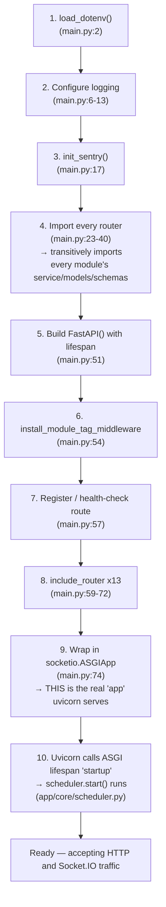

# 05 — Startup Process

This document answers: "what actually happens, in order, between running the start command and the app being ready to serve traffic?" Every step below is traced directly from `main.py` (74 lines total — short enough to read in full alongside this document).

## The command that starts everything

In production (per `render.yaml`, see [Deployment](26_Deployment.md)):
```
uvicorn main:app --host 0.0.0.0 --port $PORT
```
**`uvicorn`** is an ASGI server — a program whose job is to accept incoming network connections and hand them to an ASGI-compatible Python application object to actually handle. ("ASGI" — Asynchronous Server Gateway Interface — is a standard interface between Python web servers and web applications/frameworks, the async-capable successor to the older WSGI standard.) `main:app` tells uvicorn: "import the `main` module, and the object I should serve is the variable named `app` inside it." Everything below is what building that `app` object involves.

## Step-by-step trace through `main.py`



### 1 — Environment variables are loaded (`main.py:1-2`)

```python
from dotenv import load_dotenv
load_dotenv()
```
`python-dotenv` reads a `.env` file in the current directory and copies its key=value lines into the process's environment variables (`os.environ`), *if* they aren't already set. This has to be the very first thing that happens, because almost everything else — the database URL, API keys, feature flags — is read from the environment during import. If this ran later, code that reads `os.getenv(...)` at import time (and some code in this app does — see [Configuration](24_Configuration.md)) would see nothing.

### 2 — Logging is configured (`main.py:4-13`)

Python's built-in `logging` module is configured to print `INFO`-level-and-above messages with a timestamp and logger name. Two specific loggers (`app.modules.news_new`, `app.core.scheduler`) are explicitly forced to `INFO` as well, with a comment explaining why: some third-party library the app depends on might reconfigure the root logger later, and the developer wanted to guarantee these two particular subsystems (the news pipeline and the background scheduler) keep logging visibly regardless.

### 3 — Sentry is initialized (`main.py:15-17`)

```python
from app.core.monitoring import init_sentry, install_module_tag_middleware
init_sentry()
```
`init_sentry()` (defined in `app/core/monitoring.py`) configures the Sentry SDK to capture unhandled errors and performance data — but only if `settings.SENTRY_DSN` is set; otherwise it logs "Sentry disabled" and returns immediately, a deliberate no-op for local development. The comment on `main.py:15` explains *why* this runs before anything else is built: Sentry auto-instruments FastAPI, SQLAlchemy, httpx, and Redis by patching them, so it needs to be initialized before those libraries' objects are created, not after.

### 4 — Every feature's router is imported (`main.py:19-41`)

This is the step with the most hidden weight. Thirteen `import` statements pull in the router object from each feature module — but **importing a Python module runs every top-level statement in that file**, and each `router.py` itself imports its module's `service.py`, which imports `models.py` and `schemas.py`, and so on down the dependency chain. By the time all thirteen imports finish, essentially the entire `app/modules/` tree has been loaded into memory: every SQLAlchemy model class has been defined and registered against the shared declarative `Base` (see [Database Guide](09_Database_Guide.md)), every Pydantic schema class exists, and a handful of things with real side effects have already run:

- `app/core/database/session.py` creates the SQLAlchemy `engine` object (via `create_engine(...)`) — this does **not** open a database connection yet (connections are opened lazily, on first actual query), but the engine/connection-pool object now exists in memory.
- `app/modules/chat/presentation/connection_manager.py` creates the Socket.IO server object — `sio = socketio.AsyncServer(...)` — at module level, the moment `main.py:37`'s `from ... import sio` runs.
- `app/shared/utils/storage.py` constructs a real Supabase client at module level (`_client: Client = create_client(os.environ["DATABASE_STORAGE_URL"], os.environ["DATABASE_SERVICE_KEY"])`), using a **hard dictionary subscript** rather than a safe `.get()`. Because this file is imported transitively by the Profile, Groups, Post, and Chat routers, **if either of those two environment variables is missing, the entire application fails to start** — not just the feature that needs file storage. This is a real, audit-confirmed risk (`audit/audit_phase_03.md`, finding P3-F4) worth knowing about the first time you're debugging a "the app won't even start" problem — see [Common Debugging](28_Common_Debugging.md).

### 5 — The FastAPI app object is created (`main.py:51`)

```python
app = FastAPI(title="Vanijyaa API", lifespan=lifespan)
```
This constructs the actual application object. The `lifespan` argument (defined just above, `main.py:44-48`) is a function that FastAPI will run around the *entire* application's start and stop, not around each individual request:
```python
@asynccontextmanager
async def lifespan(app: FastAPI):
    _scheduler.start()
    yield
    _scheduler.stop()
```
Everything before `yield` runs once, at startup, after the ASGI server signals it's ready to begin serving. Everything after `yield` runs once, at shutdown. This is where the background job scheduler actually starts — see [Background Jobs](18_Background_Jobs.md) for exactly what `scheduler.start()` registers.

### 6 — Sentry module-tagging middleware is installed (`main.py:54`)

`install_module_tag_middleware(app)` adds an HTTP middleware (a function that wraps every request) whose only job is to look at the request's URL path, figure out which feature module "owns" that path (via a hand-maintained lookup table in `app/core/monitoring.py`), and tag the current Sentry transaction with that module name — purely for being able to filter/group errors and performance data by feature in the Sentry dashboard later. Like `init_sentry()`, this is a no-op if Sentry isn't configured. (Two entries in that lookup table are stale — see [Known Limitations](30_Known_Limitations.md) — so Sentry data for the Post and Deeplink modules currently isn't tagged correctly; this doesn't affect anything except how easy that data is to filter.)

### 7 — A bare health-check route is registered (`main.py:57`)

```python
app.get("/", status_code=200)(lambda: {"message": "Server is up and running!"})
```
`GET /` returns a fixed JSON message. This exists so an uptime monitor (or a human with a browser) has something trivial to hit to confirm the process is alive, distinct from any real feature.

### 8 — Every router is registered (`main.py:59-72`)

Thirteen calls to `app.include_router(...)`. Each router object (built inside its own module, see [Modules](11_Modules.md)) already knows its own URL prefix (e.g. the Post router was created with `APIRouter(prefix="/posts", ...)`) — `include_router` merges that router's whole set of endpoints into the main app's routing table. After this step, the app knows about every HTTP endpoint it will ever serve.

### 9 — The app is wrapped for Socket.IO (`main.py:74`)

```python
app = socketio.ASGIApp(sio, other_asgi_app=app)
```
This is the single most important line to understand about this app's runtime shape, and it's easy to miss on a skim. **The variable uvicorn actually serves (`main:app`) is reassigned here** to a `socketio.ASGIApp` wrapper, not the FastAPI object built in step 5. This wrapper inspects each incoming connection: if it's a Socket.IO protocol request, it's routed to `sio` (the real-time server); everything else is passed through to the wrapped FastAPI `app`. Both share the same process and the same port — there is no separate "chat server." Full implications of this in [Runtime Architecture](06_Runtime_Architecture.md).

### 10 — Startup completes

Once uvicorn finishes constructing the ASGI app and signals its own "startup" lifecycle event, FastAPI's `lifespan` function (step 5) runs its pre-`yield` code — `_scheduler.start()` — which registers and starts every background job (see [Background Jobs](18_Background_Jobs.md)). Only after that returns does the server begin accepting connections. From this point on, the process is simultaneously: an HTTP API server, a Socket.IO server, and a background job runner — all one process, all one Python interpreter. That combination, and what it means for how the app behaves under load, is the subject of the next document.

---
**Previous:** [04 — Folder Structure](04_Folder_Structure.md) · **Next:** [06 — Runtime Architecture](06_Runtime_Architecture.md)
