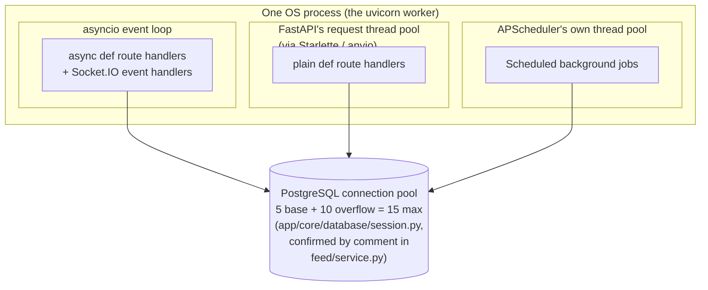
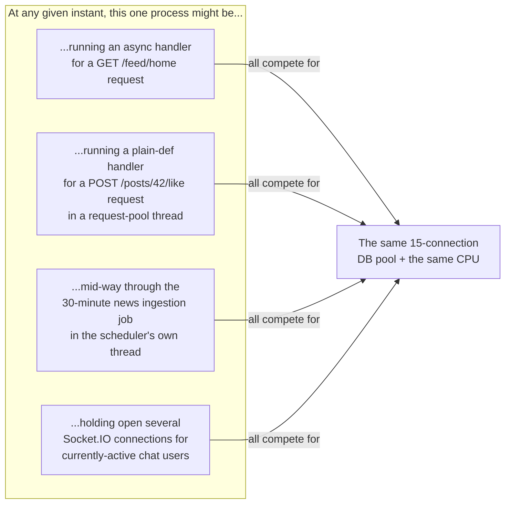

# 06 — Runtime Architecture

[Startup Process](05_Startup_Process.md) showed you *what gets built*. This document explains *what's actually running, concurrently, inside that one process, at any given moment* — the concepts you need to reason correctly about performance, and about a specific class of bug ("why did this feature stop working when we scaled to 2 servers") that has already bitten this codebase once.

## The one-process, one-worker deployment

Per `render.yaml` (see [Deployment](26_Deployment.md)), the production start command is:
```
uvicorn main:app --host 0.0.0.0 --port $PORT
```
There is no `--workers N` flag. Uvicorn's default is a single worker process. **This is a deliberate, load-bearing fact**, not an oversight — one specific feature (real-time chat delivery) is explicitly written assuming it, and would silently break if that changed without other code changing alongside it. That's covered in detail below.

## Three different kinds of "concurrency" coexist in this one process

This is the concept most likely to confuse someone new to this codebase, because the words "async," "thread," and "process" all show up, and mixing them up leads to wrong assumptions about performance. Here's the precise picture, built from what's actually verifiable in the code:



### `async def` route handlers and Socket.IO — the event loop

FastAPI is built on **asyncio**, Python's built-in framework for cooperative concurrency: a single thread runs an event loop that juggles many in-flight operations by switching between them whenever one is waiting on I/O (a network call, a database query), rather than blocking. A function declared `async def` can `await` another async operation, which is the signal "it's fine to go do something else while this is pending." Socket.IO's server (`sio`, in `chat/presentation/connection_manager.py`) runs on this same event loop.

### Plain `def` route handlers — FastAPI's own thread pool

Not every endpoint in this codebase is `async def` — many are plain `def` (e.g. `post/router.py`'s `toggle_like_api`, `get_comments_api`). FastAPI's documented behavior for a plain `def` endpoint is to run it in a separate worker thread automatically (via Starlette's thread-pool helper), specifically so that a synchronous, blocking call inside it (like a database query through this app's sync SQLAlchemy session — see below) doesn't freeze the whole event loop while it waits.

### A real nuance worth knowing: mixing `async def` with a synchronous database layer

This app's database layer is synchronous, not async — `app/core/database/session.py` uses `create_engine()`/`Session` (the sync SQLAlchemy API), not `create_async_engine()`/`AsyncSession`. That's a deliberate, consistent choice across the whole codebase (verified — no async database code exists anywhere in `app/modules/`).

Several endpoints, however, *are* declared `async def` — typically because they need to `await` something genuinely async, like the Supabase Storage calls in [Image Uploads](21_Image_Uploads.md) (e.g. `post/router.py`'s `create_post_api`, which awaits `service.create_post(...)`). Inside those same async functions, the code also makes ordinary, synchronous, blocking SQLAlchemy calls (`db.add(post)`, `db.commit()`) directly — not wrapped in anything that would hand them off to a thread pool. **When an `async def` function makes a blocking synchronous call without such a wrapper, that call blocks the entire event loop for its duration** — every other in-flight async request and every open Socket.IO connection has to wait. This is a direct, verifiable consequence of how the code is structured, not a hypothetical: `create_post_api` really is `async def`, and `service.create_post` really does call synchronous `db.commit()`. **Not verified from the current implementation:** the actual real-world performance impact of this (how long these DB calls typically take, whether it's ever been observed as a bottleneck) — that would require production timing data this handbook doesn't have access to. Flagging the mechanism, not a measured severity.

### Scheduled background jobs — a third, separate thread pool

`app/core/scheduler.py` uses APScheduler's `BackgroundScheduler`, which maintains **its own internal thread pool**, entirely separate from FastAPI's request thread pool and from the asyncio event loop. A slow scheduled job (see [Background Jobs](18_Background_Jobs.md) for exactly what's scheduled) doesn't directly block an in-flight HTTP request or a Socket.IO connection — those live on different pools. But it does share the same CPU cores and, more importantly, **the same database connection pool** as everything else in the process — see next.

## The database connection pool is shared, and finite

`app/core/database/session.py` creates one SQLAlchemy `engine`, shared by every request handler, every background job, and every source-recommender pipeline in the app. A comment in `app/modules/feed/service.py` (on the helper that gives each parallel feed-source pipeline its own DB session) states the pool size explicitly: **5 base connections + 10 overflow = 15 maximum concurrent connections.** Every one of the three pools described above draws from this same 15-connection ceiling. This is why [Feed](11_Modules.md)'s Home Feed deliberately fetches its four source pipelines in parallel using a bounded number of threads (4, one per source) rather than, say, 50 — comfortably under the connection ceiling by design, not by luck.

## Why "single worker" is load-bearing, not incidental

`chat/presentation/connection_manager.py` keeps track of which Socket.IO connection ("sid") belongs to which logged-in user in a plain Python dictionary (`_sid_user`), held in that one process's memory, and uses Socket.IO's default in-memory "room" tracking to know who's currently online and which sockets should receive a given real-time event. **This only works correctly if every user who might need to receive a real-time event is connected to the same process.** The moment there's more than one worker process (or more than one server instance behind a load balancer), a message sent by a user connected to worker A, intended for a recipient connected to worker B, has no way to reach them — worker A's in-memory dictionary has no idea worker B exists.

The module's own docstring is explicit about this constraint (it's self-documented, not something the audit had to dig for): *"Run the app with a SINGLE worker... To scale to multiple workers later, give socketio a shared backend (`socketio.AsyncRedisManager(...)`) and move `_sid_user` into Redis."* Today's deployment (`render.yaml`, no `--workers` flag) satisfies this constraint. **If anyone ever changes the deployment to run multiple workers or multiple instances without first making that change, real-time chat delivery will start silently, intermittently failing** — no error, just some users not getting live message pushes (they'd still see the message on their next poll/page-load, since it's persisted to the database regardless — this is a real-time delivery gap, not a data-loss one). See `audit/audit_phase_06.md` finding P6-F6, and [Known Limitations](30_Known_Limitations.md).

## Putting it together: what's alive right now, in one picture



None of this requires you to personally reason about race conditions constantly — most of the app's individual features are written defensively (see the atomic-counter-update patterns discussed in [Feature Guide](10_Feature_Guide.md) and cross-referenced against the audit's findings where they *aren't* atomic). But when you're debugging something that "only happens sometimes, under load," this is the mental model to reach for first.

---
**Previous:** [05 — Startup Process](05_Startup_Process.md) · **Next:** [07 — Request Lifecycle](07_Request_Lifecycle.md)
