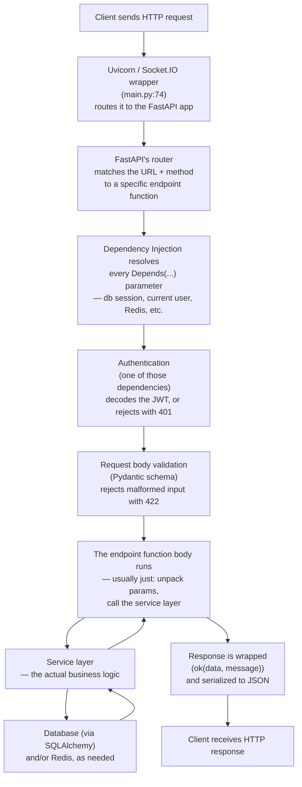

# 07 — Request Lifecycle

[Runtime Architecture](06_Runtime_Architecture.md) explained what's running concurrently. This document zooms into **one single HTTP request** and walks through every layer it passes through, in order, using a real endpoint as the worked example. By the end, you'll recognize this same shape in almost every endpoint in the codebase — once you've seen it once in full detail, the rest of the app becomes much faster to read.

## The layers, in order



## The worked example: `POST /connections/follow/{target_id}`

This is "follow another user" — chosen because it exercises almost every layer in one relatively short trace: authentication, optional request-body validation, service logic, a database write, and a Redis write. (A background-task-driven, real-time-push example is covered separately in [API Flows](08_API_Flows.md) and [Event Flows](20_Event_Flows.md).)

### Layer 1 — Routing

`app/modules/connections/router.py` defines:
```python
connections_router = APIRouter(prefix="/connections", tags=["connections"])

@connections_router.post("/follow/{target_id}", status_code=201)
def follow(
    target_id: UUID,
    payload: FollowCreate | None = None,
    user: CurrentUser = Depends(get_current_user),
    db: Session = Depends(get_db),
    r: redis_lib.Redis = Depends(get_redis),
):
    ...
```
When a request arrives for `POST /connections/follow/c95522c0-...`, FastAPI's router (built up from every `include_router` call back in [Startup Process](05_Startup_Process.md)) matches the path pattern `/connections/follow/{target_id}` and extracts `target_id` from the URL itself, converting it to a Python `UUID` automatically — if the URL segment isn't a valid UUID, FastAPI rejects the request with a `422` error before this function is ever called. This automatic "take the type annotation seriously and validate against it" behavior is one of FastAPI's core features.

### Layer 2 — Dependency Injection

Introduced conceptually in [How the System Works](02_How_the_System_Works.md); here's what it actually does for this specific request. Each `Depends(...)` in the function signature above names a function FastAPI should call *first*, using its return value as that parameter's value:

- `Depends(get_current_user)` → calls `app/dependencies.py`'s `get_current_user`, described in the next layer.
- `Depends(get_db)` → calls `get_db`, also in `app/dependencies.py`:
  ```python
  def get_db():
      db = SessionLocal()
      try:
          yield db
      finally:
          db.close()
  ```
  This is a **generator-based dependency** — FastAPI recognizes the `yield` and knows to run the code after it (`db.close()`) once the request is completely finished, guaranteeing the database session is released even if the endpoint raises an exception. `SessionLocal()` creates one new session, borrowed from the shared connection pool described in [Runtime Architecture](06_Runtime_Architecture.md), for this request only.
- `Depends(get_redis)` → `app/core/redis_client.py`'s `get_redis`, which returns the one shared Redis client (not a new connection per request — Redis clients are designed to be reused).

FastAPI resolves all of these before running the actual `follow` function body.

### Layer 3 — Authentication

`get_current_user` (`app/dependencies.py`) is itself built on another dependency:
```python
oauth2_scheme = OAuth2PasswordBearer(tokenUrl="/auth/token")

def get_current_user(token: str = Depends(oauth2_scheme)) -> CurrentUser:
    claims = decode_access_token(token)
    return CurrentUser(user_id=claims.user_id, profile_id=claims.profile_id)
```
`OAuth2PasswordBearer` is a FastAPI-provided dependency that extracts the raw string after `Authorization: Bearer` in the request's headers — if that header is missing entirely, it raises a `401` automatically, before `get_current_user` even runs. If it's present, `decode_access_token` (`app/core/security/jwt_handler.py`) verifies the token's cryptographic signature and expiry, and pulls the user's identity out of it. **The identity used for the rest of this request comes entirely from this decoded token — never from anything the client put in the URL or request body.** This is a deliberate, audited security property; see [Authentication](14_Authentication.md) and [Authorization](15_Authorization.md) for why that matters and where it's been gotten wrong elsewhere in the app historically.

If the token is valid, `get_current_user` returns a small `CurrentUser` object carrying both the user's permanent identity (`user_id`) and their profile's numeric ID (`profile_id`) — both were embedded directly in the token when it was issued, so this step needs **zero database queries** to answer "who is this?"

### Layer 4 — Request body validation

`payload: FollowCreate | None = None` — the request body (if the client sent one) is validated against the `FollowCreate` Pydantic schema (`app/modules/connections/schemas.py`):
```python
class FollowCreate(BaseModel):
    commodity_ids: list[int] = Field(default_factory=list)
    role_id: int | None = None
```
**Pydantic** is a data-validation library — a class like this one declares exactly what shape of data is acceptable, and FastAPI uses it to parse the incoming JSON body, rejecting anything that doesn't match with a `422 Unprocessable Entity` response, again before the endpoint function's own code runs. Here the whole body is optional (the endpoint works fine with no body at all — the `= None` default), and every field inside it is also optional, because this data is only used as an optional taste signal (see [Recommendation Engine](19_Recommendation_Engine.md)) — following someone works regardless of whether this extra context is supplied.

### Layer 5 — The endpoint function body

By this point, everything FastAPI needed to prepare has been prepared. The actual function body is almost nothing:
```python
result = service.follow_user(
    db, follower_id=user.user_id, following_id=target_id,
    rc=r, actor_profile_id=user.profile_id,
    commodity_ids=payload.commodity_ids if payload else [],
    role_id=payload.role_id if payload else None,
)
return ok(result, "Now following")
```
This is the pattern you'll see in almost every router file in this codebase: **routers are thin.** They don't contain business logic — they gather validated inputs and hand them to the service layer. This is a deliberate separation of concerns, explained fully in [Service Layer](12_Service_Layer.md): it means the actual "what does following someone mean" logic lives in exactly one place, testable independently of any HTTP concerns.

### Layer 6 — The service layer

`app/modules/connections/service.py`'s `follow_user`:
```python
def follow_user(db, follower_id, following_id, *, rc=None, actor_profile_id=None, commodity_ids=None, role_id=None):
    if follower_id == following_id:
        raise HTTPException(status_code=400, detail="Cannot follow yourself.")
    existing = db.query(UserConnection).filter(
        UserConnection.follower_id == follower_id,
        UserConnection.following_id == following_id,
    ).first()
    if existing:
        raise HTTPException(status_code=409, detail="Already following this user.")

    db.add(UserConnection(follower_id=follower_id, following_id=following_id))
    db.query(Profile).filter(Profile.users_id == follower_id).update(
        {"following_count": Profile.following_count + 1}
    )
    db.query(Profile).filter(Profile.users_id == following_id).update(
        {"followers_count": Profile.followers_count + 1}
    )
    db.commit()

    if actor_profile_id is not None:
        write_commodity_signals(rc, actor_profile_id, _MODULE, commodity_ids or [], ActionType.CONNECTION_FOLLOW, role_id)

    return {"status": "following", "following_id": str(following_id)}
```
This is where the actual business rules live: you can't follow yourself, you can't follow the same person twice (both enforced here, in Python, in addition to whatever the database itself would allow), and following someone has *two* durable side effects (creating the follow relationship row, and keeping two denormalized counters — `following_count` on your own profile, `followers_count` on theirs — in sync) plus one *soft* side effect (recording a taste signal — more below).

### Layer 7 — Talking to the database

`db.query(UserConnection).filter(...)` is SQLAlchemy's ORM query syntax — it builds and executes a `SELECT ... FROM user_connections WHERE follower_id = ... AND following_id = ...` behind the scenes. `db.add(...)` stages a new row for insertion. The two `.update({...})` calls are worth noticing specifically: `Profile.following_count + 1` is *not* Python arithmetic on a value already loaded into memory — SQLAlchemy translates this into `UPDATE profile SET following_count = following_count + 1 WHERE ...`, meaning the increment happens **inside the database itself**, atomically, safe even if two requests hit this at the exact same instant. (This atomic-update pattern matters enough that the audit specifically checked whether every counter in the app uses it — some, in other modules, historically didn't. See [Known Limitations](30_Known_Limitations.md).) Nothing is actually written durably until `db.commit()` — everything before that point is buffered in the session, ready to be rolled back if something goes wrong first.

### Layer 8 — Talking to Redis (a "soft" side effect)

`write_commodity_signals(rc, ...)` (`app/modules/taste/amplify.py`) records "this user just followed someone interested in these commodities" as a short-lived signal in Redis, used later to personalize that user's own feeds and recommendations. Two things are worth internalizing about this call, because the same pattern recurs constantly across the codebase: it's **fire-and-forget** — the whole function body is wrapped in a `try/except Exception: pass`, meaning if Redis is down or slow, this silently does nothing rather than failing the follow action itself — and it happens **after** the database commit, not as part of the same transaction, because losing a personalization signal occasionally is an acceptable trade-off, but losing a real follow relationship because a signal write failed would not be. Full detail on this three-layer taste system in [Recommendation Engine](19_Recommendation_Engine.md).

### Layer 9 — The response

Back in the router, `ok(result, "Now following")` (`app/shared/utils/response.py`) wraps the service's raw return value in this app's standard envelope:
```json
{
  "success": true,
  "message": "Now following",
  "data": { "status": "following", "following_id": "c95522c0-..." }
}
```
FastAPI serializes this to JSON automatically and sends it back with the `status_code=201` declared on the route decorator (`201 Created` — the conventional HTTP status for "a new resource was successfully created," here the new follow relationship). If any step along the way raised an `HTTPException` instead (the "can't follow yourself," "already following," or a `401` from a missing/invalid token), FastAPI intercepts that exception and sends the corresponding error status code and detail message instead of ever reaching this line.

## What changes for other endpoints — and what doesn't

Every endpoint in the app follows this same nine-layer shape; what varies is which layers do real work:
- A public, unauthenticated endpoint (e.g. [Deeplink](11_Modules.md)'s share-link generator) skips Layer 3 entirely.
- A `GET` endpoint with no body skips Layer 4.
- Many endpoints skip Layer 8 (no Redis involvement at all).
- Some endpoints add a layer this example didn't need: **`BackgroundTasks`** — a FastAPI-provided mechanism for scheduling a function to run *after* the response has already been sent to the client (used for real-time push notifications over Socket.IO — see [Event Flows](20_Event_Flows.md) and the worked example in [API Flows](08_API_Flows.md)).

Once this shape is second nature, reading any new endpoint in this codebase becomes a matter of spotting which of these nine layers it uses, not re-learning the whole pattern from scratch.

---
**Previous:** [06 — Runtime Architecture](06_Runtime_Architecture.md) · **Next:** [08 — API Flows](08_API_Flows.md)
