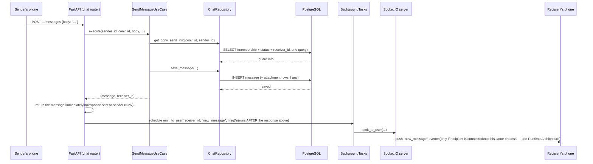
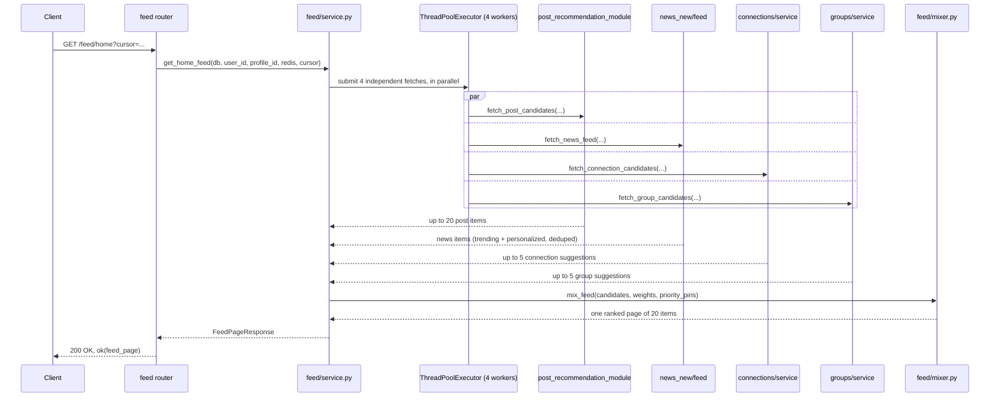
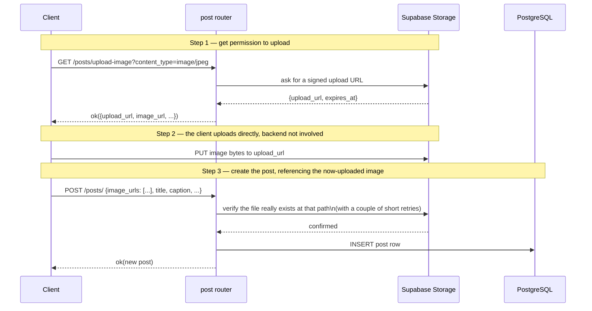
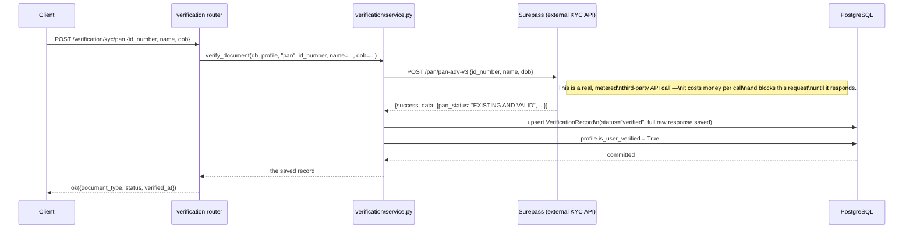

# 08 — API Flows

[Request Lifecycle](07_Request_Lifecycle.md) taught you the nine-layer shape every request follows, using one worked example. This document gives you four more worked examples, each chosen specifically because it exercises a layer or pattern the first example didn't: real-time push via `BackgroundTasks`, fanning a single request out into several parallel sub-requests, a two-step external-file-upload dance, and a request that calls a paid third-party API synchronously.

## Flow 1 — Sending a chat message (real-time push via `BackgroundTasks`)

**Endpoint:** `POST /chat/conversations/{conv_id}/messages` — `app/modules/chat/presentation/router.py`'s `send_message`.

**What's new here compared to Flow 1 in the previous document:** the response is sent to the *sender* as soon as the message is saved to the database — the sender doesn't wait for the recipient to actually receive anything. Delivering the real-time push to the recipient is registered as a `BackgroundTasks` job, which FastAPI guarantees will run *after* the HTTP response has already gone out. This is the right trade-off here: the sender's own experience ("did my message send?") shouldn't depend on whether the recipient happens to be online right now, and the message is durably saved regardless — if the recipient isn't connected, they'll simply see it next time they load their conversation over plain HTTP, no data is lost, only the instant push is skipped.

Code reference: `app/modules/chat/presentation/router.py`'s `send_message` function body ends with `background_tasks.add_task(emit_to_user, receiver_id, "new_message", jsonable_encoder(msg))`. `emit_to_user` (`connection_manager.py`) is a two-line wrapper: `await sio.emit(event, data, room=f"user:{user_id}")` — it relies on Socket.IO's "room" concept, where every connected user's socket automatically joined a room named after their own user ID at connect time (see [Event Flows](20_Event_Flows.md) for the full real-time picture, and [Runtime Architecture](06_Runtime_Architecture.md) for why this only works within one process).

**Important gap this example surfaces, and why it belongs here rather than being papered over:** whether the sender is even *allowed* to send into this conversation (e.g. if the recipient has blocked them) is supposed to be checked inside `SendMessageUseCase`, but the actual check is currently commented out in the code — a confirmed, audited finding (`audit/audit_phase_06.md`, P6-F1). This handbook's job is to describe the system as it actually behaves, and as-built today, this flow succeeds even when it arguably shouldn't. See [Authorization](15_Authorization.md) and [Known Limitations](30_Known_Limitations.md) for the full picture.

## Flow 2 — Loading the Home Feed (fan-out to parallel sub-requests)

**Endpoint:** `GET /feed/home` — `app/modules/feed/router.py`'s `home_feed`, calling `app/modules/feed/service.py`'s `get_home_feed`.

**What's new here:** a single incoming request doesn't just make one trip to the database — `get_home_feed` explicitly runs four independent fetches *in parallel*, each in its own thread, each with its **own** dedicated database session (because, as explained in [Runtime Architecture](06_Runtime_Architecture.md), a single SQLAlchemy session isn't safe to share across threads). This means the whole request's latency is roughly the time of the *slowest* of the four sources, not the sum of all four — a deliberate performance choice, not an accident, and one that's only safe because the app's connection-pool budget was sized with exactly this pattern in mind (again, see [Runtime Architecture](06_Runtime_Architecture.md)). Each of those four fetches is itself a call into a completely different feature module's own recommendation logic — the Home Feed doesn't implement ranking itself, it *borrows* each feature's own recommender and then blends the results. That blending step (`mix_feed`, weighted-random slot assignment with per-content-type caps) is explained in full, with its own diagram, in [Recommendation Engine](19_Recommendation_Engine.md).

## Flow 3 — Creating a post with an image (two requests, one upload)

This flow is unusual in that it deliberately spans **two separate HTTP requests**, plus a third interaction the backend never sees at all — because the actual image bytes never pass through this backend.

**Why it's built this way, not as a single "upload this file" request:** routing potentially large binary file uploads *through* the API server (rather than letting the client talk to object storage directly) would mean this backend's process spends time and memory proxying bytes it doesn't need to touch — a "signed URL" pattern instead lets the client upload directly to Supabase, and the backend's only job is to (a) mint a short-lived permission slip for that specific upload, and (b) later confirm the file genuinely landed where it was supposed to before trusting a URL the client claims points at a real, just-uploaded image. Full explanation, including how this exact two/three-step shape is reused identically by four different features (avatars, posts, group media, chat attachments), in [Image Uploads](21_Image_Uploads.md).

## Flow 4 — Verifying a PAN card (a synchronous call to a paid third-party API)

**Endpoint:** `POST /verification/kyc/pan` — `app/modules/verification/router.py`'s `verify_pan`, calling `app/modules/verification/service.py`'s `verify_document`.

**What's new here:** unlike every previous example, this request's latency is dominated by a network round-trip to a service this app doesn't control, and that call **costs real money per attempt** — there's no caching or batching, every submission is a fresh billed API call. Two things worth knowing that this flow surfaces directly: there's currently no rate limiting on this endpoint (a user, or an attacker, can resubmit repeatedly), and the full raw response from Surepass — which for a PAN check plausibly includes more personal data than just the number itself — is stored in the database as-is, in a plain (unencrypted) column, alongside the submitted document number itself, also stored in plain text. Both of these are confirmed, audited findings, not new observations from this handbook — see `audit/audit_phase_11.md` and [Known Limitations](30_Known_Limitations.md).

---
**Previous:** [07 — Request Lifecycle](07_Request_Lifecycle.md) · **Next:** [09 — Database Guide](09_Database_Guide.md)
