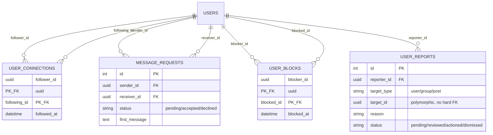
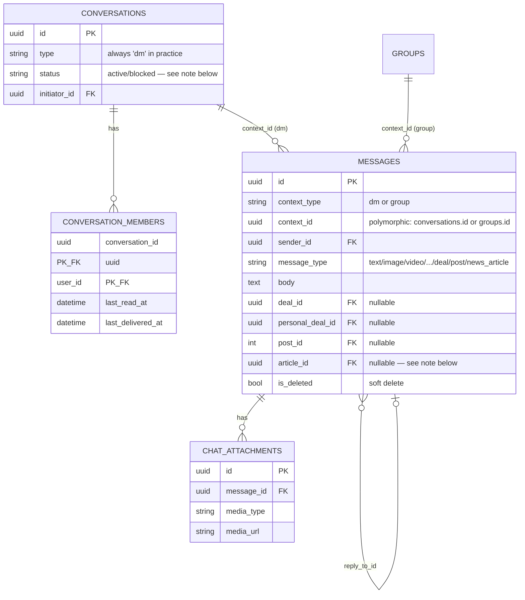
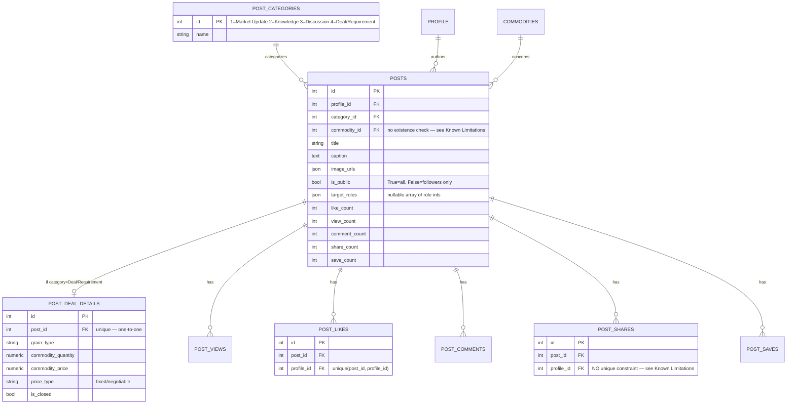
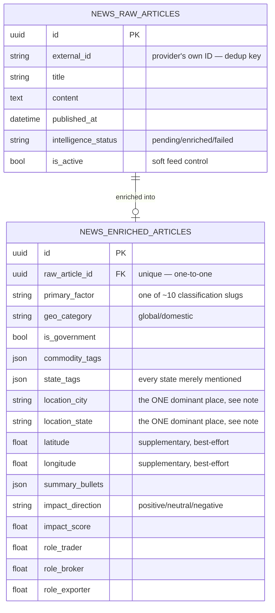

# 09 — Database Guide

This is the complete reference for the application's PostgreSQL schema — every table, grouped by the domain it belongs to, with its purpose, key columns, and relationships. If you just need to know "what's in this table and what points to it," this is the document to search.

## How to read this document

Every table listed here is a real SQLAlchemy model somewhere under `app/modules/*/models.py`, and every one has a corresponding `CREATE TABLE` migration under `alembic/versions/` (this was independently verified table-by-table during the architectural audit — `audit/audit_phase_12.md` — which found zero models without a backing migration). Where a table exists in the *database* but no longer has a matching model in the code, that's called out explicitly in its own section at the end — those are confirmed orphans, not omissions from this document.

Recall from [How the System Works](02_How_the_System_Works.md): SQLAlchemy is the ORM (Object-Relational Mapper) that lets these tables be defined as Python classes, and Alembic is the tool that tracks every schema change as a versioned migration script.

## 1. Identity & Profile

The foundation everything else hangs off of. A **user** is the authentication identity (a phone number); a **profile** is the business identity built during onboarding. They're deliberately separate — see [Feature Guide](10_Feature_Guide.md)'s onboarding section for why a user can briefly exist without a profile.

```mermaid
erDiagram
    USERS ||--o| PROFILE : "has one"
    USERS ||--o{ USER_SESSIONS : "has many"
    USERS ||--o| USER_EMBEDDINGS : "has one"
    PROFILE ||--|| BUSINESS : "has one"
    PROFILE }o--|| ROLES : "belongs to"
    PROFILE ||--o{ PROFILE_COMMODITIES : "via"
    PROFILE ||--o{ PROFILE_INTERESTS : "via"
    PROFILE_COMMODITIES }o--|| COMMODITIES : references
    PROFILE_INTERESTS }o--|| INTERESTS : references
    PROFILE ||--o{ VERIFICATION_RECORDS : "has"

    USERS {
        uuid id PK
        string country_code
        string phone_number
        bool is_active
        string fcm_token
        string access_token "plaintext, see Known Limitations"
    }
    PROFILE {
        int id PK
        uuid users_id FK
        int role_id FK
        string name
        numeric quantity_min
        numeric quantity_max
        bool is_user_verified
        bool is_business_verified
        int followers_count
        int following_count
    }
    BUSINESS {
        int id PK
        int profile_id FK
        string business_name
        string city
        string state
        float latitude
        float longitude
    }
    ROLES {
        int id PK "1=Trader 2=Broker 3=Exporter, fixed seed"
        string name
    }
    COMMODITIES {
        int id PK "1=Rice 2=Cotton 3=Sugar, fixed seed"
        string name
    }
    INTERESTS {
        int id PK "1=Connections 2=Leads 3=News, fixed seed"
        string name
    }
    USER_SESSIONS {
        uuid id PK "also the JWT jti claim"
        uuid user_id FK
        string refresh_token_hash "SHA-256, never plaintext"
        datetime expires_at
        bool is_active
    }
    USER_EMBEDDINGS {
        uuid user_id PK_FK
        vector is_vector "11-dim, pgvector"
        vector post_feed_vector "10-dim, pgvector"
    }
    VERIFICATION_RECORDS {
        int id PK
        int profile_id FK
        string document_type "pan/aadhaar/gst/iec"
        string document_number "plaintext — see Known Limitations"
        string status
        json api_response "full raw provider response"
    }
```

- **`users`** — one row per phone-verified identity. Note: `is_deleted`/`deleted_at` columns existed at one point and were deliberately removed (migration `b4c5d6e7f8a9_remove_soft_delete_from_users.py`) — users are now genuinely deleted (hard-delete), with every dependent row across the whole schema cascading away via `ON DELETE CASCADE` foreign keys. `access_token` stores a Firebase token in plaintext — a known, audited concern (see [Known Limitations](30_Known_Limitations.md)).
- **`profile`** — the business-facing identity: role, name, trade quantity range, verification flags, and denormalized follower/following counts (kept in sync by the [Connections](11_Modules.md) module, not computed on the fly).
- **`business`** — a profile's location and business name; split into its own table (one-to-one with `profile`) rather than columns on `profile` directly — likely because it's conceptually a distinct sub-entity (a profile *has* a business), though this handbook can't verify the original reasoning beyond what the schema itself implies.
- **`roles`, `commodities`, `interests`** — small, fixed lookup tables, seeded with specific integer IDs the application code refers to directly (e.g. `role_id == 1` means Trader in several places) rather than looking the name up dynamically every time.
- **`profile_commodities`, `profile_interests`** — many-to-many junction tables between a profile and its chosen commodities/interests.
- **`user_sessions`** — one row per active login session; the row's own UUID `id` is embedded directly into that session's JWT as the `jti` claim, which is how a specific session can be revoked (logout) without invalidating every other device's session. See [Authentication](14_Authentication.md).
- **`user_embeddings`** — the numeric "vector" representations of a profile used for similarity search (see [Recommendation Engine](19_Recommendation_Engine.md)); one profile has two different vectors for two different purposes (matching to other *people* vs. matching to *posts*).
- **`verification_records`** — one row per document type a profile has attempted to verify, storing the outcome and the full raw response from the external verification provider.

## 2. Social graph — connections, requests, moderation



- **`user_connections`** — the follow graph. One-directional (following someone doesn't imply they follow you back) — this is the table [Feature Guide](10_Feature_Guide.md)'s "Connections" feature is built on.
- **`message_requests`** — the consent gate for starting a direct conversation with someone you don't already have one with. **Important, audited caveat:** a separate, newer code path in the Chat module can create an active conversation without ever creating or resolving a row in this table — meaning this table's consent gate is not the only way a conversation gets created today. See [Authorization](15_Authorization.md) and `audit/audit_phase_06.md` (P6-F2).
- **`user_blocks`** — one row per "A has blocked B" relationship, composite-keyed so a duplicate block is structurally impossible. **Important, audited caveat:** nothing in the current codebase actually reads this table to prevent a blocked user from messaging or being recommended to the blocker — see [Authorization](15_Authorization.md) and `audit/audit_phase_06.md` (P6-F1). The table and the write path work correctly; the *enforcement* elsewhere in the app doesn't consult it.
- **`user_reports`** — moderation reports. `target_id` is intentionally not a hard foreign key, because it can point at a `users`, `groups`, or `posts` row depending on `target_type`, and the target might legitimately be deleted before a moderator reviews the report. **Audited caveat:** reporting a `post` is currently structurally impossible (post IDs are plain integers; this column is typed as UUID), and reporting a `group` goes through a different endpoint that doesn't write to this table at all — see `audit/audit_phase_11.md` (P11-F2) and `audit/audit_phase_05.md` (P5-F1). Only `target_type="user"` is confirmed to work end-to-end.

## 3. Groups

```mermaid
erDiagram
    GROUPS ||--o{ GROUP_MEMBERS : has
    GROUPS ||--o| GROUP_ACTIVITY_CACHE : has
    GROUPS ||--o| GROUP_EMBEDDINGS : has
    GROUPS ||--o{ GROUP_MEDIA : has
    GROUPS ||--o{ GROUP_DEALS : has
    GROUPS ||--o{ GROUP_JOIN_REQUESTS : has
    CONVERSATIONS ||--o{ PERSONAL_DEALS : "deals made in a DM"

    GROUPS {
        uuid id PK
        string name
        json commodity "array of strings"
        json target_roles "array of role ints"
        string accessibility "public/private/invite_only"
        string posting_perm "all_members/admins_only"
        uuid created_by FK
        int member_count
    }
    GROUP_MEMBERS {
        uuid group_id PK_FK
        uuid user_id PK_FK
        string role "admin/member"
        bool is_frozen
        bool is_muted
        bool is_favorite
    }
    GROUP_ACTIVITY_CACHE {
        uuid group_id PK_FK
        int messages_24h
        int active_members_7d
    }
    GROUP_EMBEDDINGS {
        uuid group_id PK_FK
        vector embedding "11-dim, pgvector"
    }
    GROUP_DEALS {
        uuid id PK
        uuid group_id FK
        uuid posted_by FK
        int commodity_id FK
        int post_id FK "nullable — set if promoted to public feed"
    }
    PERSONAL_DEALS {
        uuid id PK
        uuid conversation_id FK
        uuid posted_by FK
        int commodity_id FK
    }
```

- **`groups`** — see [Feature Guide](10_Feature_Guide.md) for the product-level explanation of accessibility levels and posting permissions.
- **`group_members`** — composite-keyed membership row, carrying per-member state (admin/member role, frozen, muted, favorited) that doesn't belong on the `groups` row itself since it's per-person.
- **`group_activity_cache`** — a rolling summary (messages in the last 24h, active members in the last 7 days) used purely to rank group suggestions by "how alive is this community," recomputed periodically rather than calculated live on every request.
- **`group_embeddings`** — the vector used to match a group against a user's profile for suggestions, the group equivalent of `user_embeddings`.
- **`group_media`** — uploaded photos/videos attached to a group (distinct from a group's single cover image, which is just a URL column on `groups` itself).
- **`group_deals`** — a Deal/Requirement listing scoped to a group, optionally promotable to the poster's own public feed (via the nullable `post_id`, which becomes non-null once that happens — see [Feature Guide](10_Feature_Guide.md)).
- **`group_join_requests`** — pending approval requests for private groups, resolved by an admin.
- **`personal_deals`** — the same "deal" concept as `group_deals`, but scoped to a 1:1 direct-message conversation instead of a group. This is a deliberate second table for what's conceptually a very similar entity — see [Known Limitations](30_Known_Limitations.md) for the audit's note on this and `group_deals` not sharing a base table.

## 4. Chat



- **`conversations`** — despite the `type` column suggesting it could represent group chats too, in practice group messages are stored via `messages.context_type = "group"` pointing straight at a `groups.id`, so this table is really DM-specific. `status` is meant to support `"blocked"` as a value, but nothing in the current app ever sets it to that — see the `user_blocks` note above, same underlying gap.
- **`conversation_members`** — per-member read/delivery cursors, which is how the "sent/delivered/read" ticks get computed (by comparing a message's timestamp against the *other* member's cursor — see [Feature Guide](10_Feature_Guide.md)).
- **`messages`** — the single table backing both DM and group messages (`context_type` + `context_id` together say which). It can optionally reference a group deal, a personal deal, a post, or a news article — that's how "share this post into a chat" works, by creating a message row that points at the shared thing rather than copying its content. The `article_id` foreign key exists and is fully supported on the *read* side, but there's currently no way for a client to actually set it when sending a message (a confirmed, audited gap — `audit/audit_phase_06.md`, P6-F3) — so in practice you won't find a message with this column set, even though the column and the code to render one exist.
- **`chat_attachments`** — one row per media file attached to a message (a message can have multiple, e.g. several images in one message).

## 5. Posts



- **`posts`** — the core content table. `commodity_id` and `category_id` are stored as plain integers with no database-level existence check against `commodities`/`post_categories` — contrast this with `profile`'s own commodity/role selection, which *is* validated at the service layer; this inconsistency is an audited finding, see [Known Limitations](30_Known_Limitations.md). `is_public` and `target_roles` exist specifically to restrict visibility, but per the audit are only actually enforced as a real filter in one narrow code path out of several places a post can be read — see [Authorization](15_Authorization.md).
- **`post_deal_details`** — the structured buy/sell fields that only apply to Deal/Requirement posts, split into their own one-to-one table rather than nullable columns on `posts` itself (keeping the base `posts` table's shape uniform regardless of category).
- **`post_views` / `post_likes` / `post_comments` / `post_shares` / `post_saves`** — one table per interaction type, each (except `post_shares`) with a unique constraint preventing the same profile from, say, liking the same post twice. `post_shares` is the one exception — it has no such constraint, meaning the same profile can inflate a post's `share_count` by repeatedly calling the share endpoint, a confirmed audited gap.

## 6. Post recommendation & interaction tracking

```mermaid
erDiagram
    POSTS ||--o| POST_EMBEDDINGS : has
    POSTS ||--o| POPULAR_POSTS : "if currently trending"
    PROFILE ||--o{ SEEN_POSTS : has
    PROFILE ||--o{ POST_INTERACTION_EVENTS : generates
    PROFILE ||--o| USER_TASTE_PROFILES : "legacy store"
    PROFILE ||--o{ USER_POST_TASTE : "active store"

    POST_EMBEDDINGS {
        int post_id PK_FK
        vector vector "10-dim, pgvector"
        string partition "hot/warm/cold — freshness bucket"
        bool is_active
        datetime expires_at
    }
    POPULAR_POSTS {
        int id PK
        int post_id FK "unique"
        float velocity_score
    }
    SEEN_POSTS {
        int id PK
        int profile_id FK
        int post_id FK
        "unique(profile_id, post_id)"
    }
    POST_INTERACTION_EVENTS {
        int id PK
        int profile_id FK
        int post_id FK
        string event_type "impression/dwell/open_.../link_click/revisit"
        int value_ms "dwell duration, nullable"
        datetime processed_at "NULL = not yet processed by the background job"
    }
    USER_TASTE_PROFILES {
        int profile_id PK_FK
        int market_update_count
        int deal_req_count
        "legacy flat counters — write-only, see note"
    }
    USER_POST_TASTE {
        int profile_id PK_part
        string dimension_type PK_part "category/commodity/author"
        string dimension_key PK_part
        float positive_score
        float negative_score
    }
```

- **`post_embeddings`** — one vector per active post, partitioned into `hot`/`warm`/`cold` freshness buckets so the recommendation engine can search the most relevant bucket first. Fully explained in [Recommendation Engine](19_Recommendation_Engine.md).
- **`popular_posts`** — a periodically-recomputed table of currently-trending posts (by a velocity score combining saves/comments/likes against age), used as one ingredient of the blended Following-feed-adjacent "post" pipeline in the Home Feed.
- **`seen_posts`** — tracks which posts a profile has already been shown, so the recommendation feed doesn't repeat itself.
- **`post_interaction_events`** — an append-only log of passive signals (did they linger on this post, did they open the comments) submitted in batches by the client, later processed by a background job into the taste tables below. `processed_at` is the marker that job uses to know what it hasn't handled yet.
- **`user_taste_profiles`** — the original, simpler taste-tracking table (one row per profile, one integer counter per post category). Per its own docstring in the code, it's kept only "for audit" now — but the audit found the Following Feed's ranking *does* still read it directly, making that docstring's claim inaccurate for at least one caller. See [Recommendation Engine](19_Recommendation_Engine.md).
- **`user_post_taste`** — the newer, more granular taste store: one row per (profile, dimension type, dimension key) — e.g. one row for "how much does profile 42 like the 'discussion' category," a separate row for "how much does profile 42 like commodity #1 (rice)." This is the table the main Recommendation Feed actually reads.

## 7. News — ingestion & AI enrichment



- **`news_raw_articles`** — the canonical, provider-agnostic shape every news source gets normalized into on ingestion (see [Feature Guide](10_Feature_Guide.md) and [Recommendation Engine](19_Recommendation_Engine.md) for the ingestion pipeline). `external_id` is how the same article is prevented from being ingested twice.
- **`news_enriched_articles`** — the output of running a raw article through the AI enrichment step: classification, summary, and — notably — `role_trader`/`role_broker`/`role_exporter` are explicitly **computed from a fixed lookup matrix keyed by `primary_factor`, never taken from the AI model's own output**, a deliberate design choice to keep that one scoring dimension deterministic rather than trusting a model that could hallucinate. `location_city`/`location_state` (added after this handbook's underlying audit was completed — verified directly against current code while writing this section) capture the *one* dominant place a story is centered on, extracted by the LLM as plain text, distinct from `state_tags` (every state merely *mentioned*, used for a broader match). These two fields feed directly into the cross-platform taste dimensions described in [Recommendation Engine](19_Recommendation_Engine.md) — `latitude`/`longitude` are supplementary and best-effort, not derived from the city/state text (no reverse-geocoding utility exists anywhere in this codebase).

## 8. News interaction & recommendation tracking

```mermaid
erDiagram
    NEWS_RAW_ARTICLES ||--o| NEWS_ARTICLE_STATS : has
    NEWS_RAW_ARTICLES ||--o{ NEWS_LIKES : has
    NEWS_RAW_ARTICLES ||--o{ NEWS_SAVES : has
    NEWS_RAW_ARTICLES ||--o{ NEWS_SHARES : has
    NEWS_RAW_ARTICLES ||--o{ NEWS_VIEWS : has
    PROFILE ||--o{ USER_NEWS_TASTE : "active-write, dead-read — see note"

    NEWS_ARTICLE_STATS {
        uuid article_id PK_FK
        int like_count "non-atomic updates — see Known Limitations"
        int save_count
        int share_count
        int view_count
    }
    USER_NEWS_TASTE {
        int profile_id PK_part
        string dimension_type PK_part
        string dimension_key PK_part
        float positive_score
    }
```

- **`news_article_stats`** — denormalized counters, one row per article, updated by reading the current value into Python and writing back a new one rather than an atomic in-database increment — the same class of race condition the Post module already fixed for its own counters, independently unfixed here. Audited finding, see [Known Limitations](30_Known_Limitations.md).
- **`news_likes` / `news_saves` / `news_shares` / `news_views`** — one row per interaction, mirroring the Post module's equivalent tables.
- **`news_interaction_events`** — the News equivalent of `post_interaction_events` (not diagrammed separately above, same shape: append-only passive-signal log with a `processed_at` marker).
- **`user_news_taste`** — the News equivalent of `user_post_taste`. Its write side is genuinely used (every like/save/share/view updates it); its *read* side (`get_taste_weights`, which would let this table actually influence the news feed's ranking) has zero callers anywhere in the app — a confirmed orphan-read table, audited finding P10-F2.
- **`news_raw_trending`** (not diagrammed — a small supporting table for the trending-feed velocity calculation) and **`user_news_taste_profiles`** (a legacy counterpart to `user_taste_profiles`, same relationship as that table has to `user_post_taste`) also exist; not detailed further here since neither surfaced anything beyond what's already described for their Post-module counterparts.
- **`news_recommendation_scores`, `news_feed_ranking_cache`** — real tables, created by a real migration, belonging to an entire recommendation-scoring module (`news_recommendation_engine`) that is fully built but has **zero live callers anywhere in the app** — the feed that actually serves news to users computes its own scores a different way and never reads or writes either of these tables. Confirmed audited finding P8-F2. These are **not** the same situation as the "orphan tables" in §10 below (those have no code at all referencing them; these have real, correct code that's simply never invoked).

## 9. Cross-module taste (persistent layer only)

Most of the recommendation "taste" system lives in Redis, not PostgreSQL — see [Recommendation Engine](19_Recommendation_Engine.md) for the full three-layer explanation. Exactly one table represents its slowest, most durable layer:

- **`user_global_taste`** — one row per (profile, dimension type, dimension key), holding taste signal that's been "promoted" from a day's worth of cross-module Redis activity into a slowly-decaying, permanent record. Written to nightly by a background job (see [Background Jobs](18_Background_Jobs.md)), read by every module's recommendation logic as the lowest-influence, most-trustworthy layer of the blend. `dimension_type` was originally `"commodity"` only; as of the current code it also carries `"city"` and `"state"` rows (the Redis layer beneath this table was generalized to handle any dimension type — see [Recommendation Engine](19_Recommendation_Engine.md) for the full, current three-layer design, verified directly against the code as it stands today rather than against this handbook's underlying audit snapshot).

## 10. Orphan tables — exist in the database, no longer have any code

These five tables were created by an early migration for a since-deleted, first-generation version of the News feature (`app/modules/news`, replaced entirely by today's `app/modules/news_new`). Unlike every table above, **no model class anywhere in the current codebase defines these**, and no migration ever dropped them — so on any database that's been migrated forward from the start of this project's history, they still physically exist, taking up storage, permanently unused:

- `news_articles`
- `news_sources`
- `news_engagement`
- `news_trending`
- `user_cluster_taste`

This was independently verified during the architectural audit by cross-referencing every `CREATE TABLE` statement across all 47 migration files against every `__tablename__` in the current codebase — see `audit/audit_phase_12.md` for the full method and evidence. If you're ever exploring the database directly (e.g. with a SQL client) and stumble on one of these five, this is why they're there and why you shouldn't build anything new against them.

---
**Previous:** [08 — API Flows](08_API_Flows.md) · **Next:** [10 — Feature Guide](10_Feature_Guide.md)
