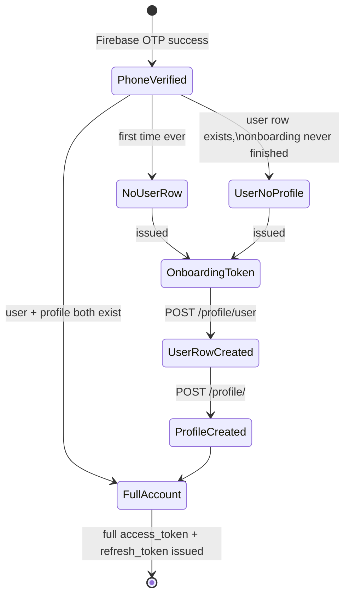
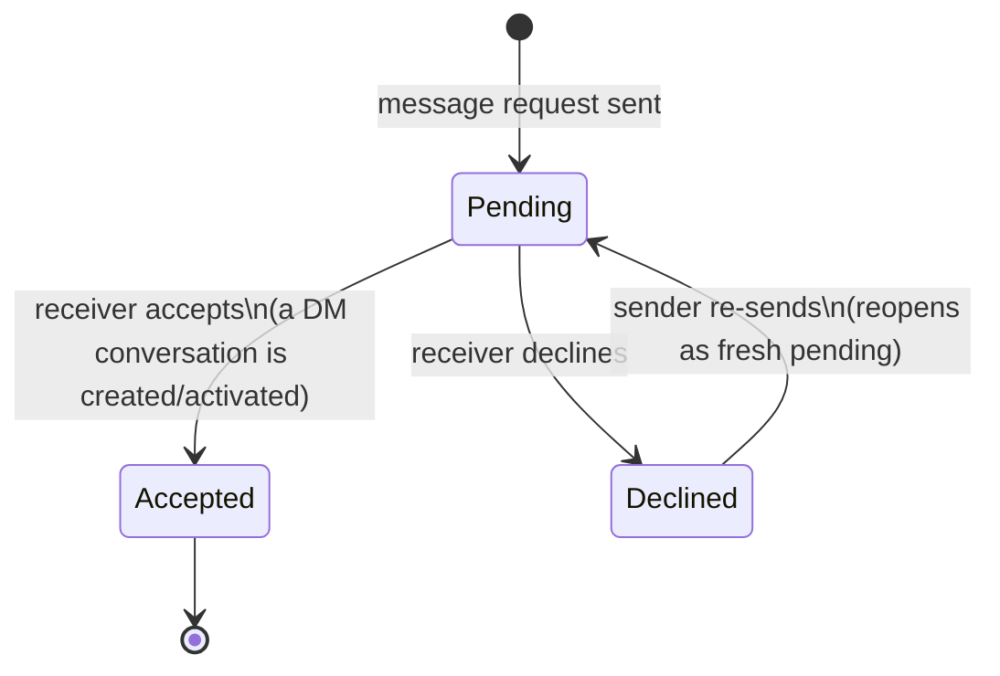
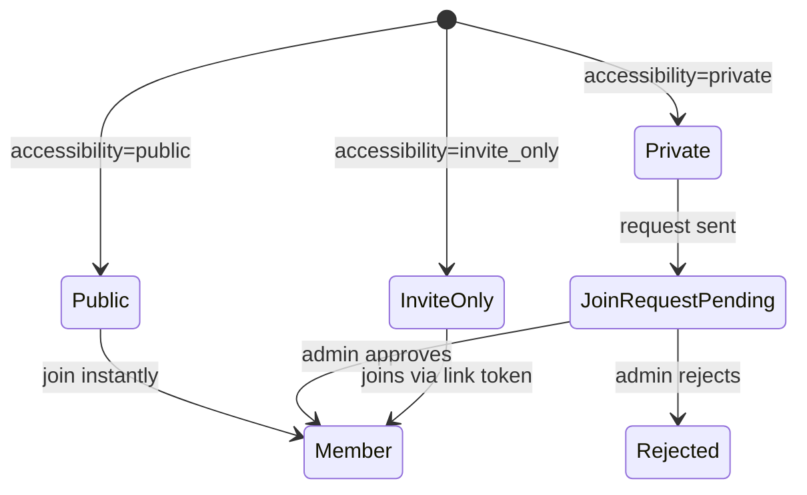
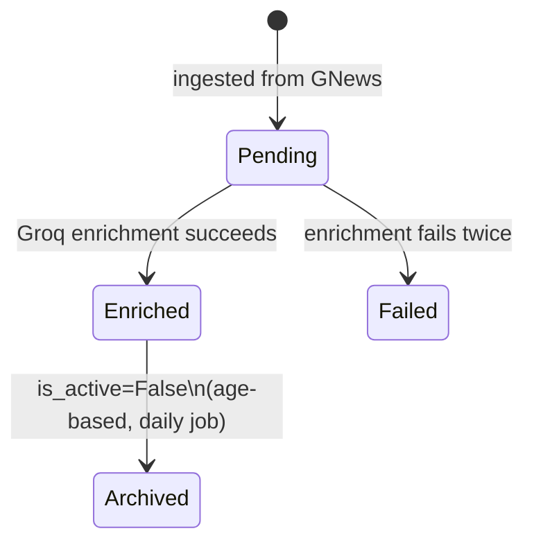

# 10 — Feature Guide

This is the complete, feature-by-feature reverse-engineering of the application. Each feature is documented against the same checklist: purpose, the business problem it solves, what the user actually does, which API endpoints are involved, the full execution path through the code, which services/tables/external systems get touched, validation and error handling, lifecycle/state transitions, and known security/performance considerations. Where a checklist item genuinely doesn't apply to a feature (e.g. a feature with no background jobs), that's stated briefly rather than skipped silently.

This document tells the story **feature-first** ("what happens when a user does X"). Its companion, [Modules](11_Modules.md), tells the story **code-first** ("what is this folder responsible for"). Features here often span more than one code module — that's noted explicitly wherever it happens.

---

## Feature: Onboarding & Authentication

### Purpose and business problem
Prove a user genuinely owns a phone number (without building SMS infrastructure), and collect the minimum business information needed to make every other feature (matching, recommendations, role-based visibility) meaningful, before granting full access to the app.

### User interaction
Enter phone number → receive and enter an OTP → (if new) fill in role, name, commodities, interests, quantity range, business location → land in the app with a full session.

### API endpoints involved
| Method & Path | Purpose |
|---|---|
| `POST /auth/firebase-verify` | Exchange a Firebase-verified ID token for either an onboarding token (new/incomplete user) or a full access+refresh token pair (returning user) |
| `POST /profile/user` | Onboarding step 1 — create the bare `User` row (requires an onboarding token) |
| `POST /profile/` | Onboarding step 2 — create the full `Profile` (requires an onboarding token); issues the first real access+refresh token pair on success |
| `POST /auth/refresh` | Exchange a refresh token for a new access+refresh pair |
| `POST /auth/logout` | Revoke the current session |
| `GET /auth/dev-token` | Local-development-only shortcut — see Security considerations below |

### Execution path
Full detail in [Authentication](14_Authentication.md); summary: the actual OTP send/verify round-trip happens client-side against Firebase directly — this backend never sees the OTP itself, only a signed ID token Firebase issues after the client proves it. `auth/service.py`'s `verify_firebase_token` validates that token server-side. From there, `auth/router.py`'s `firebase_verify` looks up whether a `User` row already exists for that phone number: if not, it issues a 15-minute **onboarding token** (a JWT that can only be used for the two profile-creation endpoints, nothing else); if a full profile already exists, it creates a new `UserSession` row and issues a real access+refresh pair immediately.

### Services / Repositories
`app/modules/auth/service.py` (Firebase verification, session lifecycle), `app/modules/profile/service.py` (`create_user`, `create_profile`). No repository layer — see [Repositories](13_Repositories.md) for why most of this app doesn't have one.

### Database tables
`users`, `user_sessions`, `profile` (and everything `create_profile` touches — see [Database Guide](09_Database_Guide.md) §1).

### Redis usage
None directly in this flow.

### External APIs
**Firebase** (ID token verification). `service_msg91.py` exists as an alternate SMS-OTP implementation but is dead code — confirmed zero callers, and it would crash if ever invoked because it references settings fields that don't exist (`audit/audit_phase_02.md`, P2-F1).

### Storage
None.

### Background jobs
None.

### Validation
Firebase's own token signature/expiry check is the primary gate. `ProfileCreate` (Pydantic schema) validates the shape of onboarding data (role_id, commodity IDs, etc.); the service layer additionally checks `role_id`/`commodity_id`/`interest_id` actually exist in their lookup tables before accepting them — a validation strictness this handbook will note again in the Posts feature below, which does **not** do the equivalent check.

### Error handling
Invalid/expired Firebase tokens → `401`. Duplicate phone number on user creation → `409`. Missing/expired onboarding token on the profile-creation endpoints → `401` (handled by the same JWT-decoding dependency used everywhere else, see [Request Lifecycle](07_Request_Lifecycle.md)).

### Lifecycle / state transitions

### Configuration
`ACCESS_TOKEN_EXPIRE_MINUTES`, `REFRESH_TOKEN_EXPIRE_DAYS` (`app/core/config.py`); `JWT_SECRET_KEY`, `JWT_ALGORITHM` (read via raw environment variables, **not** through the Settings class — see [Configuration](24_Configuration.md)); `GOOGLE_SERVICE_ACCOUNT_JSON` (or the local `service.json` fallback file).

### Security considerations
`GET /auth/dev-token` mints a fully valid access token for any profile matched by name, gated only by a raw `DEBUG` environment variable check — not part of the app's real settings system. The tracked deployment config doesn't set `DEBUG`, so this is dormant today, but it's a real, audited latent risk if that variable is ever set in a live environment (`audit/audit_phase_02.md`, P2-F4). Separately, `POST /auth/firebase-verify` has no rate limiting, despite the app having a working, unused rate limiter sitting right there in `app/core/rate_limiter.py` (P2-F2, P1-F4).

### Performance considerations
Identity checks elsewhere in the app are deliberately cheap: `get_current_user_id`/`get_current_profile_id` decode the JWT and return claims already embedded in it — **zero database queries** to answer "who is making this request," by design (see [Authentication](14_Authentication.md)).

### Future extension points
Aadhaar verification is explicitly stubbed (`501 Not Implemented`) pending a decided API provider — see the Verification feature below.

---

## Feature: Profile Management

### Purpose and business problem
Let a user present themselves professionally, control what others can see, and (via verification badges) signal trustworthiness to people they haven't met.

### User interaction
View your own profile; edit name/business/location/commodities/interests; upload/replace an avatar; view someone else's public profile (with a "follow"/"message" call to action and their recent posts); delete your account entirely.

### API endpoints involved
`GET /profile/me`, `PATCH /profile/`, `PATCH /profile/user/fcm-token`, `GET /profile/avatar-upload-url` + `PATCH /profile/avatar`, `DELETE /profile/` , `DELETE /profile/user`, `GET /profile/{profile_id}`, `GET /profile/by-user/{user_id}` — all in `app/modules/profile/router.py`.

### Execution path
Standard [Request Lifecycle](07_Request_Lifecycle.md) shape throughout. The two "view someone else's profile" endpoints (`get_profile_by_id`, `get_profile_by_user_id`) are worth calling out specifically: they're two separate functions, each resolving a different identifier (numeric profile ID vs. user UUID) but otherwise carrying out an almost identical sequence — load the profile, load a page of their posts, check whether the viewer follows them, check for an existing message request — implemented as two independent, near-duplicate ~80-line blocks rather than one function with two lookup paths (audited, `audit/audit_phase_03.md` P3-F5).

### Services
`app/modules/profile/service.py` — the only service involved.

### Database tables
`users`, `profile`, `business`, `roles`, `commodities`, `interests`, `profile_commodities`, `profile_interests`, `user_embeddings` (rebuilt whenever a profile-editing field that affects it changes), and (read-only, for the public-profile view) `posts`, `user_connections`, `message_requests`.

### Redis usage
None.

### External APIs
None directly (Supabase Storage, used for avatars, is technically external but is treated as this app's storage layer — see below).

### Storage
Avatar upload follows the same signed-URL pattern explained in depth in [Image Uploads](21_Image_Uploads.md): `GET /profile/avatar-upload-url` mints a Supabase upload permission, the client uploads directly, then `PATCH /profile/avatar` confirms the file exists and saves the URL.

### Background jobs
None.

### Validation
`role_id`, `commodities`, `interests` are checked for real existence against their lookup tables before being accepted (`_validate_role`, `_validate_ids` in `profile/service.py`) — notably stricter validation than the Posts feature applies to its own `category_id`/`commodity_id` (see below).

### Error handling
Profile-not-found → `404`. A quantity-range validation bug is worth knowing about here: `update_profile`'s check for "is `quantity_min` greater than `quantity_max`" is written as `if qmin and qmax and ...`, and in Python `0` is a falsy value — so setting `quantity_max` to exactly `0` silently bypasses the check entirely (audited, P3-F2). There's also a bare `assert` statement in `update_profile` guarding an invariant that should really raise the module's own typed "not found" error instead — if it's ever wrong, the client gets an opaque `500` with no explanation rather than a clean `404` (P3-F3).

### Lifecycle / state transitions
A profile's verification flags (`is_user_verified`, `is_business_verified`) only ever flip from `false` to `true`, and only via the Verification feature (below) — there is no "unverify" path anywhere in the app.

### Configuration
Storage bucket name via `DATABASE_STORAGE_BUCKET` (env var, defaulted to `"avatars"` if unset).

### Security considerations
Account deletion (`delete_user`) is a genuine, cascading hard delete (see [Database Guide](09_Database_Guide.md) §1) — there's no recovery window or soft-delete grace period.

### Performance considerations
`_upsert_user_embedding` (rebuilding the recommendation vector) runs synchronously as part of `create_profile`/`update_profile`, and — in `create_profile` specifically — happens in a *second*, separate database commit after the main profile data is already durably saved. If that second step fails for any reason, the profile exists successfully but silently has no recommendation vector, with no error surfaced to the caller (audited, P3-F1).

### Future extension points
None identified in the code (no feature flags, TODOs, or stubbed fields found specifically in this module beyond what's already noted).

---

## Feature: Posts & Feeds

This is the largest single feature area in the app, spanning three code modules: `app/modules/post/` (the posts themselves), `post/post_recommendation_module/` (the personalized recommendation feed), and `post/post_user_interaction/` (passive-signal tracking that feeds the recommendation logic). It also has a fourth consumer: the top-level `app/modules/feed/` Home Feed, which borrows this feature's own recommenders rather than reimplementing them — see [Recommendation Engine](19_Recommendation_Engine.md).

### Purpose and business problem
Give users a place to share market information and structured trade listings, and make sure the *right* content reaches the right people without every user having to manually search for it.

### User interaction
Create a post (four categories: Market Update, Knowledge, Discussion, Deal/Requirement — the last one carries structured price/quantity/grain fields); browse it via My Posts, Following, Saved, or the personalized Recommendation feed; like/comment/save/share; edit or delete your own posts; close a Deal/Requirement once it's no longer available.

### API endpoints involved
| Method & Path | Purpose | Module |
|---|---|---|
| `POST /posts/upload-image`, `POST /posts/` | Create (with the signed-URL image flow) | `post/` |
| `GET /posts/{id}`, `PATCH /posts/{id}`, `DELETE /posts/{id}` | Read/edit/delete one post | `post/` |
| `GET /posts/mine`, `/following`, `/saved` | The three "list" feeds | `post/` |
| `POST /posts/{id}/like`, `/save`, `/close` | Interaction + deal state toggles | `post/` |
| `GET/POST /posts/{id}/comments`, `DELETE .../comments/{id}` | Comments | `post/` |
| `GET /posts/{id}/share`, `POST /posts/{id}/send`, `POST /posts/{id}/record-share` | In-app share (via chat) and external-share tracking | `post/` |
| `GET /posts/recommendation/feed` | The personalized recommendation feed | `post_recommendation_module/` |
| `POST /posts/recommendation/jobs/expiry`, `/jobs/popular-sync` | Manual job triggers — **no authentication at all**, see Security considerations | `post_recommendation_module/` |
| `POST /posts/interactions/batch` | Client-submitted passive signals (impressions, dwell time, etc.) | `post_user_interaction/` |
| `POST /posts/interactions/jobs/taste-update`, `/jobs/ignore-detect` | Manual job triggers — same no-authentication issue | `post_user_interaction/` |

### Execution path
Creating a post (`create_post` in `post/service.py`): verify any attached image URLs genuinely belong to this profile and exist in storage → insert the `Post` row (and `PostDealDetails` if applicable) → attempt to index the post into the recommendation engine (`post_recommendation_module.index_post`) inside a broad `try/except` that silently swallows any failure, so a malformed `category_id` means the post is created successfully but never enters the recommendation pool, with nothing telling anyone that happened (audited, part of the same silent-failure pattern noted repeatedly across this codebase — see [Known Limitations](30_Known_Limitations.md)).

Reading the **Recommendation feed** (`get_recommended_posts`) is the most involved read path in the whole app: build the viewer's "want" vector from their profile → search a hot/warm/cold-partitioned pool of post vectors via pgvector similarity → blend in a freshness boost, an engagement score, category/commodity/author taste weights (persistent + session, see [Recommendation Engine](19_Recommendation_Engine.md)), and a "guaranteed fresh posts" injection pass → apply per-category and per-author diversity caps → return a page. Full diagram and explanation in [Recommendation Engine](19_Recommendation_Engine.md).

### Services
`post/service.py`, `post_recommendation_module/service.py`, `post_user_interaction/service.py` + `taste_service.py`.

### Database tables
`posts`, `post_categories`, `post_deal_details`, `post_views/likes/comments/shares/saves`, `post_embeddings`, `popular_posts`, `seen_posts`, `post_interaction_events`, `user_taste_profiles`, `user_post_taste` — full detail in [Database Guide](09_Database_Guide.md) §5–6.

### Redis usage
Session-scoped taste signals (via `app/modules/taste/amplify.py`) written on every like/save/comment/share, blended into the recommendation feed's ranking. Full detail in [Recommendation Engine](19_Recommendation_Engine.md) and [Redis](17_Redis.md).

### External APIs
None directly.

### Storage
Post images follow the standard signed-URL pattern — [Image Uploads](21_Image_Uploads.md).

### Background jobs
`run_expiry_job` (hourly — moves post embeddings through hot→warm→cold and eventually deletes old ones), `run_popular_posts_sync` (every 15 min — recomputes `popular_posts`), `run_taste_update_job` (every 12 hours — processes the passive-signal backlog), `run_ignore_detection_job` (daily — detects posts a user has seen repeatedly without engaging, and applies a negative taste signal). Full detail in [Background Jobs](18_Background_Jobs.md).

### Validation
`PostCreate`'s `category_id`/`commodity_id` are accepted as plain integers with **no existence check** against their lookup tables — contrast this directly with Profile's stricter equivalent validation described above. A bad `commodity_id` is silently mapped to a default index; a bad `category_id` causes the (swallowed) crash described above.

### Error handling
Not-found → `404`; not-your-post → `403`. Two data-integrity gaps worth knowing: `PostShare` has no uniqueness constraint, so repeatedly calling the share endpoint inflates `share_count` without limit; and `delete_comment`'s counter decrement, while now using an atomic database-level update (unlike some other counters in the app), still has a narrow window where two truly-simultaneous deletes of the same comment could double-decrement the count. Both audited, not newly discovered here.

### Lifecycle / state transitions
A Deal/Requirement post's `is_closed` flag (on `post_deal_details`) toggles between open/closed; closing it also removes it from the recommendation index, reopening it re-indexes it.

### Configuration
Recommendation pool sizing, freshness decay curves, and diversity caps are all named constants in `post_recommendation_module/constants.py`, not environment variables — they're code-level tuning knobs, not deploy-time configuration.

### Security considerations
Post visibility (`is_public`, `target_roles`) is enforced in only one of roughly four places a post can be read — the main recommendation pool query, the direct single-post fetch, and the Following feed all skip this check entirely, and a fully public, unauthenticated endpoint (`GET /share/post/{id}`, in the separate Deeplink module) returns a post's title/caption/image with no visibility check at all. This is a confirmed, audited gap — see [Authorization](15_Authorization.md) and `audit/audit_phase_11.md` (P11-F1). Separately, the four job-trigger endpoints listed in the table above have no authentication dependency whatsoever — not even "any logged-in user" — a confirmed audited gap (`audit/audit_phase_13.md`, P13-F1).

### Performance considerations
The recommendation feed's candidate-pool queries are pgvector ANN (approximate nearest-neighbor) searches, deliberately capped in size to stay under pgvector's HNSW index's default search-width — going over that ceiling silently falls back to a full sequential scan, and this is called out with an explicit comment in the code precisely because it's a non-obvious performance trap.

### Future extension points
The module's own code comments mention a planned "Mechanism 2" (a second-pass, larger ANN pool expansion / "Discover" feature) that isn't built yet, and Popular Posts' currently-hard commodity filter is noted in code as a candidate for a softer, tiered-boost replacement — neither is implemented today.

---

## Feature: Connections

### Purpose and business problem
Let users build a professional network deliberately (search, follow) and passively (recommendations), and gate direct messaging behind a lightweight consent step rather than allowing unsolicited DMs from strangers by default.

### User interaction
Search for other users by name/role/commodity/city; view someone's followers/following; follow/unfollow; get recommended matches; send/withdraw/accept/decline a message request (optionally with a short intro line).

### API endpoints involved
`GET /connections/search`, `/search/suggestions`; `POST/DELETE /connections/follow/{id}`, `GET /connections/follow/status/{id}`; `GET /connections/{user_id}/followers`, `/following` (both public, no auth); `POST/DELETE /connections/message-request/{id}`, `PATCH .../accept`, `.../decline`, `GET /connections/message-requests/received`, `/sent`; `GET /recommendations/`, `POST /recommendations/seen`, `DELETE /recommendations/seen`, `POST /recommendations/search`. All in `app/modules/connections/router.py`.

### Execution path
`follow_user` is the worked example in [Request Lifecycle](07_Request_Lifecycle.md) — read that for the full trace. `get_recommendations` builds the viewer's vector from their profile, runs a pgvector similarity search against every other profile's embedding (excluding people already followed, already messaged, or recently shown — via a Redis "seen set"), and re-ranks the page using the same session-taste blending used across every other recommendation surface in the app (see [Recommendation Engine](19_Recommendation_Engine.md)).

### Services
`app/modules/connections/service.py` — the **only** live implementation. A second, entire parallel implementation of this same feature exists in `connections/routes/` + `connections/db/` (a first-generation prototype using integer IDs and a since-abandoned vector database) but is completely dead code, confirmed by exhaustive cross-reference — `audit/audit_phase_04.md` (P4-F1). If you ever see code under `connections/routes/` or `connections/db/`, it is not part of the running application.

### Database tables
`user_connections`, `message_requests`, plus read access to `profile`/`business`/`commodities` for search and card-building, and `user_embeddings` for recommendations.

### Redis usage
Recommendation "seen" sets (48-hour TTL, so a dismissed suggestion doesn't disappear forever); session-taste signal writes on follow/message/view actions.

### External APIs / Storage
None.

### Background jobs
None specific to this module (recommendation scores are computed live on each request, not precomputed).

### Validation
Can't follow/message yourself (checked explicitly, `400` if attempted).

### Error handling
Already following → `409`. Not following → `404` on unfollow. A duplicate message request in one direction is correctly rejected, but nothing stops the *reverse* direction from also being opened — if A has already messaged B, B can still independently send a brand-new request to A, producing two parallel rows for what's conceptually one relationship (audited, P4-F2).

### Lifecycle / state transitions

### Configuration
Vector-encoding weights (commodity/role/geo boost factors) live in `connections/weights_config.py`, shared with the Groups and Profile modules' own vector-building code.

### Security considerations
None specific beyond what's already covered in [Authorization](15_Authorization.md) — this module's live code path is one of the more thoroughly access-controlled areas of the app (every mutating endpoint correctly derives identity from the JWT, not from any client-supplied ID).

### Performance considerations
`search_users` and `search_suggestions` batch-load every result's follow/message-request status in exactly two queries regardless of page size, rather than one query per result — a pattern this handbook will point out again favorably in [Modules](11_Modules.md), since the same discipline is notably absent in a couple of other places in the app.

### Future extension points
None found beyond the dead prototype noted above (which, being dead, isn't really an "extension point" — see [Known Limitations](30_Known_Limitations.md) for what to do with it).

---

## Feature: Groups

### Purpose and business problem
Give users a way to participate in a topic/region-scoped community rather than only 1:1 relationships, with its own membership rules, chat, and deal-sharing.

### User interaction
Create/join/leave a group; browse suggested groups; for private groups, request to join and wait for admin approval; for invite-only groups, join via a shared link; post a group-scoped deal (optionally also publishing it to your own public feed); admins can add/remove members, freeze a member's posting rights, and change group settings; mute or favorite a group.

### API endpoints involved
21 endpoints under `/api/v1/groups/*` (`app/modules/groups/router.py`) — group CRUD, membership, join requests, invite links, media upload, and deal management (list/get/update/close/publish — but not *create*, see below).

### Execution path
`create_group` creates the `Group` row, adds the creator as an admin `GroupMember`, seeds an empty `GroupActivityCache` row, and builds+stores the group's recommendation vector — all in one transaction. `get_group_suggestions` runs a two-stage pipeline: a pgvector ANN pre-filter capped specifically at 35 candidates (a value chosen, per an explicit code comment, to stay under pgvector's HNSW search-width default — the same non-obvious trap noted in the Posts feature), then a weighted blend of semantic similarity (75%) and the group's recent-activity score (25%).

### Services
`app/modules/groups/service.py`.

### Database tables
`groups`, `group_members`, `group_activity_cache`, `group_embeddings`, `group_media`, `group_deals`, `group_join_requests`. See [Database Guide](09_Database_Guide.md) §3.

### Redis usage
Session-taste signal writes on join/view actions, same mechanism as Connections and Posts.

### External APIs
None.

### Storage
Group cover image and group media (photos/videos) both use the signed-URL pattern — [Image Uploads](21_Image_Uploads.md).

### Background jobs
None specific to this module — `group_activity_cache` is described in comments as intended to be periodically refreshed, but this handbook could not find a scheduled job anywhere that actually updates it; **not verified from the current implementation** whether it's updated some other way or simply goes stale. Worth checking directly if you're relying on it being fresh.

### Validation
Deal creation checks the group's posting permission (`admins_only` vs. `all_members`) and whether the poster has been frozen.

### Error handling
Not a member → `403` on member-only actions; not an admin → `403` on admin-only actions; already a member → `409` on duplicate join.

### Lifecycle / state transitions

### Configuration
None beyond the shared vector-encoding weights already mentioned under Connections.

### Security considerations
`POST /api/v1/groups/{id}/report` looks like it submits a moderation report, but it doesn't write to the moderation `user_reports` table (or call the Safety module at all) — it validates the group exists and returns a hand-built "submitted" response with no persistence behind it. A user who reports a group via this endpoint gets a success message, and nothing happens. Confirmed, audited (`audit/audit_phase_05.md`, P5-F1) — see [Authorization](15_Authorization.md) and [Known Limitations](30_Known_Limitations.md).

### Performance considerations
`list_groups`'s membership-status lookup is explicitly batched into one query for the whole page — a code comment notes this replaced an earlier per-row loop, i.e. this was a deliberate fix at some point, not an accident of the original design.

### Future extension points
Group deal *creation* (as opposed to every other deal operation) is only reachable through the **Chat** module's router (`POST /chat/groups/{group_id}/deals`), not through this module's own router — an architectural inconsistency the audit flagged (`audit/audit_phase_06.md`, P6-F7) as worth fixing by adding the equivalent endpoint here, likely as a thin alias, rather than a "future feature" per se — mentioned here because it's the kind of gap you'd otherwise reasonably assume was just an oversight in this document.

---

## Feature: Chat

### Purpose and business problem
Let two users (or a group's members) actually converse, with the real-time responsiveness users expect from a modern messaging product, plus the ability to share structured content (deals, posts, articles) directly into a conversation.

### User interaction
Open or continue a DM; send text/image/video/document/audio/location messages; see delivery and read ticks; reply to a specific message; delete your own sent message; participate in group chat (subject to the group's own permission rules); create a "personal deal" inside a DM; see who's currently online; a unified inbox mixing DMs and groups by recency.

### API endpoints involved
15 endpoints under `/chat/*` (`app/modules/chat/presentation/router.py`) plus the Socket.IO real-time layer (not a REST endpoint at all — see [Event Flows](20_Event_Flows.md)).

### Execution path
The full worked example (`send_message`) is in [API Flows](08_API_Flows.md) Flow 1. Opening a DM (`get_or_create_dm`) either finds an existing conversation between the two users or creates a new one with status `"active"` immediately — notably, **without** requiring a `MessageRequest` (the Connections feature's consent mechanism, described above) to exist or be accepted first. This means there are, today, two different ways a DM conversation comes into existence, with different rules, and the one reachable directly from this module's own `POST /chat/conversations` endpoint bypasses the other feature's consent gate entirely. Confirmed, audited (`audit/audit_phase_06.md`, P6-F2) — see [Authorization](15_Authorization.md).

### Services / architecture note
Chat is one of the two modules in this codebase built with a fully layered "clean architecture" (separate `domain/`, `application`... effectively `use_cases.py`, `data/`, `presentation/` folders) rather than the simpler flat `router.py`/`service.py`/`models.py` shape most other modules use — see [Modules](11_Modules.md) and [Service Layer](12_Service_Layer.md) for what that means concretely. `ChatRepository` (`data/repository.py`) is a genuine, real repository-pattern class — the only fully-realized one in the app alongside Taste's — see [Repositories](13_Repositories.md).

### Database tables
`conversations`, `conversation_members`, `messages`, `chat_attachments`. See [Database Guide](09_Database_Guide.md) §4.

### Redis usage
None for message persistence — Redis's role here is purely presence (`is_online`, via Socket.IO's own room-membership tracking, not a separate Redis write).

### External APIs
None.

### Storage
Chat attachments use the signed-URL pattern, with a broader set of allowed file types (video, audio, PDF documents) than any other feature's upload flow — [Image Uploads](21_Image_Uploads.md).

### Background jobs
None.

### Validation
Group-chat sending re-checks the group's posting permission and the sender's frozen status on every message, not just at group-join time.

### Error handling
Not a conversation member → `403`/`404` depending on the specific check. Message-not-found-or-not-yours → `404` on delete.

### Lifecycle / state transitions
A message's `is_deleted` flag is a soft delete — the row stays in the database (so counts and ordering elsewhere stay consistent) but the client renders it as removed. Delivery/read state is tracked per-member via cursor timestamps (`conversation_members.last_delivered_at`/`last_read_at`), compared against a message's `sent_at` to derive its tick state — there's no separate "receipt" row per message.

### Configuration
None beyond the storage bucket name.

### Security considerations
The single most significant finding of the entire prior audit lives here: the code that's supposed to refuse sending a message into a `"blocked"` conversation is **present in the code but commented out** (`chat/domain/use_cases.py`'s `SendMessageUseCase`), and separately, nothing anywhere in the app ever actually sets a conversation's status to `"blocked"` in the first place — the Safety module's `block_user` only writes to an entirely separate table. The net effect: blocking someone does not stop them from messaging you, despite the shipped product description saying it does. This is covered in complete depth, deliberately, in [Authorization](15_Authorization.md) rather than summarized further here — treat that as required reading before touching anything block-related in this module. (Audited: `audit/audit_phase_06.md`, P6-F1 — the audit's own top finding.)

Separately, `connection_manager.py`'s real-time layer is explicitly single-process-only by design (self-documented in its own module docstring) — see [Runtime Architecture](06_Runtime_Architecture.md).

### Performance considerations
Every list-building function in `ChatRepository` (conversation lists, message pages, the unified inbox) is written with explicit batch queries and an accompanying comment noting the specific N+1 pattern it's avoiding — this module has the most consistent query-batching discipline in the codebase, verified during the audit and worth treating as the example to imitate elsewhere.

### Future extension points
`Message.article_id` (sharing a news article into chat) is fully supported on the read/render side but has no way to be set from the write side today (no request field, no use-case parameter) — a genuinely half-built feature, not a bug, per the audit (P6-F3).

---

## Feature: News

### Purpose and business problem
Give traders/brokers/exporters a curated, pre-digested stream of relevant agricultural/trade news, instead of expecting them to separately follow general news sources and manually judge relevance to their specific commodity/role/region.

### User interaction
Browse a personalized recommended feed, a trending feed, filtered feeds (global/domestic/government), and saved articles; like/save/comment/share an article; share an article into a chat.

### API endpoints involved
Ingestion/admin: `POST /news/admin/ingest`, `/enrich`, `GET /news/admin/stats` (all under `app/modules/news_new/ingestion/router.py` — see Security considerations). Feed reading: `GET /news/feed`, `/news/trending`, `/news/saved`, filtered variants, article detail (`news_new/feed/`, not diagrammed with its own router file name since it's the module aggregator — see [Modules](11_Modules.md)). Interaction: `POST /news/interactions/batch`, `/like/{id}`, `/save/{id}`, `/share/{id}`, `/send/{id}` (`news_new/news_user_interaction/router.py`).

### Execution path
**Ingestion** (`ingest_rotation`, run on a schedule): fetch a rotating batch of pre-defined search queries against GNews → normalize each result into the canonical `RawArticle` shape → skip anything already ingested (deduplicated by the provider's own article ID) → insert new rows as `status=pending`. **Enrichment** (`enrich_pending`): pull the oldest pending articles → for each, build a prompt from its title/description/content → call Groq (an LLM provider) → validate the model's JSON response against a strict schema, retrying once on failure → compute the deterministic role-relevance scores from a fixed matrix (never trusting the LLM for that specific number) → save as `EnrichedArticle` and flip the raw article's status. **Serving the feed** (`get_recommended_feed`): pull a time-bucketed pool of recently-enriched, active articles → score each by role-relevance (read straight off the enriched row) multiplied by a profile-commodity/state match boost → apply the same session-taste blending used everywhere else in the app → sort and paginate.

### Services
`news_new/ingestion/service.py`, `intelligence/service.py`, `feed/service.py` (the one that actually serves users), `news_user_interaction/service.py` + `taste_service.py`.

### Database tables
`news_raw_articles`, `news_enriched_articles`, `news_article_stats`, `news_likes/saves/shares/views`, `news_interaction_events`, `user_news_taste`. See [Database Guide](09_Database_Guide.md) §7–8.

### Redis usage
Session-taste signals (commodity + location dimensions), same shared mechanism as every other recommendation surface.

### External APIs
**GNews** (article source), **Groq** (LLM enrichment) — both real, metered third-party services.

### Storage
None directly (article images are hosted by the original news source, not re-uploaded to this app's storage).

### Background jobs
`run_news_pipeline` (every 30 minutes — ingestion then enrichment, each step independently error-isolated so a GNews outage doesn't stop enrichment of the existing backlog), `archive_old_articles` (daily). See [Background Jobs](18_Background_Jobs.md).

### Validation
Enrichment output is validated against a strict Pydantic schema (`LLMEnrichment`) with one automatic retry on a bad/unparseable model response before giving up and marking the article `failed` rather than saving a partial or malformed result.

### Error handling
A persistently-bad enrichment marks the article `failed` (excluded from feeds) rather than blocking the rest of the batch.

### Lifecycle / state transitions

### Configuration
`GNEWS_API_KEY`, `GROQ_API_KEY`; enrichment pacing (`ENRICH_ARTICLES_PER_MIN`), ingestion query rotation size, and category/status constants all live in `news_new/config.py` as code-level constants rather than environment variables.

### Security considerations
The three `/news/admin/*` endpoints require *a* valid login token, but nothing checks that the logged-in user is any kind of administrator — because **no administrator/role-permission concept exists anywhere in this codebase** (the `Role` table is Trader/Broker/Exporter, a business concept, not a privilege level). Any regular user can trigger a real, metered GNews fetch or a batch of real, metered Groq calls on demand. Confirmed, audited (`audit/audit_phase_08.md`, P8-F1) — see [Authorization](15_Authorization.md).

### Performance considerations
Both the GNews inter-query pacing and Groq's own rate-limiter use a genuine, synchronous `time.sleep()` inside the scheduled job — meaning the job occupies one of the scheduler's worker threads for its entire, potentially multi-minute duration. This is the same architectural pattern a prior, separate audit of an earlier version of this feature had already flagged before this app's news pipeline was rewritten — and it was reintroduced, not fixed, in the rewrite. Confirmed, audited (`audit/audit_phase_08.md`, P8-F4).

### Future extension points
An entire, separately-built recommendation-scoring module (`news_recommendation_engine/`, with its own two database tables for persisted scores and a feed-ranking cache) exists, fully implemented, and is **never called by anything** — the feed that actually serves users computes its scores a different, simpler way inline instead. This reads as an abandoned "next iteration" rather than a currently-active extension point — see [Recommendation Engine](19_Recommendation_Engine.md) and `audit/audit_phase_08.md` (P8-F2) for the full story, and a decision point (finish wiring it in, or delete it) rather than something safe to build further on as-is.

---

## Feature: Verification (KYC / KYB)

### Purpose and business problem
Let counterparties trust each other's identity and business legitimacy on a platform where high-value trade deals are being discussed with people you've often never met in person.

### User interaction
Submit a PAN number (+ name, date of birth) for identity verification; submit a GST or IEC number (depending on role) for business verification, only available after identity verification succeeds; check current verification status.

### API endpoints involved
`POST /verification/kyc/pan`, `POST /verification/kyc/aadhaar` (stubbed, `501`), `POST /verification/kyb/gst`, `POST /verification/kyb/iec`, `GET /verification/status` — all in `app/modules/verification/router.py`.

### Execution path
Full worked example (PAN verification) in [API Flows](08_API_Flows.md) Flow 4. In summary: check the business rule (GST/IEC verification requires identity verification to already have succeeded, and the specific document required depends on the user's role) → call the appropriate Surepass endpoint → interpret its response → upsert a `VerificationRecord` with the full outcome → on success, flip the corresponding `profile` verification flag.

### Services
`app/modules/verification/service.py`.

### Database tables
`verification_records`, and it updates `profile.is_user_verified`/`is_business_verified`.

### Redis usage
None.

### External APIs
**Surepass** — a real, metered, third-party KYC/KYB data provider.

### Storage
None.

### Background jobs
None.

### Validation
Role-appropriate document type is enforced server-side (a Trader/Broker submitting an IEC, or an Exporter submitting a GST, is rejected with a clear message naming the expected document type for their role).

### Error handling
A failed verification (bad number, provider says invalid/inactive) is saved as its own record with `status="error"` and a message — not silently discarded, and not treated as a server error either (`400`, with the reason).

### Lifecycle / state transitions
One `VerificationRecord` per document type per profile (enforced by a unique constraint) — resubmitting the same document type updates that same row in place rather than accumulating a history of attempts.

### Configuration
`SUREPASS_BASE_URL`, `SUREPASS_TOKEN` — read via raw environment variables, not through the app's Settings class (see [Configuration](24_Configuration.md) for why this pattern recurring across several modules is worth knowing about).

### Security considerations
The document number itself, and the **entire raw response** from Surepass (which, for identity documents, plausibly contains more personal data than just the number), are both stored in plain, unencrypted database columns. This is a real, audited data-sensitivity concern for a feature that specifically handles government identity documents — see [Known Limitations](30_Known_Limitations.md) and `audit/audit_phase_11.md`. There's also no rate limiting on these endpoints, the same missing-rate-limiting pattern noted for Authentication above — and here it has a direct cost dimension, since every submission is a billed third-party API call.

### Performance considerations
Each verification call is a synchronous network round-trip to Surepass — the request genuinely waits on that external service; there's no async queueing or webhook-based async verification flow.

### Future extension points
Aadhaar verification is explicitly, deliberately stubbed pending a decided API provider (`_verify_aadhaar` raises `NotImplementedError` directly, and the endpoint returns a clear `501` rather than pretending to work) — this is the one place in the app where an unfinished feature is honestly self-declared as unfinished, worth noting as a contrast to some of the silent gaps found elsewhere.

---

## Feature: Safety (Block & Report)

### Purpose and business problem
Give users a way to protect themselves from unwanted contact and flag problematic content/users for moderation.

### User interaction
Block/unblock another user; view your block list; report a user, group, or post with a reason and optional description; view your own submitted reports.

### API endpoints involved
`POST/DELETE /safety/block/{id}`, `GET /safety/blocked`, `GET /safety/block/status/{id}`, `POST /safety/report`, `GET /safety/reports` — `app/modules/safety/router.py`.

### Execution path
Straightforward CRUD against two tables — no complex pipeline. `either_blocked(db, a, b)` is specifically built and exposed as a reusable helper explicitly intended for other modules to call before allowing a DM or showing recommended content — its own docstring says so directly.

### Services
`app/modules/safety/service.py`.

### Database tables
`user_blocks`, `user_reports`.

### Redis usage / External APIs / Storage / Background jobs
None.

### Validation
Can't block or report yourself (`400`). A duplicate block or a duplicate report against the same target by the same reporter is rejected (`409`).

### Error handling
Block-not-found → `404` on unblock.

### Lifecycle / state transitions
A report moves `pending → reviewed → actioned` or `pending → reviewed → dismissed` conceptually (the `status` column supports this), but **no code anywhere in this repository ever transitions a report out of `pending`** — there is no moderator-facing endpoint or admin tool found that reviews, actions, or dismisses a report. Every report ever created stays `pending` forever from the system's own perspective. **Not verified from the current implementation** whether such a review process exists as a separate internal tool outside this codebase — only that nothing in this repository provides it.

### Configuration
None.

### Security considerations
This is the feature with the largest gap between what it promises and what it does. `is_blocked`/`either_blocked` — the two functions this module specifically built for other features to call — have **zero callers anywhere in the app**. Blocking someone changes nothing about what they can do to you: they can still message you (see Chat, above), still see your public content, and still be recommended to you. This module's own `router.py`/`service.py` work correctly for what they directly do (creating/removing a block record); the gap is entirely on the *consuming* side, in every other feature that should be checking this and isn't. Fully covered in [Authorization](15_Authorization.md); this is the audit's single most significant finding (`audit/audit_phase_06.md`, P6-F1).

### Performance considerations
None notable — this is a low-traffic, low-complexity feature.

### Future extension points
A moderator review interface for the report queue is the most obvious missing piece, per the lifecycle note above — **not verified** whether this was planned and just not built yet, or handled entirely outside this codebase.

---

## Feature: External Sharing (Deep Links)

### Purpose and business problem
Let a user share a post, news article, or profile to someone outside the app (WhatsApp, SMS, etc.) with a link that opens the app directly to that content if installed, plus sensible fallback text if not.

### User interaction
Tap "Share" on a post/article/profile outside of the in-app chat-sharing flow; get a deep link (`vanijyaa://...`) and ready-made share text.

### API endpoints involved
`GET /share/post/{id}`, `GET /share/news/{id}`, `GET /share/user/{id}` — `app/modules/deeplink/router.py`. **All three are public — no authentication dependency at all.**

### Execution path
Look up the target row → build a `vanijyaa://` deep link + human-readable share text (truncating long captions/descriptions) → return it. No side effects, no state change.

### Services
`app/modules/deeplink/service.py`.

### Database tables
Read-only access to `posts`, `news_raw_articles`, `profile`.

### Redis usage / External APIs / Storage / Background jobs
None.

### Validation
A malformed article UUID is caught and turned into a clean "not found" rather than a raw parsing error.

### Error handling
Target not found → `404`.

### Lifecycle / state transitions
None — this is a pure read/format operation.

### Configuration
`PLAY_STORE_URL`, `APP_SCHEME` — hardcoded constants in `deeplink/service.py`.

### Security considerations
Because these endpoints are intentionally public (a link needs to work for someone who hasn't opened the app yet), **none of them check a post's `is_public`/`target_roles` visibility settings** before returning its title/caption/image. A post explicitly marked "followers only" is still fully readable through this endpoint by anyone with (or able to guess — post IDs are small sequential integers) its numeric ID. This is the same underlying gap noted in the Posts feature above, just reachable here with zero login required at all. Confirmed, audited (`audit/audit_phase_11.md`, P11-F1).

### Performance considerations
None notable.

### Future extension points
None identified.

---
**Previous:** [09 — Database Guide](09_Database_Guide.md) · **Next:** [11 — Modules](11_Modules.md)
