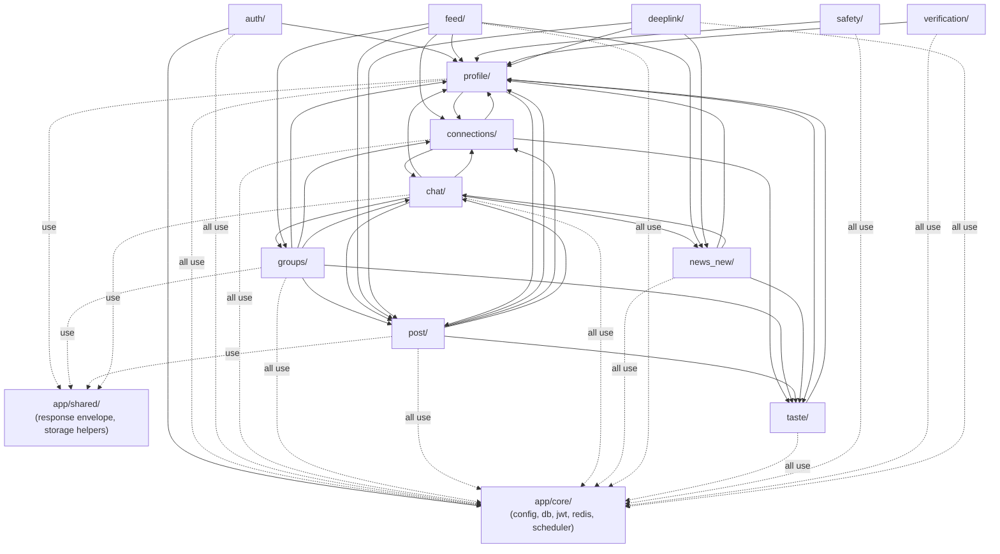
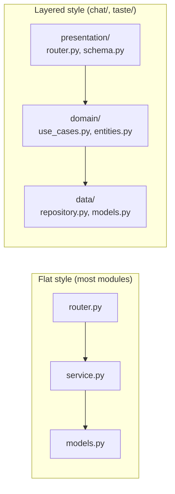

# 11 — Modules

[Feature Guide](10_Feature_Guide.md) told the story feature-first. This document tells it **code-first**: for every folder under `app/modules/` (plus `app/core/` and `app/shared/` as the two supporting, non-feature packages), what it's responsible for, what its public interface looks like, and — the part that's genuinely new information here — **who actually imports from whom**, verified directly from the import statements in the code, not inferred from feature descriptions.

## The whole-app dependency graph

This is the single most useful diagram in this handbook for understanding "if I change this module, what else might break?" An arrow means "the module at the tail imports something from the module at the head."

**What this graph tells you, at a glance:**
- **`app/core/`** is a true foundation — everything depends on it, it depends on nothing feature-specific. This is exactly the property [Repository Tour](03_Repository_Tour.md) said `app/core/` should have.
- **`profile/`** is the most-depended-upon feature module — almost everything needs to know who a user is at a business level. It also, notably, depends *back* on a few things it's depended upon by (`connections/`, `post/`, `taste/`) — for building a public profile view (needs `connections/`'s follow-status and `post/`'s post cards) and for its recommendation vector (needs `taste/`-adjacent encoding helpers). This isn't a circular *import* problem in the strict Python sense (imports are function-local in some of these spots specifically to avoid that — see below), but it is a two-way dependency relationship worth knowing about before you assume `profile/` is a safe, no-side-effects leaf module to change casually.
- **`taste/`** is the one module deliberately designed to depend on nothing feature-specific except a narrow reach into `profile/` (for the commodity name→ID lookup) — every recommendation-adjacent module (`connections/`, `groups/`, `post/`, `news_new/`) depends on it, never the other way around. This is a correct, load-bearing property of the design, not a coincidence — see [Recommendation Engine](19_Recommendation_Engine.md).
- **`chat/`** and **`groups/`** are the two biggest "hub" consumers — each reaches into several other feature modules directly (`chat/` into `groups/`, `post/`, `news_new/`, `connections/`; `groups/` into `post/` and `chat/`). This is a natural consequence of both being genuinely cross-cutting concepts (you can chat *about* a post, a deal, a news article; a group can *have* deals that become posts) rather than a sign of poor boundaries — but it does mean changes to `post/models.py` or `news_new`'s article shape have a wider blast radius than you might expect from a module named just "post" or "news."
- **`feed/`** deliberately calls into every content-producing module's own recommender rather than reimplementing ranking itself — see [Feature Guide](10_Feature_Guide.md)'s Home Feed section and [Recommendation Engine](19_Recommendation_Engine.md).

**A specific, deliberate pattern worth naming:** several of the cross-module calls above (`connections/service.py` reaching into `chat/`, `groups/service.py` reaching into `post_recommendation_module`) are written as **local imports inside a function body**, not top-of-file imports — e.g. `connections/service.py`'s `respond_to_request` does `from app.modules.chat.presentation.connection_manager import emit_to_user` *inside* the function, with a comment explaining why: *"keeps the chat-module dependency contained (avoids an import cycle)."* This is a real, intentional technique for breaking what would otherwise be a circular import (`chat` needs `connections`-adjacent things too, in other spots) — worth recognizing this pattern for what it is if you see it, rather than assuming it's accidental or sloppy.

## Two architectural styles coexist — flat vs. layered

Most modules use a **flat** shape: `router.py`, `service.py`, `models.py`, `schemas.py`, all siblings in one folder. Two modules — **`chat/`** and **`taste/`** — use a **layered** ("clean architecture"-influenced) shape instead:

The layered style adds one real structural rule the flat style doesn't enforce: the `domain/` layer (business rules, pure Python dataclasses) is written to not import anything from `data/` directly — it depends on an *interface*, and the concrete database-backed implementation is handed to it (this is [dependency injection](02_How_the_System_Works.md) again, applied to whole classes rather than individual function parameters — see [Repositories](13_Repositories.md) for exactly how this works and why it's a genuine repository pattern here, unlike everywhere else in the app). **This handbook cannot verify why only these two modules use this style** while eleven others don't — the most plausible read of the git history (per the prior audit) is that it reflects a later stage of the project adopting a more deliberate structure, rather than a documented team decision to use it selectively. Don't assume there's a rule about *when* to use which style beyond "these two modules happen to."

---

## `app/core/` — shared infrastructure

**Why it exists:** every feature module needs a database session, a way to check who's logged in, and a Redis connection. Putting these in one place means there's exactly one implementation of each, not thirteen.

**Responsibilities:** settings/config (`config.py`), the SQLAlchemy engine and session factory (`database/`), JWT creation/validation (`security/jwt_handler.py`), the shared Redis client (`redis_client.py`), a rate limiter (`rate_limiter.py`), background job registration (`scheduler.py`), and Sentry setup (`monitoring.py`).

**Public interface:** `get_db` (via `app/dependencies.py`, which itself lives one level above `core/` — see note below), `settings`, `create_access_token`/`decode_access_token`, `get_redis`, `rate_limiter`, `scheduler.start`/`.stop`, `init_sentry`/`install_module_tag_middleware`.

**Who calls it:** every single module in the app, directly or indirectly.
**Who it calls:** nothing feature-specific — by design, this is the one module allowed to have zero outbound dependencies on `app/modules/*`.

**A note on `app/dependencies.py`:** this file lives at `app/dependencies.py`, one level above `app/core/`, not inside it — it's the FastAPI-specific dependency-injection glue (`get_db`, `get_current_user`, etc.) that every router imports, built *on top of* `app/core/`'s lower-level pieces (the JWT decoder, the session factory). Structurally it plays the same "everyone depends on this" role as `app/core/` itself.

**Failure scenarios:** if `app/core/config.py`'s required environment variables are missing, the app fails at import time (before serving anything) — see [Configuration](24_Configuration.md) and [Startup Process](05_Startup_Process.md).

---

## `app/shared/` — small, generic utilities

**Why it exists:** two pieces of logic (the response envelope, and Supabase Storage helpers) are genuinely generic and used by multiple *unrelated* feature modules — small enough that they don't deserve their own top-level package, but shared enough that duplicating them per-module would be worse than one small shared home.

**Public interface:** `ok(data, message)`; `generate_signed_upload_url`, `object_exists`, `delete_object`, `path_from_url`, `public_url`, `ext_for`, `ALLOWED_IMAGE_TYPES`.

**Who calls it:** `profile/`, `groups/`, `post/`, `chat/` all use `storage.py`. Eleven of thirteen router modules use `response.py`'s `ok()` — Chat and Safety are the two exceptions, which don't use it at all (see [Known Limitations](30_Known_Limitations.md)).

**Failure scenarios:** `storage.py` constructs its Supabase client at *import time* using a hard dictionary-style environment-variable lookup (`os.environ["DATABASE_STORAGE_URL"]`, not `.get()`) — if that variable is missing, **any module that transitively imports this file fails at startup**, which given the "who calls it" list above means most of the app. See [Startup Process](05_Startup_Process.md) and [Common Debugging](28_Common_Debugging.md).

---

## `app/modules/auth/`

**Why it exists:** owns the phone-OTP-to-session pipeline — the one place "prove you are who you say you are" happens.
**Responsibilities:** Firebase token verification, session (refresh token) lifecycle, onboarding-token issuance.
**Public interface:** `verify_firebase_token`, `create_session`, `refresh_session`, `revoke_session_by_jti`, `issue_onboarding_token`.
**Who calls it:** `profile/router.py` (to create a session immediately after profile creation completes).
**Who it calls:** `profile/models` (`Profile`, `User`), `core/security/jwt_handler`.
**Important classes:** `UserSession` (model); `AccessTokenClaims`, `OnboardingClaims` (dataclasses carrying decoded JWT contents).
**Dead code inside this module:** `service_msg91.py` — see [Feature Guide](10_Feature_Guide.md)'s Authentication section.
**Failure scenarios:** a missing Firebase service-account credential fails token verification with a clear error, not a crash.

## `app/modules/profile/`

**Why it exists:** owns the `User`/`Profile`/`Business` identity model and the reference lookup tables (`Role`/`Commodity`/`Interest`) every other feature reads from.
**Public interface:** `create_user`, `create_profile`, `get_my_profile`, `update_profile`, `get_profile_by_id`/`get_profile_by_user_id`, `delete_profile`/`delete_user`, `get_avatar_upload_url`/`save_avatar_url`.
**Who calls it:** `auth/`, `chat/`, `groups/`, `post/`, `news_new/`, `feed/`, `safety/`, `verification/`, `deeplink/` — read access to `Profile`/`User`/`Commodity`/`Role` models is the single most common cross-module dependency in the app.
**Who it calls:** `connections/models` + `post/models` (building the public-profile view), `connections/encoding/vector` + `post/post_recommendation_module/vector` (building the two recommendation vectors).
**Important models:** `User`, `Profile`, `Business`, `Role`, `Commodity`, `Interest`, `UserEmbedding`.
**Caching behaviour:** none within this module itself.
**Failure scenarios:** see [Feature Guide](10_Feature_Guide.md) for the two-commit non-atomicity in `create_profile`.

## `app/modules/connections/`

**Why it exists:** the follow graph, message-request consent gate, user search, and person-to-person recommendation matching.
**Public interface (live code only — see below):** `follow_user`/`unfollow_user`, `send_message_request`/`respond_to_request`, `search_users`, `get_recommendations`.
**Who calls it:** `groups/service.py` (reuses the shared commodity-list constant and vector encoder), `profile/service.py` (follow-status on public profiles), `feed/pipelines.py` (the connection-suggestion source of the Home Feed).
**Who it calls:** `profile/models`, `taste/session_taste` + `taste/amplify`, and — via function-local imports specifically to avoid a circular dependency — `chat/presentation/connection_manager` and `chat/data/repository`/`data/models`.
**Important classes:** `UserConnection`, `MessageRequest` (models).
**Dead code inside this module:** `routes/` and `db/` — an entire first-generation prototype (integer IDs, an abandoned vector-database dependency, its own separate database engine) with zero live callers. If you're exploring this module and land in either of those two subfolders, you have wandered into dead code — the live router is `connections/router.py`, the live service is `connections/service.py`, one level up. See `audit/audit_phase_04.md` (P4-F1).
**Failure scenarios:** see [Feature Guide](10_Feature_Guide.md) for the message-request bidirectionality gap.

## `app/modules/groups/`

**Why it exists:** community/group functionality — membership, deals, join workflows, invite links, group-level recommendations.
**Public interface:** `create_group`, `list_groups`, `join_group`/`leave_group`, `get_group_suggestions`, `create_group_deal`/`update_group_deal`/`publish_group_deal`, membership management functions (`add_members`, `set_member_frozen`, etc.).
**Who calls it:** `chat/presentation/router.py` (group deal creation — the one operation on this module's own data that's exposed through a *different* module's router, see [Feature Guide](10_Feature_Guide.md)), `feed/pipelines.py` (group-suggestion source).
**Who it calls:** `profile/models`, `taste/session_taste` + `taste/amplify`, `connections/encoding/vector` + `connections/weights_config`, `post/models` + `post/post_recommendation_module/service` (promoting a deal to a public post), `chat/data/models` (posting a system message card when a deal is created).
**Important models:** `Group`, `GroupMember`, `GroupActivityCache`, `GroupEmbedding`, `GroupMedia`, `GroupDeal`, `GroupJoinRequest`, `PersonalDeal`.
**Failure scenarios:** see [Feature Guide](10_Feature_Guide.md) for the fake-report-endpoint gap.

## `app/modules/chat/`

**Why it exists:** all direct and group messaging, plus the app's only real-time transport.
**Structure:** layered — see the dedicated section above. `presentation/router.py` (HTTP), `presentation/connection_manager.py` (Socket.IO), `domain/use_cases.py` (business rules), `data/repository.py` (all database access, a genuine repository — see [Repositories](13_Repositories.md)).
**Public interface:** `ChatRepository` (the class other modules reach into directly for share-recipient lists and send-eligibility checks — an unusual choice, since normally you'd expect a service-layer function to be the public interface rather than a repository class itself; **not verified** why this specific class, rather than a wrapping service function, became the thing other modules import), `emit_to_user`/`emit_to_group`/`is_online` (from `connection_manager.py`).
**Who calls it:** `connections/service.py`, `post/service.py`, `news_new/news_user_interaction/service.py` (all three: sharing content into a chat message), `groups/router.py` (deal-creation notifications).
**Who it calls:** `groups/models` + `groups/service`, `post/models`, `news_new/ingestion/models` + `intelligence/models`, `connections/models`, `profile/models`.
**Important models:** `Conversation`, `ConversationMember`, `Message`, `ChatAttachment`.
**Failure scenarios:** see [Feature Guide](10_Feature_Guide.md) and [Authorization](15_Authorization.md) for the block-enforcement gap — the audit's headline finding.

## `app/modules/post/`

**Why it exists:** the core content/feed unit, plus (as two nested sub-packages) its own dedicated recommendation and interaction-tracking systems.
**Structure:** `post/` (flat: router/service/models/schemas) containing two further flat sub-packages, `post_recommendation_module/` and `post_user_interaction/`.
**Public interface:** `create_post`/`get_post`/`update_post`/`delete_post`, `toggle_like`/`toggle_save`, `get_following_feed`/`get_my_posts`/`get_saved_posts`, `send_post`; from the sub-packages, `get_recommended_posts`/`get_popular_posts` and `process_interaction_batch`.
**Who calls it:** `groups/service.py` (promoting a deal to a post), `feed/pipelines.py` (three of its own post-content sources), `chat/data/repository.py` (post snaps for shared-post messages), `deeplink/service.py` (share-link generation).
**Who it calls:** `profile/models`, `connections/models`, `chat/data/repository` + `domain/entities` (in-app post sharing), and internally, `post/service.py` calls into both of its own sub-packages.
**Important models:** `Post`, `PostCategory`, `PostDealDetails`, plus the five interaction tables and the two recommendation-tracking tables listed in [Database Guide](09_Database_Guide.md).
**Failure scenarios:** see [Feature Guide](10_Feature_Guide.md) — several, including the unauthenticated job-trigger endpoints.

## `app/modules/news_new/`

**Why it exists:** news ingestion, AI enrichment, and news-specific feeds — named `news_new` because it's a full rewrite of an earlier `news` module that no longer exists in the codebase (only its stale, orphaned database tables remain — see [Database Guide](09_Database_Guide.md) §10).
**Structure:** four flat sub-packages (`ingestion/`, `intelligence/`, `news_recommendation_engine/`, `news_user_interaction/`) plus `feed/` (the one that actually serves users) and a shared `config.py`.
**Public interface:** `ingest_rotation`, `enrich_pending`, `get_recommended_feed`/`get_trending_news`/`get_saved_feed`/`get_filtered_feed`, `process_interaction_batch`, `toggle_like`/`toggle_save`/`record_share`/`send_article`.
**Who calls it:** `chat/data/repository.py` (news-article snaps for shared-article messages), `feed/pipelines.py` (the Home Feed's news source), `deeplink/service.py` (share-link generation).
**Who it calls:** `profile/models`, `taste/amplify` + `global_session` + `global_taste`, `chat/data/repository` + `domain/entities` (in-app article sharing).
**Important models:** `RawArticle`, `EnrichedArticle`, plus the interaction/stats/taste tables in [Database Guide](09_Database_Guide.md) §7–8.
**Mostly-dead sub-package:** `news_recommendation_engine/` — its `service.py`/`router.py`/`models.py` (2 DB tables) have zero live callers (audit P8-F2), see [Feature Guide](10_Feature_Guide.md). **Correction verified during this handbook's writing:** one file in the same package, `profile_scorer.py` (`compute_profile_boost`/`apply_profile_boost`, pure functions, no DB dependency), is not dead — `feed/service.py` imports and calls it on every scored article. The audit's "zero live callers" applied to the module's own pipeline as a unit; it didn't hold at the individual-file level. See [Recommendation Engine](19_Recommendation_Engine.md).
**Failure scenarios:** see [Feature Guide](10_Feature_Guide.md) and [Authorization](15_Authorization.md) for the admin-endpoint gap.

## `app/modules/feed/`

**Why it exists:** the Home Feed — the one screen that blends content from every other feature into a single ranked page, without reimplementing any of their ranking logic itself.
**Public interface:** `get_home_feed`, `submit_engagement`.
**Who calls it:** nobody — this is a genuine "top of the stack" module; nothing else in the app depends on it.
**Who it calls:** `post/service` + `post_recommendation_module/service`, `connections/service`, `groups/service`, `news_new/feed/service`, `profile/models`.
**Important files:** `service.py` (orchestration), `pipelines.py` (thin per-source adapters), `mixer.py` (the weighted-random blending algorithm), `priority.py` (time-critical "pin" content).
**Dead file inside this module:** `session_taste.py` — a fully-built, zero-caller session-taste engine, separate from (and not to be confused with) the real `app/modules/taste/` package described next. See [Feature Guide](10_Feature_Guide.md).
**Failure scenarios:** `submit_engagement` is a confirmed no-op — see [Feature Guide](10_Feature_Guide.md).

## `app/modules/taste/`

**Why it exists:** the shared, cross-module recommendation "taste" system — explained in full, as its own dedicated deep dive, in [Recommendation Engine](19_Recommendation_Engine.md). This section covers only its module-boundary role.
**Structure:** layered, like `chat/` — `amplify.py` is the single public-facing entry point other modules actually call; `global_session/`, `global_taste/`, `session_taste/` are its three internal layers, each itself further split into `domain/`/`application/`/`data/`.
**Public interface:** `get_amplify_weights`, `commodity_boost`/`location_boost`, `write_commodity_signals`/`write_post_signals`/`write_news_signals`, plus the lower-level `sync_module_to_global`/`merge_weights`/`read_global_taste_weights` that `post/` and `news_new/` call directly instead of the higher-level `amplify` wrapper (deliberately — see [Recommendation Engine](19_Recommendation_Engine.md) for exactly why).
**Who calls it:** `connections/`, `groups/`, `post/post_recommendation_module`, `post/post_user_interaction`, `news_new/feed`, `news_new/news_user_interaction`. Every recommendation-adjacent module in the app, and only those.
**Who it calls:** `profile/models` (the `Commodity` lookup table, for the shared name→ID cache).
**Failure scenarios:** every public function in `amplify.py` fails silently (a bare `except Exception: pass`) if Redis is unavailable — a deliberate choice (a personalization signal failing shouldn't break the action that triggered it) but one that means a Redis outage degrades every recommendation surface in the app simultaneously, silently, with nothing in the logs to show it happened (the same no-logging pattern noted in [Known Limitations](30_Known_Limitations.md)).

## `app/modules/safety/`

**Why it exists:** blocking and reporting — see [Feature Guide](10_Feature_Guide.md).
**Public interface:** `block_user`/`unblock_user`, `submit_report`, and — specifically designed for other modules to call — `is_blocked`/`either_blocked`.
**Who calls it:** nobody, currently — the module's own designed public interface (`is_blocked`/`either_blocked`) has zero external callers, which is the mechanism behind the audit's headline finding. See [Authorization](15_Authorization.md).
**Who it calls:** `profile/models` only.
**Important models:** `UserBlock`, `UserReport`.

## `app/modules/verification/`

**Why it exists:** KYC/KYB — see [Feature Guide](10_Feature_Guide.md).
**Public interface:** `verify_document`, `get_verification_status`.
**Who calls it:** nobody else in the app — self-contained.
**Who it calls:** `profile/models` only, plus the external Surepass API.
**Important models:** `VerificationRecord`.

## `app/modules/deeplink/`

**Why it exists:** public, shareable link generation — see [Feature Guide](10_Feature_Guide.md).
**Public interface:** `get_post_share_link`/`get_news_share_link`/`get_user_share_link`.
**Who calls it:** nobody else in the app.
**Who it calls:** `post/models`, `news_new/ingestion/models`, `profile/models` — read-only, no writes.

---
**Previous:** [10 — Feature Guide](10_Feature_Guide.md) · **Next:** [12 — Service Layer](12_Service_Layer.md)
