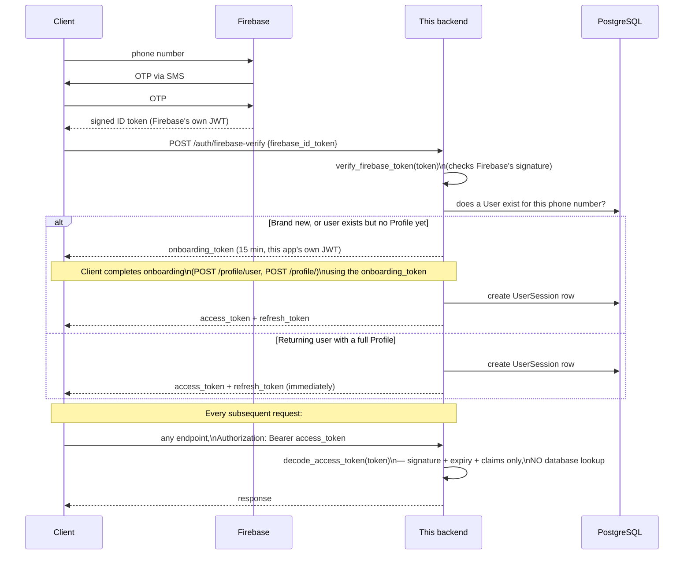

# 14 — Authentication

This is the complete, standalone reference for "how does this app know who's making a request." [Feature Guide](10_Feature_Guide.md) covered this as part of the Onboarding feature story; this document goes one level deeper into the actual token mechanics, because almost every other document in this handbook assumes you understand them.

## The two concepts you need first: OTP and JWT

**OTP (One-Time Password)** — a short numeric code sent to a phone number, valid briefly and only once, used to prove the person entering it has access to that phone. This app never generates, sends, or checks an OTP itself — that entire round-trip happens between the client app and **Firebase** directly. What this backend receives afterward is not the OTP, but a **Firebase ID token** — a signed, tamper-proof piece of data Firebase issues after it has already verified the OTP on its own, essentially saying "I, Firebase, checked this, and it's genuinely this phone number."

**JWT (JSON Web Token)** — a signed piece of text encoding a small set of claims (key-value facts) plus an expiry, such that anyone holding the correct secret key can verify it hasn't been tampered with, without needing to look anything up in a database. This app issues its *own* JWTs (distinct from Firebase's) once it has decided who you are — these are what the client sends back on every subsequent request as proof of identity.

## The full flow, end to end



## The two token types this app issues, and their claims

Both are created and decoded in exactly one file, `app/core/security/jwt_handler.py` — worth knowing as the single place to look if you ever need to change anything about how tokens are shaped.

| | Access token | Onboarding token |
|---|---|---|
| **Purpose** | Proves identity for every normal request | Proves "you just passed OTP" during the brief window before a full account exists |
| **Lifetime** | `ACCESS_TOKEN_EXPIRE_MINUTES` (see note below) | 15 minutes, fixed |
| **Claims** | `sub` (user ID), `pid` (profile ID), `jti` (session ID), `type="access"`, `exp` | `sub` (user ID), `phone_number`, `country_code`, `token_type="onboarding"`, `exp` |
| **Can be used for** | Any endpoint using `Depends(get_current_user)` / `get_current_user_id` / `get_current_profile_id` | Only `POST /profile/user` and `POST /profile/` |

**A small inconsistency worth knowing if you're ever debugging token issues:** the "what kind of token is this" claim uses a *different key name* in each token type — `"type"` for access tokens, `"token_type"` for onboarding tokens. Both decoding functions check the correct key for their own token type, so this doesn't cause a functional bug, but if you're ever inspecting a decoded token's raw payload by hand, don't be surprised that the field is named differently depending on which kind of token you're looking at.

## Why the access token carries `pid` (profile ID) directly

This is a deliberate, important design choice, and it's the reason [Request Lifecycle](07_Request_Lifecycle.md) could say identity checks cost "zero database queries." Because `profile_id` is baked into the token at issuance time, `get_current_profile_id` (`app/dependencies.py`) never needs to ask the database "what's this user's profile ID" — it's just sitting right there in the already-decoded token. The trade-off: if a user's profile ID could ever change after a token was issued (it can't, in the current schema — profile IDs are permanent once created), the token would carry a stale value until it expired or was refreshed. Since that scenario doesn't apply here, this is a clean win with no real downside as the app is built today.

## Refresh tokens are not JWTs — a distinction worth understanding

Unlike the access token, the **refresh token** is not a JWT at all — it's an opaque random string (`secrets.token_urlsafe(48)`), and the server only ever stores its **SHA-256 hash**, never the raw value, in `user_sessions.refresh_token_hash`. When a client calls `POST /auth/refresh`, the server hashes the submitted token and looks for a matching, still-active session row — if found, it **rotates**: a brand-new refresh token is generated and its hash replaces the old one on the same session row, and a new access token is issued alongside it. The old refresh token stops working the instant this happens. This "opaque token, hash-only storage, rotate on every use" pattern is a standard, deliberate choice for refresh tokens specifically — unlike an access token, a refresh token's only job is to be presented rarely and to survive being stolen from storage (since even the database itself never holds the usable value, only its hash).

## Logout, and a nuance worth understanding precisely

`POST /auth/logout` finds the session by the access token's `jti` claim and sets that `UserSession` row's `is_active` to `False`. This is checked by `refresh_session` (an inactive session's refresh token is rejected), **but `decode_access_token` itself never queries the database at all** — by design, per its own purpose of being a zero-DB-call identity check. This means: **logging out immediately blocks that session from ever being refreshed again, but does not immediately invalidate the access token currently in the client's possession** — that token remains cryptographically valid, and this app will keep honoring it, until it naturally expires. Whether that gap matters depends entirely on how long access tokens actually live — which is where the next point matters.

## A verified discrepancy: the access-token lifetime's own comment is wrong

`app/core/config.py` sets:
```python
ACCESS_TOKEN_EXPIRE_MINUTES: int = 600     # 1 hour
```
600 minutes is 10 hours, not 1 hour — the comment and the value disagree, and the value (not the comment) is what the code actually uses. This means an access token is genuinely valid for 10 hours from issuance, and — combined with the logout nuance above — a "logged out" session's last-issued access token remains fully usable for up to 10 hours afterward. This handbook verified this directly by reading the current value in `app/core/config.py`; it is not a claim inherited from the prior audit (which didn't happen to examine this specific line). If you're the one who changes this value, please also fix the comment.

## Where identity actually comes from — and where it deliberately never does

Every mutating endpoint in this app is supposed to derive identity exclusively from the decoded JWT — never from a client-supplied path parameter, query parameter, or request body field. This wasn't always true (the prior audit's earliest, most severe findings — before this handbook's timeframe — were exactly this kind of bug, across several modules, all since fixed) and the correct pattern is now consistent everywhere this handbook checked: `Depends(get_current_user_id)` or `Depends(get_current_profile_id)`, never `user_id: UUID = Query(...)`. See [Authorization](15_Authorization.md) for the closely related, but distinct, question of what a correctly-identified user is actually *allowed* to do.

## Configuration this system depends on

`ACCESS_TOKEN_EXPIRE_MINUTES`, `REFRESH_TOKEN_EXPIRE_DAYS` — read through the app's real `Settings` class (`app/core/config.py`). `JWT_SECRET_KEY`, `JWT_ALGORITHM` — read via raw `os.getenv(...)` calls directly inside `jwt_handler.py`, **bypassing** the Settings class entirely, one of several instances of this app not having one single consistent way of reading configuration — see [Configuration](24_Configuration.md) for the full picture and why it matters practically (a missing `JWT_SECRET_KEY` fails with a clear error only the first time a token is actually created or decoded, not at application startup, unlike most other missing configuration in this app).

## A local-development-only escape hatch

`GET /auth/dev-token?name=<profile name>` mints a fully valid access token for any profile matched by name, with no password or OTP — gated only by checking `os.getenv("DEBUG") == "true"`. This exists purely to make local testing faster (skip the whole Firebase OTP round-trip). The deployment configuration tracked in this repository (`render.yaml`) never sets `DEBUG`, so this route 404s in the documented deployment path — but because the gate is a raw environment variable rather than something wired through the real settings system, it's worth remembering this route exists at all, and to never set `DEBUG=true` in any environment reachable by real users. See [Known Limitations](30_Known_Limitations.md).

---
**Previous:** [13 — Repositories](13_Repositories.md) · **Next:** [15 — Authorization](15_Authorization.md)
