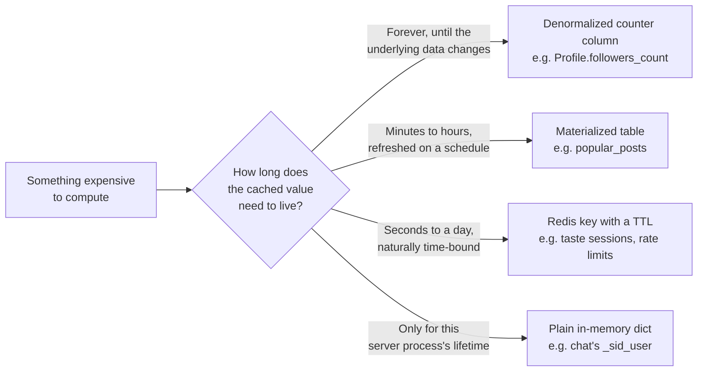

# 16 — Caching

**Caching**, as a general concept, means storing a value that was expensive (or slow, or rate-limited) to compute, so a later read can reuse it instead of redoing the work — at the cost of that stored value potentially going **stale**: wrong, until something refreshes or invalidates it. Every cache is a bet that "reused but possibly stale" beats "always fresh but always recomputed." This chapter is about every place that bet gets made in this codebase, in four different shapes, and — because this is exactly the kind of thing that's easy to build and then forget to maintain — two places where this handbook independently verified the bet stopped paying off.

This app has **no in-process function-level cache anywhere** — no `functools.lru_cache`, no `cachetools`, confirmed by grepping all of `app/` for both. Every cache in this codebase is one of the four kinds below.

## The four shapes caching takes in this codebase



### Shape 1 — denormalized counters (cache of a `COUNT(*)`)

`Profile.followers_count` / `Profile.following_count` (`app/modules/profile/models.py:90-91`) and `Post.like_count` / `view_count` / `comment_count` / `share_count` / `save_count` (`app/modules/post/models.py:58-62`) are, conceptually, a cache: instead of running `SELECT COUNT(*) FROM user_connections WHERE following_id = ...` on every profile view, the count is stored directly on the row and kept in sync by whichever write touches it. [Request Lifecycle](07_Request_Lifecycle.md) showed the actual update mechanism for this — an atomic, SQL-level `Profile.following_count = Profile.following_count + 1` rather than "read the value into Python, add one, write it back" (which would race under concurrent requests). This is the cheapest, longest-lived kind of cache in the app: it never expires on its own, and its only invalidation path is "every single write path that changes the underlying relationship must remember to update the counter too" — there's no reconciliation job that recomputes these from scratch if one of those write paths ever misses.

### Shape 2 — scheduled-refresh materialized tables

`popular_posts` (`PopularPost` model, `app/modules/post/post_recommendation_module/models.py:31-42`) holds a precomputed, ranked list of currently-trending posts per commodity, entirely replaced every 15 minutes by `run_popular_posts_sync` (`post_recommendation_module/jobs.py:86`, scheduled at `app/core/scheduler.py:90`, `id="posts.popular"` — see [Background Jobs](18_Background_Jobs.md)). Computing "what's trending" from raw interaction events on every feed request would be far too expensive to do live, so the job computes it once on a timer and every request just reads the precomputed rows (`_get_popular_posts`, `post_recommendation_module/service.py:186-195`).

The refresh strategy is worth calling out specifically: the job doesn't update rows in place — it deletes every row in the table and bulk-inserts the new ranked set, in one transaction (`jobs.py:139-142`). The job's own comment explains why: *"delete-all then bulk-insert avoids ORM dirty-object race conditions with the concurrent expiry_job which also deletes from popular_posts."* This is a real, deliberate design choice, not an oversight — a "diff and update only what changed" approach would have been more efficient, but harder to make race-safe against a second job that's also deleting from the same table on its own independent schedule (`posts.expiry`, hourly). `groups/models.py`'s `GroupActivityCache` (`:91-105`) is the same idea in principle — a per-group row of `messages_24h`, `unique_senders_24h`, `active_members_7d`, `member_growth_7d` — but see below for why it doesn't actually work as one today.

### Shape 3 — Redis keys with a TTL

Redis's native `EXPIRE` mechanism makes "this cached value should stop mattering after N seconds/hours" essentially free, which is why every genuinely short-lived cache in this app lives there: the taste system's module-session (2-hour TTL) and global-session (1-day TTL) layers ([Recommendation Engine](19_Recommendation_Engine.md) has the full picture), and `app/core/rate_limiter.py`'s sliding-window request counters (`rl:{key}`, auto-expired via `pipe.expire(full_key, window + 1)` — see [Redis](17_Redis.md) for the exact key catalog). In every one of these, Redis's own expiry *is* the invalidation strategy — nothing needs to remember to clean these up.

### Shape 4 — plain in-memory dicts

`chat/presentation/connection_manager.py`'s `_sid_user` dict maps an active Socket.IO session ID to a user ID, purely in the web server process's own memory — the fastest possible cache (no network round-trip at all), but the least durable: it vanishes on restart and, per [Runtime Architecture](06_Runtime_Architecture.md), only stays correct because this app is deployed as a single worker process (a second process would have its own, different, unsynchronized copy of this dict).

## What's deliberately *not* cached

`taste/amplify.py`'s `get_amplify_weights` — the function that blends a profile's persistent, module-session, and global-session taste signals into the weights used to boost recommendations — recomputes the entire blend from scratch on **every single call**: a database read plus at least two Redis round-trips, every time, for every recommendation request that consults it. There is no memoization of the blended result anywhere in the call chain. This is a legitimate, deliberate freshness-over-speed choice for this specific value (a user's taste signal can change from one interaction to the next, and this system is explicitly designed to react quickly — see [Recommendation Engine](19_Recommendation_Engine.md)) — mentioned here specifically so it's clear this was a choice, not a gap that happened to get missed.

## Three verified cases where the cache stopped being trustworthy

### `GroupActivityCache` is written once and never refreshed — so the "activity" half of group ranking is always zero

This is a new finding, verified directly by this handbook rather than inherited from the prior audit (which listed the model as "live, correct" without tracing its full read/write lifecycle). `groups/service.py` creates one `GroupActivityCache` row per group, at group-creation time, with every field defaulting to `0` (`service.py:313`). It's read back during group recommendation scoring (`service.py:968-973`). **Nothing else in the codebase ever writes to this table** — grepping the entire app for `GroupActivityCache` turns up exactly those two usage points, and `app/core/scheduler.py`'s full job list (`start()`, lines 83-96) has no group-activity refresh job among its nine scheduled jobs.

The consequence is precise and computable. `compute_activity_score` (`groups/vector.py:87-97`) is:
```python
raw = messages_24h * 0.4 + active_members_7d * 0.4 + max(member_growth_7d, 0) * 0.2
return math.log1p(raw) / math.log1p(100)
```
With every input permanently `0` (since the row is never updated after creation), `raw = 0`, and `math.log1p(0) = 0`, so this function returns exactly `0.0` for every group, always. That feeds directly into `compute_final_score` (`vector.py:100-102`):
```python
return round(cosine_sim * 0.75 + activity_score * 0.25, 4)
```
The code comment above this call site (`service.py:978`) documents the intent as *"final = 0.75 × (semantic × commodity_boost) + 0.25 × activity"* — but since `activity_score` is always `0.0`, the actual, currently-running behavior is **every group's final ranking score is exactly `cosine_sim × 0.75`, full stop** — the entire "surface groups that are recently, genuinely active" half of the ranking formula is silently inert. This isn't a crash or an exception anywhere — the code runs, returns plausible-looking scores, and nothing about the output would look obviously wrong without doing exactly this trace. That's precisely the kind of gap a "does it compile and run" check can't catch, and exactly why this handbook's sibling audit exists.

### A fully-built Redis rate limiter, wired into nothing

`app/core/rate_limiter.py`'s `RateLimiter` class is a correct, complete Redis sliding-window request counter, exported as a ready-to-use singleton with a docstring showing exactly how a route should call it (`limiter.check(redis, f"ip:{request.client.host}", limit=10, window=60)`). The prior audit confirmed, by grepping all of `app/` for any call to `.check()` or any import of the class, that **the only file referencing it is the file itself** (`audit/audit_phase_01.md`, finding P1-F4). The most concrete consequence: `POST /auth/firebase-verify` — the endpoint that exchanges a Firebase OTP-verification result for this app's own tokens — has no throttling of any kind (`audit/audit_phase_02.md`, finding P2-F2), so nothing stops a script from hammering it. Unlike a genuinely dead file, the audit's final report is explicit that this one **should not simply be deleted** as unused code — "Phase 02 determined this fills a real, currently-missing gap (OTP rate limiting) and should be wired in, not removed" (`audit/audit_phase_14_FINAL_REPORT.md`). See [Known Limitations](30_Known_Limitations.md).

**A naming collision worth not confusing this with:** `app/modules/news_new/intelligence/providers/groq.py` defines its *own*, separate `RateLimiter` class (`groq.py:29-50`) — an in-memory (not Redis) pacer that actually is used, to keep this app's outbound calls to the Groq LLM API under its per-minute quota. Two unrelated classes, same name, opposite fate (one unused entirely, one actively load-bearing) — if you're searching the codebase for "the rate limiter," check which one a search result actually landed on.

### A process-wide commodity name-to-ID cache with no invalidation path at all

`taste/amplify.py`'s `commodity_id_by_name` (`amplify.py:44-55`) loads the entire `commodities` table into a plain module-level dict the first time it's called, and never again for the lifetime of the server process:
```python
_commodity_id_by_name: dict[str, int] | None = None

def commodity_id_by_name(db: Session) -> dict[str, int]:
    global _commodity_id_by_name
    if _commodity_id_by_name is None:
        rows = db.query(Commodity).all()
        _commodity_id_by_name = {r.name.lower(): r.id for r in rows}
    return _commodity_id_by_name
```
This is the same Shape-4 "plain in-memory dict" idea as chat's `_sid_user`, but used for reference data instead of live session state — and unlike `_sid_user` (which is *supposed* to only reflect the current process's live connections), this one is standing in for the `commodities` database table indefinitely. If a commodity were ever added, renamed, or removed while the server is running, every process would keep serving the name/ID mapping it loaded at its first call, until the next restart or deploy. The audit (`audit/audit_phase_10.md`, finding P10-F1) flagged this precisely and noted the mitigating fact: commodities are treated as an append-only, migration-seeded list in practice, not something edited through the running app — which is *why* this hasn't caused a visible bug, not evidence that the caching approach itself is correct.

## The lesson all three gotchas share, for when you build the next cache

`GroupActivityCache`, `rate_limiter.py`, and `commodity_id_by_name` are all competently written — none has a bug in the code that exists. The gap in every case is a piece of code that was **never written**: nothing ever calls `RateLimiter.check()`, nothing ever updates a `GroupActivityCache` row after it's created, and nothing ever refreshes or invalidates `commodity_id_by_name`'s dict. Whenever you introduce a new cached value in this codebase, treat "what, specifically, keeps this from going stale, and is that thing actually wired up and running" as a mandatory design question — not an afterthought to add once someone notices the number is wrong. For a scheduled-refresh table, that means adding the job to `scheduler.py`'s `start()` in the same change that adds the table, not as a follow-up.

---
**Previous:** [15 — Authorization](15_Authorization.md) · **Next:** [17 — Redis](17_Redis.md)
