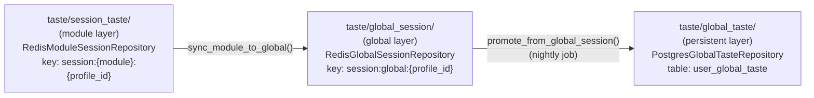

# 17 — Redis

[Caching](16_Caching.md) introduced Redis as this app's home for short-lived, TTL-bound state. This chapter is the complete, literal key-by-key catalog: every distinct Redis key *shape* this codebase creates, read, or deletes. Verified by grepping all 24 files in `app/` that import `redis` and reading every file that actually calls a Redis command (not just ones that pass a client handle through to another function) — **this app uses exactly three Redis key namespaces**, listed in full below. If you're ever looking at a Redis `MONITOR` or `KEYS` output from this app's database and see a key that doesn't match one of these three shapes, something has changed since this was written — treat that as a signal to re-verify, not to assume this document is wrong.

## The client itself

One lazy singleton, created on first use from `settings.REDIS_URL`:
```python
_client = redis.from_url(
    settings.REDIS_URL,
    decode_responses=False,
    socket_connect_timeout=5,
    socket_timeout=5,
)
```
(`app/core/redis_client.py:16-25`, exposed as the FastAPI dependency `get_redis`.) The detail worth internalizing: **`decode_responses=False`** means every value that comes back from Redis is raw `bytes`, not `str` — Python's `"pos" == b"pos"` is `False`, so code reading a hash back has to explicitly `.encode()` the key it's looking up and/or `.decode()` what comes back. This is *why* both taste repositories (below) define their own small `_f()`/`_i()` byte-to-number helper functions rather than just calling `float()`/`int()` directly — and why, if you're writing new Redis-reading code in this app, you need to remember bytes-in, bytes-out, or you'll get a silent `KeyError`/`0.0` fallback instead of an obvious crash.

## The three key namespaces

| Key shape | Written by | Read by | TTL | Purpose |
|---|---|---|---|---|
| `session:{module}:{profile_id}` | `RedisModuleSessionRepository.write_signals` | same class's read methods, and the sync-to-global step | 7200s (2h), reset on every write | A profile's very-recent taste signal, scoped to one module (`post`, `news`, `connection`, `group`) |
| `session:global:{profile_id}` | `RedisGlobalSessionRepository.write_dimension_delta` | same class's read methods, and the nightly promotion job | 86400s (1 day), also explicitly deleted by the nightly promotion job once its data is safely in Postgres | A profile's taste signal blended across *all* modules for the current day |
| `rl:{key}` | `RateLimiter.check` | `RateLimiter.check`/`.remaining` | `window + 1` seconds (caller-supplied window) | Sliding-window request counter — built, **wired into zero endpoints** (see [Caching](16_Caching.md) and [Known Limitations](30_Known_Limitations.md)) |

There is no fourth namespace. Every other file that imports `redis` (routers and services across `groups/`, `connections/`, `feed/`, `post_recommendation_module/`, `news_new/`) does so only to receive a client handle and pass it straight into one of the taste functions below (`get_amplify_weights`, `write_commodity_signals`) — none of them issue a Redis command directly or invent a key of their own.

## `session:{module}:{profile_id}` — the module-session layer

Owned by `RedisModuleSessionRepository` (`app/modules/taste/session_taste/data/redis_repository.py`). One Redis **hash** per `(module, profile_id)` pair — e.g. `session:post:42` for profile 42's activity inside the Post module specifically. Field naming follows a fixed pattern: a short dimension prefix, the dimension's own key, then a suffix:
```
{pfx}:{dim_key}:pos       accumulated positive taste (float)
{pfx}:{dim_key}:neg       accumulated negative taste (float)
{pfx}:{dim_key}:conf      accumulated confidence (float)
{pfx}:{dim_key}:cnt       event count (int)
{pfx}:{dim_key}:ts        unix timestamp of the last event touching this dimension key (int)
{pfx}:{dim_key}:synced    a snapshot of `pos` as of the last module→global sync (float) — see below
```
plus four bookkeeping fields with no prefix at all: `_total_events`, `_session_start`, `_last_event_at`, `_last_synced_ts`.

The dimension-type-to-prefix mapping (`redis_repository.py:42-50`) is:

| Dimension type | Prefix |
|---|---|
| `category` | `cat` |
| `commodity` | `com` |
| `author` | `aut` |
| `role` | `rol` |
| `city` | `cit` |
| `state` | `sta` |
| `trade_intent` | `tin` |

Note that this list is *longer* than the four `CROSS_PLATFORM_DIMS` ([Recommendation Engine](19_Recommendation_Engine.md) covers this constant in full) — `category`, `author`, and `role` are tracked at the module-session layer but are **not** among the dimension types that ever get synced onward to the global layer. `role`, specifically, is written to this hash (per `taste/amplify.py:79`'s own comment: *"role is recorded to the module session but is NOT yet used by the boost"*) but nothing currently reads it back out for ranking — a scaffolded-but-inert dimension at this layer, the same shape as `trade_intent` one layer up.

Every write (`write_signals`) resets the key's TTL back to the full 2 hours — this is why the docstring calls it "2h inactivity": the clock only starts counting down once a profile stops generating signals in that module, not 2 hours after the session started.

## `session:global:{profile_id}` — the global-session layer

Owned by `RedisGlobalSessionRepository` (`app/modules/taste/global_session/data/redis_repository.py`) — note this is a **different Python package** from the one below with the very similar name; see the naming note further down. One hash per profile, combining signal from every module. Field layout is the same idea, one layer up, and dimension-type-generic (the dimension type itself is the field prefix, not a 3-letter code):
```
{dimension_type}:{key}:pos    accumulated positive taste, all modules combined (float)
{dimension_type}:{key}:neg    accumulated negative taste (float)
{dimension_type}:{key}:conf   accumulated confidence (float)
{dimension_type}:{key}:cnt    event count (int)
{dimension_type}:{key}:ts     unix timestamp of last write (int)
```
plus `_total_events`, `_day` (an integer `YYYYMMDD`, set on the first event of each day), `_last_synced_at`. Per the module's own docstring: **active** `dimension_type` values actually being written today are `commodity`, `city`, `state`; `trade_intent` is scaffolded (appears in the allowed-dimensions constant, has no writer yet); `quantity` is listed as a placeholder for a dimension that doesn't exist yet at all. This directly extends [Recommendation Engine](19_Recommendation_Engine.md)'s explanation of `CROSS_PLATFORM_DIMS` — this docstring is the most precise, current statement of exactly which of those dimensions are live versus reserved.

### A safety contract worth respecting exactly: commit before clear

The nightly promotion job moves qualifying deltas from this Redis hash into the persistent `user_global_taste` Postgres table, then deletes the Redis hash — and the order matters. `taste/global_taste/__init__.py`'s `promote_from_global_session` docstring spells out the contract explicitly:
```
Safety contract:
    1. Writes qualifying deltas to PostgreSQL (inside this call)
    2. Caller MUST commit db BEFORE clearing Redis:
           candidates = promote_from_global_session(db, rc, profile_id)
           db.commit()
           if candidates:
               from app.modules.taste.global_session import clear_global_session
               clear_global_session(rc, profile_id)
```
If this were ever reordered — clear Redis first, commit second — a failed or rolled-back commit would silently lose that day's taste data entirely: gone from Redis, never landed in Postgres. Nothing in the type system enforces this ordering; it's a documented convention the calling code (inside the scheduled job — see [Background Jobs](18_Background_Jobs.md)) has to honor by hand. If you ever touch this code path, preserve the commit-then-clear order exactly.

## `rl:{key}` — the rate limiter

`RateLimiter.check` (`app/core/rate_limiter.py:27-59`) uses a Redis **sorted set** per throttled key (e.g. `rl:ip:203.0.113.4`), scoring each request attempt by its arrival timestamp, trimming anything older than the current window on every call, and relying on Redis's own `EXPIRE` to clean up a key nobody's hit recently:
```python
full_key = f"rl:{key}"
pipe.zremrangebyscore(full_key, "-inf", window_start)   # drop old entries
pipe.zadd(full_key, {str(uuid.uuid4()): now})           # record this attempt
pipe.zcard(full_key)                                     # count within window
pipe.expire(full_key, window + 1)                        # self-cleaning
```
This is fully correct, ready-to-use infrastructure — see [Caching](16_Caching.md) for the confirmed fact that it's called from exactly nowhere in the current router set, and [Known Limitations](30_Known_Limitations.md) for why the audit specifically flagged it as "keep, wire in" rather than "dead code, delete."

## Three similarly-named packages — a map, so you don't lose your place

This is the single easiest place in the taste system to get lost, purely from naming:



`global_session` and `global_taste` are **two different packages**, one Redis-backed and one-day-scoped, the other Postgres-backed and permanent — the names differ by one word and are easy to transpose when skimming an import list. If you're chasing a taste-related bug, check which of the two packages the import you're looking at actually points to before reasoning about TTLs or persistence.

## A stale code comment worth knowing about

`app/core/redis_client.py`'s own module docstring says: *"Sync Redis client — used by the home feed (session taste + seen-sets)."* The "session taste" half is accurate. The "seen-sets" half is not, as currently implemented: this handbook traced every "seen" reference in the feed and post-recommendation code and found post view deduplication is handled by a real Postgres table, `SeenPost` (`post_recommendation_module/models.py`, written by `record_seen`, read by `_get_seen_post_ids` — see [Database Guide](09_Database_Guide.md) §6), plus a plain in-memory Python `set()` used only to deduplicate candidates *within* a single feed-assembly call (`feed/pipelines.py:120,129,131` — gone the moment that function returns). No Redis set backs "seen" tracking anywhere this handbook could find. This is a small, low-stakes example of exactly the kind of drift this handbook's ground rules ask to be caught rather than repeated: a comment describing what a past version of the code did, still sitting next to code that has since changed.

---
**Previous:** [16 — Caching](16_Caching.md) · **Next:** [18 — Background Jobs](18_Background_Jobs.md)
