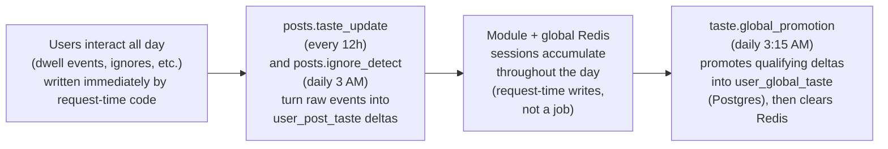

# 18 — Background Jobs

A **background job** is code that runs on its own schedule, not in response to any specific user's HTTP request — there's no client waiting for a response, and no `Depends(get_db)` request-scoped database session to reuse, because there's no request. [Runtime Architecture](06_Runtime_Architecture.md) introduced *how* this app runs scheduled code (APScheduler's own internal thread pool, a third concurrency mechanism alongside the asyncio event loop and FastAPI's request thread pool); this chapter is what actually runs on that schedule, and why.

## The complete job list

All nine jobs are registered in one place, `app/core/scheduler.py`'s `start()` function (called once, from `main.py`'s lifespan startup — see [Startup Process](05_Startup_Process.md)):

| Job ID | Cadence | Function | What it does |
|---|---|---|---|
| `news_new.pipeline` | every 30 min | `run_news_pipeline` | Fetch a batch of new articles from GNews, then enrich whatever's pending via the Groq LLM |
| `news_new.trending` | every 5 min | `recalc_trending` | Recompute news velocity scores from the last few hours of interactions; upsert `news_raw_trending`, drop anything that's cooled off |
| `news_new.archive` | daily, 2:00 AM | `archive_old_articles` | Soft-delete (`is_active=False`) raw articles older than the configured retention window |
| `posts.expiry` | every 1 hour | `run_expiry_job` | Deactivate `PostEmbedding` rows past their `expires_at` — keeps the ANN recommendation pool from serving stale posts |
| `posts.popular` | every 15 min | `run_popular_posts_sync` | Fully rebuild the `popular_posts` table from the last 30 days of activity (see [Caching](16_Caching.md) for the delete-all-then-bulk-insert strategy and why) |
| `posts.taste_update` | every 12 hours | `run_taste_update_job` | Process a batch of unprocessed post dwell events into `user_taste_profiles` and `user_post_taste` |
| `posts.ignore_detect` | daily, 3:00 AM | `run_ignore_detection_job` | Find posts a profile has seen repeatedly but never engaged with; write a negative taste signal |
| `taste.global_promotion` | daily, 3:15 AM | `_run_global_taste_promotion` | Move each active profile's Redis global-session taste into the permanent `user_global_taste` Postgres table, then clear the Redis key |
| `server.keepalive` | every 10 min | `_keep_alive` | `GET` this app's own public URL, to stop it from idling |

**All cron-style times are in `Asia/Kolkata` (IST), not UTC** — `scheduler = BackgroundScheduler(timezone="Asia/Kolkata")` (`scheduler.py:17`). If you're correlating a job's behavior against a log timestamp or a Sentry event shown in UTC, remember to shift by +5:30 first.

## Why each job wraps itself in its own database session

Every job function that needs the database opens and closes a session itself, since there's no HTTP request to hang a `Depends(get_db)` session off of:
```python
def _run_expiry_job():
    db = SessionLocal()
    try:
        post_rec_jobs.run_expiry_job(db)
    finally:
        db.close()
```
(`scheduler.py:29-34`, and identically shaped for `_run_popular_sync`, `_run_taste_update`, `_run_ignore_detection`.) This is the same `SessionLocal` factory [Request Lifecycle](07_Request_Lifecycle.md) showed `get_db` using — background jobs just call it directly instead of through a FastAPI dependency, because dependency injection is a FastAPI-request concept and a scheduled job isn't one.

## Two jobs worth reading closely, because they handle failure carefully

**`run_news_pipeline`** (`app/modules/news_new/ingestion/jobs.py:49`) deliberately isolates its two steps from each other:
```python
try:
    ingest = ingest_rotation(db, GNewsProvider())
except Exception:
    db.rollback()
    log.exception("news_new pipeline: ingest step failed (continuing to enrich)")
```
The comment above this states the reasoning directly: *"Ingest and enrich are independent: a fetch problem (e.g. GNews daily cap) must NOT stop us from enriching the existing pending backlog."* If GNews's daily quota is exhausted, this job still spends its 30-minute slot running the Groq enrichment step against whatever's already sitting in the pending queue, rather than the whole run failing outright.

**`_run_global_taste_promotion`** (`scheduler.py:61-80`) loops over every profile with an active Redis global-session key, and wraps each profile's promotion individually:
```python
for pid in profile_ids:
    try:
        candidates = promote_from_global_session(db, rc, pid)
        db.commit()
        if candidates:
            clear_global_session(rc, pid)
    except Exception:
        db.rollback()
        _log.exception("Global taste promotion failed for profile_id=%s", pid)
```
This does two things worth noticing: it follows the commit-before-clear safety contract explained in [Redis](17_Redis.md) exactly (`db.commit()` on the line before `clear_global_session`, never the reverse), and one profile's failure (`db.rollback()`, logged, loop continues) can never take down the whole nightly run for every other profile.

## The data-dependency chain behind the taste jobs

Three of these jobs aren't independent of each other — they form a pipeline across time, feeding the recommendation system covered fully in [Recommendation Engine](19_Recommendation_Engine.md):



`posts.taste_update` and `posts.ignore_detect` don't write to Redis at all — they write directly to the `user_post_taste` Postgres table from batched dwell/impression events (see [Database Guide](09_Database_Guide.md) §6). The Redis session layers ([Redis](17_Redis.md)) are populated separately, at request time, by the fire-and-forget `write_commodity_signals`/`write_post_signals` calls each module's service layer makes on every relevant interaction — not by any scheduled job. `taste.global_promotion` is the only job in this chain that touches Redis, and it's positioned at the very end: once a day, sweep up whatever accumulated in Redis over the day and land it permanently in Postgres.

## `server.keepalive` — why a backend pings itself

`_keep_alive` (`scheduler.py:22-26`) issues a plain `GET` against `https://vanijyaa-backend.onrender.com/` — this app's own public URL — every 10 minutes, and just logs a warning if it fails; nothing else depends on the result. This exists because of how the deployment platform (Render — see [Deployment](26_Deployment.md)) behaves: certain Render service tiers spin a web service down after a period of no incoming traffic, and back up again (slowly) on the next request. A self-ping keeps "no incoming traffic" from ever being true for more than 10 minutes, at the cost of the server never actually being allowed to idle. **Not verified from the current implementation:** which specific Render plan this deployment is on, and therefore whether this job is currently load-bearing or a defensive leftover from a tier that would otherwise spin down — that's an infrastructure/billing fact outside this repository.

## The manual-trigger endpoints that duplicate four of these jobs

[Authorization](15_Authorization.md) covers this in full detail from the security angle — repeated here only for completeness of the operational picture. Four of these exact job functions are also reachable directly over HTTP, on demand, bypassing the schedule entirely:

| Scheduled job | Manual trigger endpoint | Auth required |
|---|---|---|
| `news_new.pipeline` (ingest half) | `POST /news/admin/ingest` | Any logged-in user (P8-F1) |
| (enrich half) | `POST /news/admin/enrich` | Any logged-in user (P8-F1) |
| `posts.expiry` | `POST /posts/recommendation/jobs/expiry` | **None at all** (P13-F1) |
| `posts.popular` | `POST /posts/recommendation/jobs/popular-sync` | **None at all** (P13-F1) |
| `posts.taste_update` | `POST /posts/interactions/jobs/taste-update` | **None at all** (P13-F1) |
| `posts.ignore_detect` | `POST /posts/interactions/jobs/ignore-detect` | **None at all** (P13-F1) |

These read as convenience triggers for manual testing or ops debugging — being able to force a popular-posts refresh without waiting up to 15 minutes is a genuinely reasonable thing to want during development — but as shipped, they're live, public endpoints with the auth gaps [Authorization](15_Authorization.md) documents in full.

---
**Previous:** [17 — Redis](17_Redis.md) · **Next:** [19 — Recommendation Engine](19_Recommendation_Engine.md)
