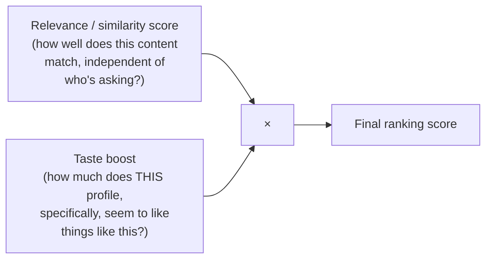
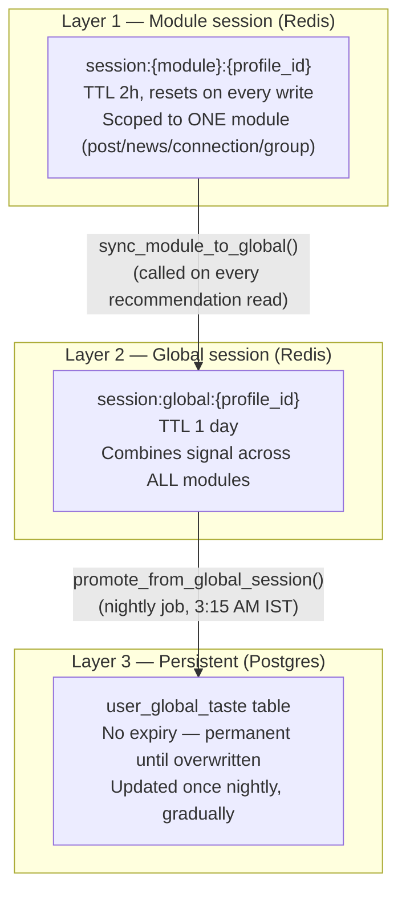
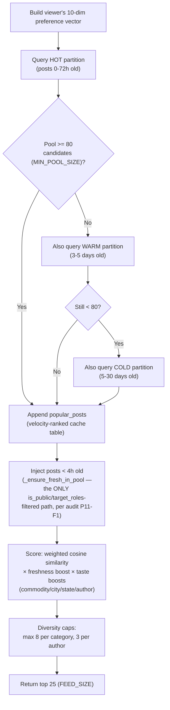
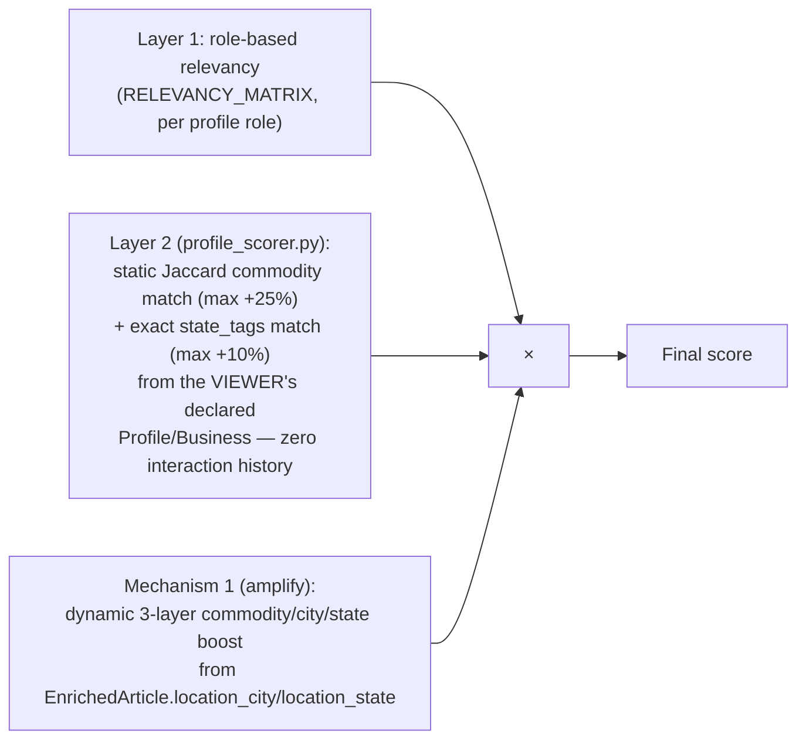

# 19 — Recommendation Engine

**This document reflects the taste/recommendation code as it currently exists**, verified by direct reading during this handbook's writing — not the state described in the prior audit's Phase 10, which was written before a later round of changes generalized the taste system from commodity-only to also cover city and state. Every discrepancy found between the audit and the current code is called out explicitly below, per this handbook's own ground rules.

## The one idea used by every recommendation surface in this app

Four different features — the Post recommendation feed, the News feed, Group suggestions, and "who to follow" Connections suggestions — all combine the same two ingredients, just with different specifics:



The **relevance** half differs per module: pgvector cosine similarity between embeddings for Post and Groups, a hand-written role/commodity/state relevance formula for News, plain similarity search for Connections. The **taste boost** half is, for all four, the same shared system: [Caching](16_Caching.md) and [Redis](17_Redis.md) already introduced pieces of it; this chapter is its complete explanation.

## The three-layer taste architecture, in full

A profile's "taste" for something — a commodity, a city, a state, a content category, a specific author — is never stored as one number. It's blended, at read time, from three layers that trade off *recency* against *stability*:



**Why three layers instead of one:** a single number can't be both "reacts within seconds to what you just clicked" and "doesn't get erased by one impulsive session." Layer 1 is deliberately volatile and cheap — losing it on a restart is fine, the docstring says so explicitly. Layer 3 is deliberately slow-moving and permanent — it only accepts a new day's signal if that signal cleared real confidence and volume gates (below), specifically so a handful of accidental clicks can never overwrite months of established behavior. Layer 2 is the bridge: same-day, cross-module (a Post-module signal and a Chat-module signal both land in the same global bucket), but still temporary.

### The dimension types, and which ones actually work today

`CROSS_PLATFORM_DIMS` (`app/modules/taste/session_taste/domain/constants.py:69`) names every dimension type eligible to flow from Layer 1 into Layer 2:
```python
CROSS_PLATFORM_DIMS: frozenset[str] = frozenset({"commodity", "city", "state", "trade_intent"})
```
But eligibility to *sync* isn't the same as being *blended* once there. `aggregator.py`'s `_GLOBAL_BLENDED_DIMS` (`global_session/application/aggregator.py:37`) is the narrower set that actually gets a real 3-layer read in `MergeWeights`:
```python
_GLOBAL_BLENDED_DIMS = frozenset({"commodity", "city", "state"})
```
`trade_intent` is a real, working no-op today: it's allowed to sync (so nothing breaks if something starts writing it), but nothing currently does write it, and even if it did, `MergeWeights._influence` has no branch for it (falls through to `return 1.0, 0.0, 0.0` — pure persistent, no global/module influence at all). The code comment above `_GLOBAL_BLENDED_DIMS` is explicit that this is deliberate, not forgotten: *"has no blend behavior decided yet — deliberately excluded here until that feature resumes."* `quantity` is mentioned in the global-session repository's docstring as a placeholder dimension name reserved for a feature that doesn't exist yet at all.

Beyond these four, the **module-session** layer (Layer 1 only) also tracks `category`, `author`, and `role` — real, working, but deliberately never promoted past a single module. `role` specifically is written (any `write_commodity_signals` call with a `role_id` records it) but not yet read by any boost function — the same "scaffolded but inert" status as `trade_intent`, one layer down.

### The blend formula, exactly

`MergeWeights.execute` (`global_session/application/aggregator.py:106-137`) computes, per dimension key (e.g. per commodity, per city name):
```
merged[key] = p_influence × persistent[key] + g_influence × global[key] + m_influence × module[key]
```
where the three influence fractions always sum to `1.0`, and are themselves confidence-gated — `_influence` (`aggregator.py:141-208`):
```
m_influence = MODULE_SESSION_MAX_INFLUENCE  × min(module_confidence / module_threshold, 1.0)   # cap 0.31
g_influence = GLOBAL_SESSION_MAX_INFLUENCE  × min(global_confidence / global_threshold, 1.0)   # cap 0.15
p_influence = max(1.0 - g_influence - m_influence, PERSISTENT_MIN_INFLUENCE)                    # floor 0.54
```
In plain language: the more confidently a profile's recent behavior (module or global session) supports a given commodity/city/state, the more that recent behavior is allowed to steer the ranking — but persistent, long-established taste can never be diluted below 54% influence, and a same-day session can never be trusted for more than 31% (module) or 15% (global). The thresholds themselves scale with how established the persistent score already is (`module_commodity_threshold`/`global_commodity_threshold`, and the identically-shaped `..._city_threshold`/`..._state_threshold` functions, `session_taste/domain/constants.py:77-110`) — the docstring's own framing: *"established traders are harder to shift."* `category` and `author` are 2-layer only (persistent + module, no global term at all — `g_inf = 0.0` unconditionally in those branches), and `author`'s module-influence ceiling is further reduced to 35% of the normal cap (a lower ceiling specifically because a single author affinity signal is considered weaker evidence than a commodity match).

### Decay — old signal fades, it doesn't vanish

Every read of accumulated positive/negative taste applies exponential decay based on how long ago the signal landed:
```python
days = (now - last_event_timestamp) / 86400.0
decayed = pos * math.exp(-TASTE_DECAY_LAMBDA * days)   # TASTE_DECAY_LAMBDA = 0.023 → ~30-day half-life
net = decayed - (neg * 0.6)
```
(Same shape in both `RedisModuleSessionRepository._scores_from_raw` and `RedisGlobalSessionRepository._decay_scores`.) A commodity you engaged with heavily a week ago still matters; the same engagement six months ago barely does. Negative signal is subtracted at 60% of its raw weight, not decayed by time in the code shown — a deliberate asymmetry (a recent "not interested" counts more than an old one, but doesn't erase positive history one-for-one).

### The write side: what generates a taste signal, and how strongly

Every user action that should influence taste funnels through one shared table, `SIGNAL_WEIGHTS` (`session_taste/domain/constants.py:22-54`) — a `(positive_delta, negative_delta, confidence_delta)` triple per action type, shared across every module:

| Action | pos | neg | conf | Action | pos | neg | conf |
|---|---|---|---|---|---|---|---|
| `impression` | 0.1 | 0 | 0 | `connection_view` | 0.5 | 0 | 0.2 |
| `view` | 0 | 0 | 0.1 | `connection_follow` | 5.0 | 0 | 4.0 |
| `dwell_bounce` | 0 | 0.5 | 0 | `connection_msg` | 5.0 | 0 | 4.0 |
| `dwell_short` | 0.5 | 0 | 0.2 | `connection_dismiss` | 0 | 2.0 | 0 |
| `dwell_medium` | 2.0 | 0 | 0.5 | `group_view` | 0.5 | 0 | 0.2 |
| `dwell_long` | 3.5 | 0 | 1.0 | `group_join` | 5.0 | 0 | 4.0 |
| `open_read_more` | 1.5 | 0 | 0.3 | `group_dismiss` | 0 | 2.0 | 0 |
| `like` | 3.0 | 0 | 2.0 | `save` | 5.0 | 0 | 4.0 |
| `comment` | 4.0 | 0 | 5.0 | `share` | 4.0 | 0 | 6.0 |
| `revisit` | 6.0 | 0 | 4.0 | `feed_skip` | 0 | 1.0 | 0 |

(Full table: `constants.py:22-54`.) The pattern is legible once you see a few rows: passive signals (`impression`, `view`) barely move anything and mostly build confidence, not direction; explicit high-effort actions (`save`, `share`, `comment`) carry the most weight in all three columns; anything read as disengagement (`dwell_bounce`, `feed_skip`, the two `_dismiss` actions) is pure negative signal with **zero confidence contribution** — the system treats "this didn't land" as informative about direction but not as strong evidence either way about how sure it should be.

Three thin, module-specific write functions turn a real interaction into signals in this shape, all in `taste/amplify.py`:

- **`write_commodity_signals`** — used by Connections and Groups (a follow, a join, a profile/group view). Writes only a `commodity` dimension signal (plus a `role` dimension signal, currently unread — see above).
- **`write_post_signals`** — writes `category` + `commodity` always, and now **`city`/`state`** when supplied — sourced from the *post author's* `Business` record, not the viewer's. This is one of the two places the recent city/state generalization shows up in the write path.
- **`write_news_signals`** — writes `commodity` (a list) and now **`city`/`state`**, sourced from `EnrichedArticle.location_city`/`location_state` — the LLM-extracted primary place the article is about (see [Database Guide](09_Database_Guide.md) §7).

Every one of these is explicitly fire-and-forget: wrapped in `try/except Exception: pass`, so a Redis outage degrades the calling action's own success silently rather than failing it. The audit noted this exception-swallowing pattern is unlogged (no `logger.exception` call inside the `except` blocks) — consistent with a broader pattern flagged elsewhere in the codebase, not unique to taste.

### The read side: `get_amplify_weights` and the boost functions

Reading a blended weight dict is one call, `get_amplify_weights(db, rc, profile_id, module, dimension_type)` (`amplify.py:228-258`), which runs the persistent read, the module→global sync, and the 3-layer merge, each independently wrapped so any single layer's failure degrades rather than breaks the caller. The result is a plain `{dimension_key: weight}` dict, turned into an actual score multiplier by one shared function, `_hottest_boost` (`amplify.py:263-287`):
```python
best = max(weights.get(key, 0.0) for key in candidate_keys)   # candidate's HOTTEST matching key, not the sum
return 1.0 + boost_max * min(best / ref, 1.0)                  # multiplier in [1.0, 1.0 + boost_max]
```
Two callers wrap this with different key semantics: `commodity_boost` (integer commodity IDs) and `location_boost` (plain lowercased city/state name strings — called once per dimension, since a candidate has at most one city and one state). Taking the **hottest** matching key rather than summing across all of them is a deliberate choice, called out in the function's own docstring: it stops a candidate that happens to touch many weakly-relevant keys from out-ranking a candidate that matches one thing the profile clearly, strongly cares about.

## What used to be different, and why it's worth knowing even though it's gone

Before the generalization this handbook verified, city/state-style personalization existed only inside the News module, as a **module-local, non-cross-platform** mechanism (an old `location`/`state_tags` dimension pair, News-only, never synced to Layer 2 or Layer 3). That mechanism has been fully superseded — `write_news_signals`'s own docstring says so directly: *"city/state are now full cross-platform dimensions (3-layer, global-synced) — superseding the earlier News-local 2-layer 'location' dimension."* If you ever find older references to a plain `location` dimension anywhere in code comments, migrations, or (per [Repository Tour](03_Repository_Tour.md)'s warning) the `documentation/`/`upgraded_documentation/` folders, treat them as describing this now-replaced mechanism, not the current one.

## Per-module recommendation pipelines

### Post recommendation

`post_recommendation_module/service.py`'s main scoring path builds a 10-dimension numeric vector for the viewer (`[0:3]` commodity, `[3:6]` role, `[6:9]` geo, `[9]` quantity — `constants.py:37-40`), then retrieves candidate posts via pgvector approximate-nearest-neighbor search, partitioned by **post age**:



Each partition query only considers categories still valid for that age band (`PARTITION_ALLOWED`, `constants.py:30-34`) — `market_update` posts (2-day expiry per `CATEGORY_EXPIRY_DAYS`) never reach the warm or cold partitions at all, since they're expired by the time a post would age into them. Vector similarity uses a weighted cosine similarity (`FEED_WEIGHTS = [3,3,3, 2,2,2, 1.5,1.5,1.5, 1.0]` — commodity match weighted twice as heavily as role, which is weighted more than geo, with quantity as the softest signal), and a separate freshness boost (`1.0 + 0.4 × exp(-age_hours / 8)`, fading to essentially nothing by 48 hours) rewards recency independently of the ANN score. Post's taste weights are read via the lower-level `merge_weights`/`sync_module_to_global` calls directly rather than through the `get_amplify_weights` wrapper News and Groups use (`service.py:560-568`) — functionally the same underlying blend, just invoked one layer down; if you're comparing the two modules' code side by side, don't read this as a different algorithm.

### News recommendation

News combines **three** multiplicative layers, not two — the middle one is easy to miss if you only look at the taste system:



Layer 2 (`news_recommendation_engine/profile_scorer.py`) is a small, self-contained, still-live pair of functions — Jaccard set-overlap between the viewer's declared commodities and the article's `commodity_tags`, and an exact-membership check between the viewer's declared business state and the article's `state_tags`. **This is a genuinely different mechanism from the dynamic taste system**, using different source fields (`state_tags`, populated by the same enrichment pass, versus `location_city`/`location_state`) and requiring no interaction history at all — a brand new profile gets this boost from its onboarding data alone. `feed/service.py`'s own code comment marks exactly where the dynamic half was generalized: *"Commodity, city, and state are all now real 3-layer (persistent + global + module) dimensions via get_amplify_weights, since the global-session infra was generalized beyond commodity-only"* (`feed/service.py:205-209`).

**A correction to this handbook's own earlier statements, verified while researching this chapter:** [Folder Structure](04_Folder_Structure.md) and [Modules](11_Modules.md) originally described `news_recommendation_engine/` as fully dead, following the prior audit's P8-F2 finding verbatim. That finding is correct about the package's `service.py`, `router.py`, and its two database tables (`ArticleRecommendationScore`, `FeedRankingCache`) — none of those have any live caller. But `profile_scorer.py`, one file in that same package, is **not** dead: `feed/service.py` imports `compute_profile_boost` and `apply_profile_boost` from it directly and calls them on every scored article. The audit's "zero live callers" was true of the module's own pipeline as a unit; it didn't hold at the individual-file level, and this handbook's two earlier references to it have been corrected accordingly.

**Whether `UserNewsTaste`'s persistent read path is still dead:** re-verified directly for this chapter — yes, still true. `news_user_interaction/taste_service.py`'s `get_taste_weights` has zero external callers anywhere in the current codebase (confirmed by a fresh grep, not inherited from the audit's Phase 10 record). The audit's P10-F2 finding stands: News writes to its own dedicated persistent per-category taste table and never reads it back for ranking. This is separate from — and in addition to — the now-generalized cross-platform `user_global_taste` table, which News' Mechanism 1 boost does read from correctly via `get_amplify_weights`.

### Group suggestions

`groups/service.py`'s suggestion scoring blends embedding cosine similarity with a `GroupActivityCache`-derived activity score, nominally 75%/25%. **This blend is currently broken in a specific, verified way**: [Caching](16_Caching.md) documents the full evidence that `GroupActivityCache` rows are written once at zero and never refreshed by anything, which means the activity term is mathematically always exactly `0.0` — every group's suggestion score today is, in practice, `cosine_similarity × 0.75` and nothing else. Not re-derived here to avoid drift between the two documents; see [Caching](16_Caching.md) for the full walk-through of the math.

### Connections ("who to follow") suggestions

`connections/service.py`'s `get_recommendations` (`:687`) follows the same shape as News and Groups — read blended commodity weights via `get_amplify_weights`, then rerank candidates by `similarity × commodity_boost(...)` (`service.py:791-794`). **Not verified from the current implementation:** the exact composition of the underlying `similarity` term for Connections (this handbook did not trace how candidate profiles are initially surfaced/scored before the commodity boost is applied) — flagged here rather than guessed, consistent with this handbook's validation rules.

## What's scaffolded versus what actually moves a ranking today

A quick reference, gathered from across this chapter, since "is this dimension actually live" is exactly the kind of question that's easy to get wrong by skimming a constants file in isolation:

| Dimension | Written? | Synced to global? | Blended (3-layer)? | Notes |
|---|---|---|---|---|
| `commodity` | Yes, all modules | Yes | Yes | The original, most mature dimension |
| `city` | Yes (Post via author's Business; News via `location_city`) | Yes | Yes | Generalized from News-only recently |
| `state` | Yes (same sources, `location_state`/Business.state) | Yes | Yes | Same generalization as `city` |
| `category` | Yes | No (not cross-platform) | 2-layer only (no global) | Module-local by design |
| `author` | Yes | No | 2-layer only, reduced ceiling | Module-local by design |
| `role` | Yes (alongside commodity writes) | No | **Not read by any boost function** | Recorded, inert |
| `trade_intent` | **No writer anywhere** | Eligible, but no-op (nothing to sync) | No blend branch exists | Fully scaffolded, waiting on a paused feature |
| `quantity` | No | N/A | N/A | Name reserved in a docstring only; no module exists for it |

---
**Previous:** [18 — Background Jobs](18_Background_Jobs.md) · **Next:** [20 — Event Flows](20_Event_Flows.md)
