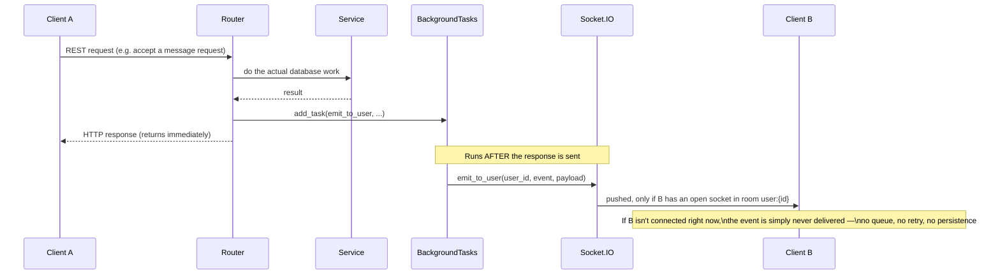

# 20 — Event Flows

Almost everything in this app is a plain HTTP request/response: the client asks, the server answers, the connection closes. But a handful of features need the opposite direction too — the server telling a client something *without* that client having asked, right now, because a different user just did something (sent a message, accepted a request). [How the System Works](02_How_the_System_Works.md) introduced Socket.IO as the mechanism for this; this chapter is the complete, literal catalog of every event this app sends or receives that way, plus the one non-Socket.IO "fan-out" pattern that deserves the same "event flow" label.

## The addressing scheme: rooms

Socket.IO organizes connected clients into **rooms** — a client can be a member of any number of them, and emitting "to a room" reaches every client currently in it. This app uses exactly two room-naming conventions, both created implicitly the first time something joins them:

- **`user:{user_id}`** — every connected socket joins its own personal room automatically, the moment it connects (`connection_manager.py:39`). This is how a server-initiated push reaches "this specific person, on whichever of their devices happen to be connected right now" — emitting to `user:{id}` fans out to every open socket for that user, not just one.
- **`group:{group_id}`** — joined only on explicit request (the `join_group` event, below), and only after a real membership check against the `GroupMember` table. A socket that never asks to join a group's room never receives that group's broadcast events.

## Every event, in one table

| Event | Direction | Room | Fired by | Payload gist |
|---|---|---|---|---|
| `connect` | Client → Server | — | Socket.IO handshake, `auth.token` = access token | Rejects the connection (`return False`) if the token doesn't decode |
| `disconnect` | Client → Server | — | Socket.IO, automatic | Removes the `sid` from `_sid_user` |
| `join_group` | Client → Server | — | Client, after opening a group's chat screen | `{group_id}`; silently refused if not a real member |
| `typing` / `stop_typing` | Client → Server, relayed onward | `group:{id}` or `user:{peer_id}` | Client, while composing | Relayed verbatim to the other party, never echoed back to the sender |
| `message_delivered` | Client → Server, triggers `delivered` | — | Client, on receiving `new_message` or loading unseen messages via REST | `{conv_id}`; bumps `last_delivered_at`, then pushes `delivered` to the sender |
| `delivered` | Server → Client | `user:{sender_id}` | The `message_delivered` handler above | `{conv_id, delivered_to, last_delivered_at}` |
| `new_message` | Server → Client | `user:{receiver_id}` | Sending a DM (`chat/presentation/router.py`, 2 call sites), sharing a post or news article into a DM | The full message object |
| `new_group_message` | Server → Client | `group:{id}` | Sending a group message, sharing a post or news article into a group | The full message object |
| `message_deleted` | Server → Client | `group:{id}` or `user:{receiver_id}` | Deleting a message (either context) | `{message_id, context_id}` |
| `new_group_deal` | Server → Client | `group:{id}` | Creating a group deal | The full deal object |
| `message_request_accepted` | Server → Client | `user:{sender_id}` | Accepting a connection's message request | `{request_id, conversation_id, accepted_by}` |
| `message_request_declined` | Server → Client | `user:{sender_id}` | Declining a connection's message request | `{request_id, declined_by}` |

All handlers live in exactly one file, `app/modules/chat/presentation/connection_manager.py` — if you're hunting for "what happens when a socket event fires," that file is the entire answer; nothing socket-related lives anywhere else.

## How a REST action turns into a push — the general shape

[API Flows](08_API_Flows.md) walked through this once for sending a chat message; every other server-initiated event in the table above follows the identical shape, so it's worth naming as a pattern rather than re-deriving per event:



Every one of `new_message`, `new_group_message`, `message_deleted`, `new_group_deal`, `message_request_accepted`, and `message_request_declined` is scheduled this way: `background_tasks.add_task(emit_to_user_or_group, ...)` from inside a router function, after the database write it depends on has already happened, so the HTTP response to the *acting* user never waits on the push actually reaching anyone else. [API Flows](08_API_Flows.md) covers `BackgroundTasks` as a FastAPI concept in more depth; this chapter assumes that explanation and focuses on what gets scheduled.

**This is fire-and-forget with no delivery guarantee, by design, not by oversight.** If the recipient's app isn't holding an open socket at the moment `emit_to_user` runs, the event is gone — there's no queue, no offline mailbox, no retry. This is why chat has a separate, independent mechanism for the offline case: any REST endpoint that lists messages/conversations also returns the current state directly from Postgres, so a client that missed a live push still sees the message the next time it asks — the socket event is a *speed* optimization (arrives instantly if you're online) layered on top of a REST API that's fully correct on its own without it.

## The one non-Socket.IO "event-like" pattern: one request, N background pushes

Sharing a post or a news article into multiple conversations at once (the share-sheet feature — [Feature Guide](10_Feature_Guide.md)'s External Sharing / Posts sections) is a single REST call that fans out into several independent background pushes, one per recipient:
```python
for receiver_id, msg in result["dm_deliveries"]:
    background_tasks.add_task(emit_to_user, receiver_id, "new_message", jsonable_encoder(msg))
for group_id, msg in result["group_deliveries"]:
    background_tasks.add_task(emit_to_group, group_id, "new_group_message", jsonable_encoder(msg))
```
(Identical logic duplicated in both `post/router.py:242-245` and `news_new/news_user_interaction/router.py:117-120` — sharing a post and sharing a news article each re-implement this same loop rather than sharing one helper.) The `service.py` layer underneath does the actual database writes (creating one message row per selected DM/group) and hands back a plain list of `(recipient_id, message)` pairs; the router is what turns that list into N independently-scheduled, independently-failing background tasks. If nineteen of twenty pushes succeed and one recipient's socket has already disconnected by the time their task runs, that one silently no-ops — same fire-and-forget contract as everywhere else in this chapter, just applied per-recipient instead of once.

## Presence: not a stored value, a live query

`is_online(user_id)` (`connection_manager.py:165-166`) doesn't read a flag anyone set — it asks Socket.IO's own in-memory room registry, right now, whether any socket currently sits in `user:{id}`'s room:
```python
def is_online(user_id: UUID) -> bool:
    return bool(list(sio.manager.get_participants('/', f'user:{user_id}')))
```
Three REST endpoints call this to annotate a response (`chat/presentation/router.py`: listing DMs, listing conversations, and a dedicated bulk online-status-check endpoint used by the chat header/inbox) — presence is computed fresh on every one of those requests, not cached or pushed as its own event. This is simple and always-correct *within one process* — which is exactly the qualifier that matters here.

## Why every one of these events depends on the single-worker constraint

[Runtime Architecture](06_Runtime_Architecture.md) already established this as a deployment fact; it's worth restating in this specific context, since it's the thing that would break first if it were ever forgotten. `_sid_user`, Socket.IO's room registry, and therefore every room membership check, every `emit_to_user`/`emit_to_group` call, and `is_online` itself, all live in **this one process's memory** — `connection_manager.py`'s own module docstring says so directly, and flags the exact failure mode: *"HTTP handlers emit from background tasks in whatever worker served the request — if that's a different worker than the one holding the recipient's socket, the push is silently dropped."* A second Socket.IO connection registered against a second worker process would have its own, entirely separate `_sid_user` dict and room membership — indistinguishable from "recipient not connected" to the first worker. The same docstring names the fix for if this ever needs to scale past one worker: give `socketio.AsyncServer` a shared backend (`socketio.AsyncRedisManager(...)`) and move `_sid_user` into Redis — genuinely not done today, and not something to attempt piecemeal (both halves would need to move together).

---
**Previous:** [19 — Recommendation Engine](19_Recommendation_Engine.md) · **Next:** [21 — Image Uploads](21_Image_Uploads.md)
