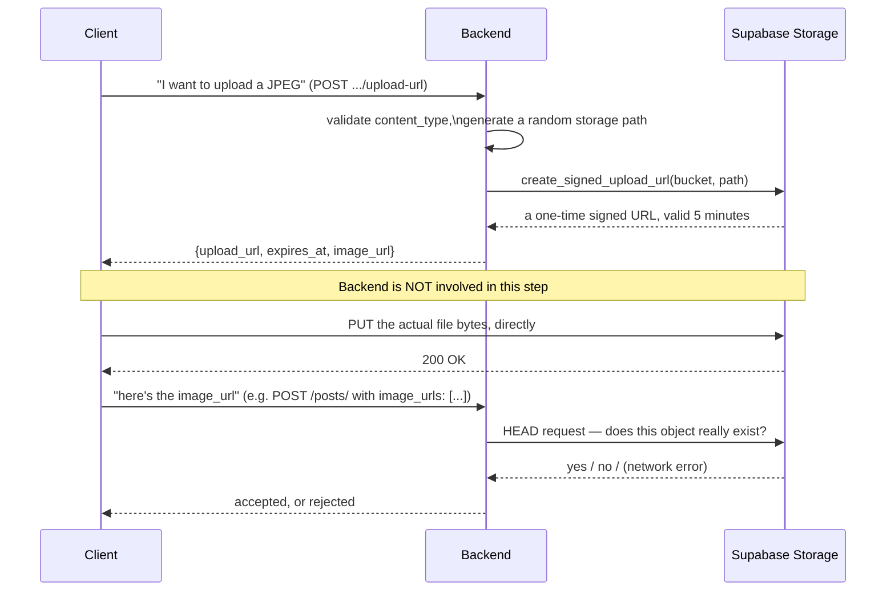

# 21 — Image Uploads

Every image (and, for Chat, other media) uploaded anywhere in this app follows the same two-request pattern, and every module that needs it shares one small helper file, `app/shared/utils/storage.py`. This chapter explains the pattern once, in full, and then how each of the four modules that use it — Profile, Post, Groups, Chat — applies it with its own bucket and rules.

## Why two requests instead of one

The naive way to build file upload is: the client sends the raw file bytes to your API server in one request, your server relays those bytes to storage. That works, but it means every uploaded photo's bytes flow through your API server's own memory and bandwidth — for an app-wide image feature, that adds up. This app instead uses **Supabase Storage's signed-upload-URL** mechanism: the backend never touches the file's bytes at all.



The second phase's verification step matters: without it, a client could claim any `image_url` string it wants (including one pointing at another profile's file, or nothing at all) when creating a post or setting an avatar. The backend never trusts a client-supplied URL until it has independently confirmed, via its own request to storage, that the object is actually there.

## The shared helper: `app/shared/utils/storage.py`

One file, six functions, used by every module in this chapter:

| Function | Does |
|---|---|
| `generate_signed_upload_url(bucket, path)` | Asks Supabase for a one-time upload URL, valid for `SIGNED_URL_TTL_SECONDS` (300s / 5 min) |
| `public_url(bucket, path)` | Computes the permanent public URL an object will have — needed even before the file exists, since the caller has to return `image_url` in the same response as the upload URL |
| `path_from_url(bucket, url)` | The inverse — extracts the bucket-relative path back out of a full public URL, since the database stores full URLs but storage operations need just the path |
| `object_exists(bucket, path)` | Returns `True` / `False` / `None` — see below, a three-way result, not a boolean |
| `delete_object(bucket, path)` | Removes a file, used when an old avatar/image is replaced |
| `ext_for(content_type)` | Maps `image/jpeg`/`image/png`/`image/webp` to `.jpg`/`.png`/`.webp` |

**`object_exists`'s three-way return is a deliberately precise piece of error handling, worth understanding exactly:**
```python
async def object_exists(bucket: str, path: str) -> bool | None:
    """
    True  = file exists
    False = file not found (404)
    None  = infra/network error — caller should return 503
    """
```
It works by issuing a raw HTTP `HEAD` request (via `urllib.request`, not the Supabase client) against the object's own public URL, and distinguishing a real "not found" (404, `False`) from anything that looks like an infrastructure problem (`None` — any status ≥ 500, or a network-level error). Every caller checks specifically for `result is None` and raises a `...StorageUnavailableError` (mapped to an HTTP 503) rather than treating it the same as a genuine "that file doesn't exist" (which callers map to a validation error, not a server error). This distinction is easy to skip when writing this kind of check quickly — the fact that it's handled correctly here, consistently, at every call site, is worth calling out as solid work, not just documented as trivia.

**The module-level Supabase client is a hard startup dependency.** `_client = create_client(os.environ["DATABASE_STORAGE_URL"], os.environ["DATABASE_SERVICE_KEY"])` runs at import time, using bracket access (not `.get(...)`) on both environment variables — if either is unset, this raises immediately when the module is first imported. [Startup Process](05_Startup_Process.md) already covers why this specific line is one of the mechanisms behind the "whole app fails to start, not just this feature" risk (audit P3-F4) — not re-derived here.

## The four modules, side by side

| Module | Bucket (env var, default) | Path shape | Allowed types | Cleanup on replace? |
|---|---|---|---|---|
| Profile (avatar) | `DATABASE_STORAGE_BUCKET` (`avatars`) | not directly shown but same `{id}/{uuid}{ext}` shape as Post | `ALLOWED_IMAGE_TYPES` (jpeg/png/webp) | Yes — old file deleted after the new one verifies, only if the path actually changed |
| Post (post images) | `POST_STORAGE_BUCKET` (`posts`) | `{profile_id}/{uuid4()}{ext_for(content_type)}` | `ALLOWED_IMAGE_TYPES` | Yes, same pattern, on post edit |
| Groups (group image + group media) | `GROUP_IMAGE_BUCKET` (`group-image`), `GROUP_MEDIA_BUCKET` (`group-media`) — **two separate buckets in one module** | same shape | `ALLOWED_IMAGE_TYPES` for the group's own image; a wider `ALLOWED_MEDIA_TYPES` (adds `video/mp4`, per `groups/service.py:62-64`) for posted media | Media deletion is explicit (deleting a `GroupMedia` record deletes its file too, best-effort) |
| Chat (message attachments) | `CHAT_STORAGE_BUCKET` (`chat`) | same shape | Its own `ALLOWED_CHAT_MEDIA_TYPES` — broader than images; the module's own comment explains why: *"Chat supports more than images — storage.ext_for only knows images, so chat carries its own allowlist + extension map"* | Best-effort delete, `except StorageError: continue` |

Every path follows the same `{owner_id}/{random_uuid}{extension}` shape (confirmed directly in Post's `get_post_upload_url`, `post/service.py:59`: `path = f"{profile_id}/{uuid.uuid4()}{ext_for(content_type)}"`) — namespaced per owner (so listing a bucket by prefix would group a profile's own files together), with a random filename specifically so nothing about the URL is guessable or sequential, unlike (per [Authorization](15_Authorization.md)'s discussion of `Post.id`) this app's plain sequential integer primary keys.

## The verify-with-retry pattern — duplicated, not shared

Profile's avatar update and Post's image verification both retry `object_exists` on the same schedule before giving up:
```python
for delay in (0.15, 0.35):
    result = await object_exists(bucket, path)
    if result is True or result is None:
        break
    await asyncio.sleep(delay)
else:
    result = await object_exists(bucket, path)
```
This exists to absorb a real race condition: the client's direct upload to Supabase and the client's follow-up call to this app's own API can arrive close enough together that Supabase's own storage hasn't finished being consistent yet when this app first checks. Retrying at 150ms and 350ms gives that a couple of chances to resolve before treating a still-missing file as genuinely missing. **This exact retry logic is written out independently in both `profile/service.py` and `post/service.py`, rather than living once in `shared/utils/storage.py` as a seventh helper function.** It's a small, low-risk duplication — both copies are identical and correct — but it's exactly the kind of thing worth factoring into the shared module if a third caller ever needs the same check, rather than copying it a third time.

## Cleanup on replace: only delete if the path actually changed

Both Profile and Post follow the same careful order when a user replaces an existing image: verify the *new* file exists first, then compare its path against the old one, and only delete the old file if the two paths differ:
```python
old_path = path_from_url(bucket, profile.avatar_url)
new_path = path_from_url(bucket, avatar_url)
if old_path != new_path:
    await delete_object(bucket, old_path)
```
Deleting unconditionally would be a real bug if a client ever "updates" an image to the exact same URL it already had — the random-UUID path scheme makes an accidental collision essentially impossible, but a client could deliberately resubmit the same `image_url` it was already given, and this check correctly treats that as a no-op rather than deleting the file a user still expects to see.

---
**Previous:** [20 — Event Flows](20_Event_Flows.md) · **Next:** [22 — Search](22_Search.md)
