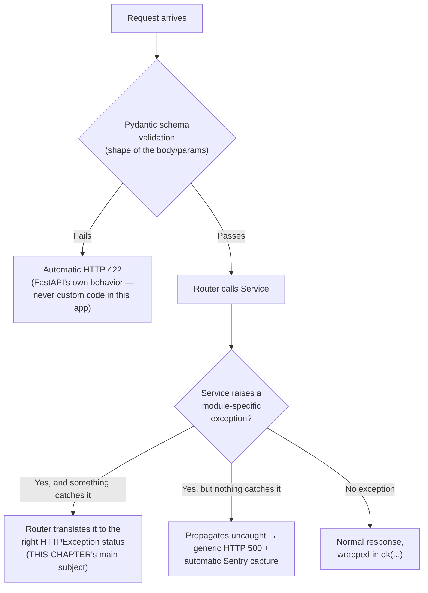

# 25 — Error Handling

An error in this app passes through up to three distinct layers before it becomes whatever the client actually receives. This chapter covers all three, but spends most of its time on the middle one — the hand-written, per-module exception classes — since that's where almost all of the real decision-making happens, and where this codebase's own conventions are worth understanding precisely.

## The three layers



**Layer 1 (automatic, framework-provided):** if a request body or query parameter doesn't match its Pydantic schema, FastAPI itself returns a `422 Unprocessable Entity` with a structured description of what failed — no code in this app writes this path; it's inherent to how FastAPI uses Pydantic, already touched on in [Request Lifecycle](07_Request_Lifecycle.md)'s validation step.

**Layer 3 (also automatic, but a fallback, not a feature):** if a service function raises something no router catches — a genuine bug, a new exception type someone forgot to wire up, or a third-party library's own exception leaking through — FastAPI's default behavior takes over: a generic `500 Internal Server Error` with no details leaked to the client (this app doesn't wrap this in a custom global handler — there is no `@app.exception_handler(...)` anywhere in `main.py`, confirmed by grep). This isn't silent, though: [Startup Process](05_Startup_Process.md) already noted Sentry initializes before the app or its routers are even built specifically so *every* request is traced — an uncaught exception here is automatically captured and reported to Sentry, even though the client just sees a bare 500.

**Layer 2 — hand-written module exceptions, translated by the router — is the one this app actually designs around,** and where the real variety is.

## Every module writes its own exception classes — flat, not shared

There is no shared base exception class anywhere in this app — every custom exception inherits directly from Python's built-in `Exception`, confirmed by grepping every `class ...Error(Exception)` / `class ...Exception(Exception)` declaration in `app/`. Each flat module has its own small, independent family: Post's `PostNotFoundError`, `PostForbiddenError`, `PostImageUploadError`, `PostStorageUnavailableError`, `CommentNotFoundError`, `CommentForbiddenError`, `CommentsDisabledError`; Groups' `GroupNotFoundError`, `GroupPermissionError`, `GroupConflictError`, `GroupValidationError`, `GroupStorageError`; Profile's `ProfileNotFoundError`, `ProfileConflictError`, `ProfileValidationError`, `ProfileStorageUnavailableError`, `UserConflictError`; Chat's `ChatMediaUploadError`, `ChatStorageUnavailableError`. None of a given module's own exceptions share a common parent beyond `Exception` itself — there's no `PostError` you could catch once to mean "any Post-module failure."

**The one place a real hierarchy exists** is inside `taste/`'s three sub-packages, each with its own `domain/exceptions.py` defining a genuine base class with real subclasses — e.g. `taste/global_taste/domain/exceptions.py`:
```python
class GlobalTasteError(Exception):
    """Base for all global taste failures."""

class GlobalTasteWriteError(GlobalTasteError):
    """Raised when a promotion delta cannot be persisted."""

class GlobalTasteReadError(GlobalTasteError):
    """Raised when global taste weights cannot be read."""
```
`global_session/domain/exceptions.py`'s `GlobalSessionError` and `session_taste/domain/exceptions.py`'s `SessionTasteError` follow the identical shape. This is one more entry in the running pattern [Repositories](13_Repositories.md), [Recommendation Engine](19_Recommendation_Engine.md), and the prior audit's Phase 10 all independently noticed: `taste/` is consistently the most deliberately-architected module in this codebase, and its exception design is no exception (so to speak) to that pattern.

## How a router turns a caught exception into an HTTP status — two different mechanisms

**The common pattern (Post, Profile, Chat, and most of Groups' own endpoints): catch-and-translate, inline, per function.** [Service Layer](12_Service_Layer.md) already showed this for `post/router.py`'s `toggle_like_api`; the shape repeats across the app — a `try`/`except SpecificError as e: raise HTTPException(status_code=N, detail=str(e))` block, once per exception type the endpoint's own service call can raise.

**Groups' twist: a shared dispatcher for the common case, manual handling for the rest.** Most of `groups/router.py`'s 29-plus endpoint functions don't repeat this translation themselves — they call a shared helper instead:
```python
def _handle(fn, *args, **kwargs):
    """Dispatch service call -> HTTP status codes."""
    try:
        return fn(*args, **kwargs)
    except GroupPermissionError as e:
        raise HTTPException(status_code=403, detail=str(e))
    except GroupNotFoundError as e:
        raise HTTPException(status_code=404, detail=str(e))
    except GroupConflictError as e:
        raise HTTPException(status_code=409, detail=str(e))
    except GroupValidationError as e:
        raise HTTPException(status_code=422, detail=str(e))
```
(`groups/router.py:108-119`), called as `_handle(service.some_function, arg1, arg2)`. A handful of endpoints that need a fifth case not covered by `_handle` — the image/media-upload routes, which can also raise `GroupStorageError` — fall back to their own local `try`/`except` instead (adding one more `except GroupStorageError as e: raise HTTPException(status_code=503, ...)` clause that `_handle` doesn't know about). This is a genuinely more DRY approach than the rest of the app for the cases it covers, at the cost of being one more pattern a new engineer needs to recognize alongside the plain per-function version used everywhere else.

**Connections' twist: some errors skip translation entirely, because the service layer raises `HTTPException` directly.** [Service Layer](12_Service_Layer.md) already flagged this: `connections/service.py` raises `HTTPException(status_code=400, detail="Cannot follow yourself.")` and similar, straight from inside the service function, rather than a module-specific exception a router would translate. Functionally identical to a client — same status code arrives either way — but it means `connections/service.py` isn't callable from a non-HTTP context (a background job, say) without dragging an HTTP-specific exception type along with it, unlike every other module's service layer.

## The status-code convention, consistent even though the mechanism isn't

Despite three different *mechanisms* for getting there, the actual status codes chosen are consistent across every module this handbook checked:

| Situation | Status | Seen in |
|---|---|---|
| Caller isn't allowed to do this | 403 | `PostForbiddenError`, `GroupPermissionError`, `CommentForbiddenError` |
| The thing referenced doesn't exist | 404 | `PostNotFoundError`, `GroupNotFoundError`, `ProfileNotFoundError`, `CommentNotFoundError`, `ArticleNotFoundError`, `DeepLinkNotFoundError` |
| Action conflicts with current state | 409 | `GroupConflictError`, `ProfileConflictError`, `UserConflictError` |
| Input failed a business rule (not a schema shape rule — that's the automatic 422 from Layer 1) | 422 | `ProfileValidationError`, `GroupValidationError`, `PostImageUploadError` |
| An external dependency (Supabase storage, in every case seen) is unreachable | 503 | `ProfileStorageUnavailableError`, `PostStorageUnavailableError`, `GroupStorageError`, `ChatStorageUnavailableError` |

Worth noticing: a hand-raised **422** (a business-rule failure, from Layer 2) and an **automatic 422** (a schema-shape failure, from Layer 1) are indistinguishable to a client by status code alone — both are "the request was malformed," just caught at different points. If you're debugging a 422 and wondering which layer produced it, the response body's shape is the tell: FastAPI's automatic validation errors have their own structured `detail` format (a list of per-field error objects); a hand-raised one has a single plain string `detail`, per every custom exception class shown above.

---
**Previous:** [24 — Configuration](24_Configuration.md) · **Next:** [26 — Deployment](26_Deployment.md)
